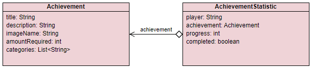
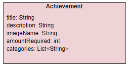
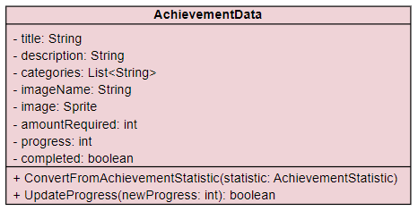

# Achievement Data Model

This file describes how the data required for loading, storing and handling achievements is done.

## Overworld

The Overworld expects to receive the achievement data in form of an array of `AchievementStatistic`  

That contains an `Achievement` with all player independant data as well as all relevant player specific data.  

These are then converted into `AchievementData` objects combining achievement related data and player related data together for easier handling.  

