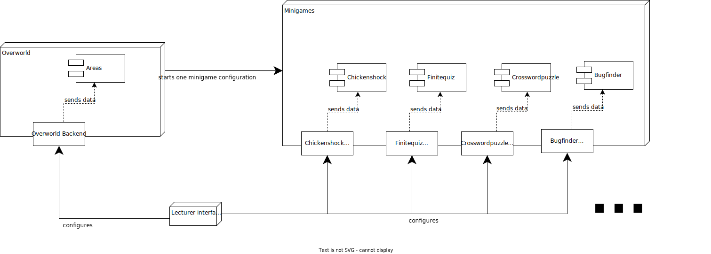

# General architecture

## Table of contents

- [Component structure](#component-structure)
  - [Diagram inconsistencies](#diagram-inconsistencies)
- [Typical user procedure](#typical-user-procedure)
- [Overworld data model](#overworld-data-model)
- [Alternative component diagram](#alternative-component-diagram)

## Component structure

In general, _Gamify-IT_ can be split up into three main components: the _Overworld_, the _Lecturer Interface_, and the _Minigames_.  
Purpose:

- minigame: A small game to learn something by playing
- overworld: consists of areas you can walk around in, interact with your environment or start minigames
- lecturer interface: The allmighty configurator to configure what happens where in the overworld, or to set what is displayed in the minigames.

Every of these services has its own backend, except the lecturer interface whose backend is the overworld backend as well.
You can inform yourself about all these services in detail [here](https://gamifyit-docs.readthedocs.io/en/latest/dev-manuals/index.html).

### Diagram inconsistencies

For simplicities sake, the diagram above omits a few things:

- it trades formal correctness for understandability
- actually, the backends don't send the data without being asked but rather the frontends query the backends
- when a minigame completes, control is returned to the overworld
- when a minigame run is finished, the respective minigame backend lets the overworld backend know about that as well

## Typical user procedure

As you can see, the user first has to login, and is then forwarded to the overworld, where he can then at some point start a minigame and finish it.

## Overworld data model

Another good overview over the structure of _Gamify-IT_ can be seen in the data model of the overworld backend:

As you can see, the course is the top most level.  
Each course can now have a number of worlds, who in turn can have a number of dungeons.  
All types of areas can have NPCs and minigames.

## Alternative component diagram

The following is an alternative component diagram which is more formally correct, but also a lot harder to read:

