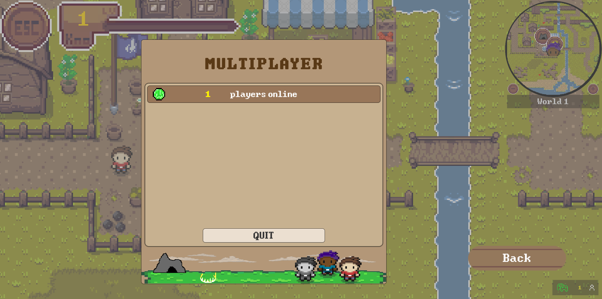
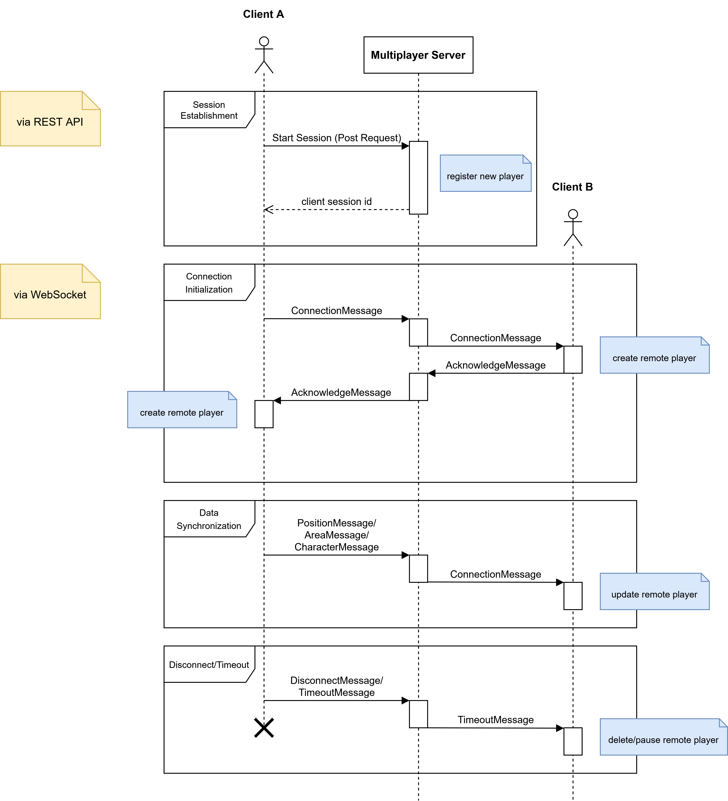

<h1>Architecture of the Multiplayer</h1>

## Table of Contents
	
- [Table of Contents](#table-of-contents)
- [Purpose](#purpose)
- [Architecture Design](#architecture-design)
- [Used Technologies](#used-technologies)
  - [Client](#client)
  - [Server](#server)
- [Component Description](#component-description)
  - [Server](#server-1)
    - [General Structure](#general-structure)
    - [REST API](#rest-api)
    - [WebSocket](#websocket)
  - [Client](#client-1)
    - [Main Scripts](#main-scripts)
      - [MultiplayerManager.cs](#multiplayermanagercs)
      - [EventManager.cs](#eventmanagercs)
    - [User Interface](#user-interface)
  - [Network Messages](#network-messages)
    - [Class Diagram](#class-diagram)
    - [Protocol Data Unit (PDU)](#protocol-data-unit-pdu)
  - [Typical Message Exchange Sequence](#typical-message-exchange-sequence)
- [Development](#development)
  - [Getting Started](#getting-started)
    - [Overworld](#overworld)
    - [Multiplayer Server](#multiplayer-server)
  - [Build and Run](#build-and-run)
- [Tests](#tests)
  - [Unique ID generation](#unique-id-generation)
- [Known Design Flaws](#known-design-flaws)

## Purpose 
Implementing multiplayer functionality in the overworld enhances engagement and social interaction 
by allowing players to see each other in real time. 
The system synchronizes the position and outfit of each player in the same course, encouraging exploration of 
the overworld and collaboration in minigames. 
By enabling users to identify and connect with others, Gamify-It promotes engagement and sustained participation while maintaining performance efficiency.

## Architecture Design 
The overall architecture of the multiplayer is shown below.


## Used Technologies 
### Client
The same technologies are used as in the overworld:
- Unity and C#
- WebGL (build)
### Server
The server is built using Node.js and consists of a
  - REST API to manage session requests using [Express.js](https://www.npmjs.com/package/express) 
  - WebSocket for real-time communication using [ws](https://www.npmjs.com/package/ws)

## Component Description
Here you can find a detailed description how each component is designed and works as well as where to find the code and
and how to implement new features. It should be read carefully before changing the current code.
### Server
The multiplayer server has its own [repository](https://github.com/Gamify-IT/multiplayer-server).
Its purpose is to handle client sessions as well as processing and broadcasting messages to players of the same course. That is, it consists of two parts, the WebSocket and the REST API.
#### General Structure
- `clients`: contains the b2b (backend-2-backend) communication methods
- `controllers`: contains the behavior behind a server route
- `data`: contains the server's data structures
- `routes`: contains the server routes definition
- `services`: 
- `utils`: contains utility functions like the id generation
- `websocket`: contains the websocket functionality
#### REST API
The REST API currently accepts a `POST` request for establishing a new session and is accessible under `api/v1/join/`. For that, the user needs to send a `ConnectionData` object. \
**Note:** To create a WebSocket connection, a client must register itself successfully via the REST API.
#### WebSocket
The WebSocket handles the message exchange between clients. It supports the following functionality:
- client id retrieval
- (dis)connection handling
- timeout handling
- course broadcasting

If a client does not send any messages for 50 seconds, its WebSocket connection will be closed (= **timeout**), but it can reconnect using the same client ID. However, if a client actively disconnects (e.g., by quitting multiplayer/overworld or closing the browser), it will be removed permanently with no option to reconnect.
### Client
The code for the multiplayer can be found in the [multiplayer folder](https://github.com/Gamify-IT/overworld/tree/main/Assets/Scripts/Multiplayer) of the overworld repository. \
A client is a player and can start a new multiplayer session by sending a post request to the server. 
As a response, the client receives a unique session id and opens a WebSocket connection to send messages 
in order to synchronize position and outfit.
#### Main Scripts
##### MultiplayerManager.cs
The [MultiplayerManager.cs](https://github.com/Gamify-IT/overworld/blob/main/Assets/Scripts/Multiplayer/MultiplayerManager.cs) script manages all client-side multiplayer content. \
It consists of six regions:
- `websocket connection` to establish and manage the WebSocket connection
- `time-based routines `like checking inactivity 
- `message sending` for serializing and sending different types of messages
- `message processing` for deserializing messages and process their content
- `multiplayer session handling` like pausing, resuming or quitting a session
- `remote player handling `to update the physics and appearance of other (remote) players
##### EventManager.cs
The [EventManager.cs](https://github.com/Gamify-IT/overworld/blob/main/Assets/Scripts/Multiplayer/EventManager.cs) defines a generic event which is used for an event-driven communication.
Each section in the code that requires data-synchronizing uses the trigger event to send a network message
of a certain type.
#### User Interface
There are two multiplayer-related UI elements in the overworld:
- `Multiplayer Menu` in the pause menu to start and quits sessions, provides a detailed overview
- `Multiplayer HUD` in the bottom left corner shows the connection state

Their logic is handled in the [MultiplayerMenu](https://github.com/Gamify-IT/overworld/blob/main/Assets/Scripts/Multiplayer/UI/MultiplayerMenu.cs) and [MultiplayerHUD](https://github.com/Gamify-IT/overworld/blob/main/Assets/Scripts/Multiplayer/UI/MultiplayerHUD.cs) script.




### Network Messages
The data sent via the WebSocket is called network messages. Their overall structure is defined
in the abstract **NetworkMessage class** and is further extended by the children classes in order to consider specific behavior.
Currently, the multiplayer supports sending network messages of [seven different types](https://github.com/Gamify-IT/overworld/tree/main/Assets/Scripts/Multiplayer/Messages). \
Below, you can find a detailed overview how the messages are defined.

#### Class Diagram


#### Protocol Data Unit (PDU)


### Typical Message Exchange Sequence
Connection and disconnection to the server requires sending a specific combination of messages.
The sequence diagram below illustrates a typical message exchange between two clients connected 
with the multiplayer. Note that in this case, player B has already established a successful connection.

  
## Development
### Getting Started
Install [Unity Version 2021.3.2f1 (LTS)](https://unity.com/de/releases/editor/whats-new/2021.3.2).
#### Overworld
Clone the repository  
```sh
git clone https://github.com/Gamify-IT/overworld.git
```
#### Multiplayer Server
Clone the repository  
```sh
git clone https://github.com/Gamify-IT/multiplayer-server.git
```

Install the dependencies
```sh
npm install
```

### Build and Run
Build the unity project like described in [this manual](https://gamifyit-docs.readthedocs.io/en/latest/dev-manuals/languages/docker/docker-compose-unity.html).

To run the multiplayer server locally with IDE features and all necessary dependencies, start the dependencies via docker:
```sh
docker compose -f docker-compose-dev.yaml up
```
Then start the frontend with:
```sh
npm run dev
```
You can now access the game at [localhost](http://localhost).

## Tests
There are a few [tests](https://github.com/Gamify-IT/multiplayer-server/blob/main/tests/) to check system performance and feature accuracy.
### Unique ID generation 
The generation of new client session ids is [tested](https://github.com/Gamify-IT/multiplayer-server/blob/main/tests/idGeneration.spec.ts) for:
- uniqueness
- reuse after release
- error for releasing invalid id
- error for unavailable ids
<!--### Client traffic-->

## Known Design Flaws
- No updating of remote players if player is in pause menu (since time and hence physics is paused)
- Outfit is sent as two strings (body, head), better would be an efficient byte coding, allowing unique outfit determination and reconstruction
- Lobbys might improve user experience and network traffic