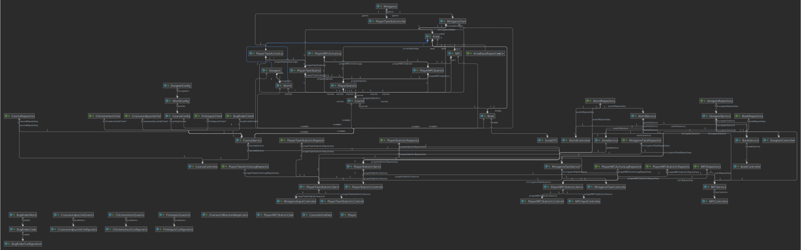
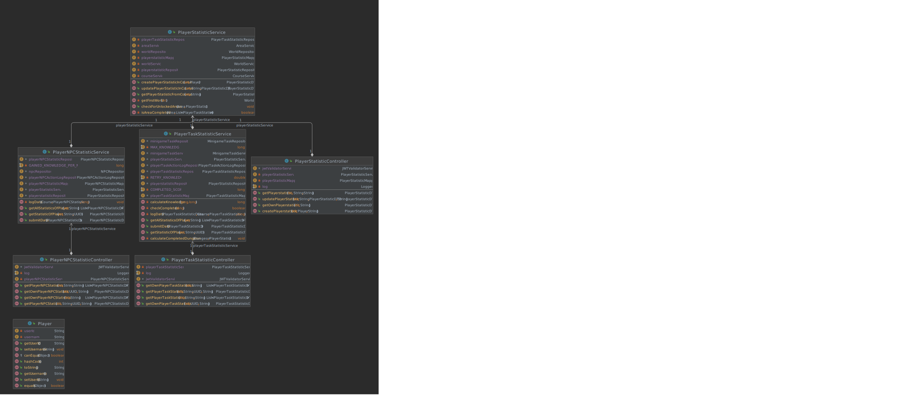

# Architecture of Overworld-backend

Project: <https://github.com/Gamify-IT/overworld-backend> \
Classes: <https://github.com/Gamify-IT/overworld-backend/tree/main/src/main/java>

## Purpose

This backend saves the different overworld configurations and general player statistics. 

## Table of Contents

* [Links](#links)
* [General code structure](#general-code-structure)
* [Starting the service](#starting-the-service)
* [What to look at](#what-to-look-at)
* [What to ignore](#what-to-ignore)
* [Class diagrams](#class-diagrams)
    * [Overview complete application](#overview-complete-application)
    * [Courses](#courses)
    * [Worlds](#worlds)
    * [Dungeons](#dungeons)
    * [Minigames](#minigames)
    * [NPCs](#npc)
    * [Books](#books)
    * [PlayerStatistic](#playerstatistics)
    * [ActionLog](#actionlog)
* [Known Design Flaws](#known-design-flaws)
* [Known Bugs](#known-bugs)
* [Tests](#tests)

## Links

- The program code is available [here](https://github.com/Gamify-IT/overworld-backend).
- The overview of the architecture can be found [here](../general-architecture.md).
- The frontend architecture is described [here](../overworld/README.md).

## General code structure

This backend has the following package structure
- `data`: Contains the data objects and DTOs
- `controller`: Containers the server routes
- `service`: Contains the business logic
- `client`: Contains the b2b (backend-2-backend) communication methods
- `repositories`: Contains the database repositories

## Starting the service

See the [README](https://github.com/Gamify-IT/overworld-backend#readme).

## What to look at

You can either start at the course or the playerStatistic.
From there you should move up the code flow.

## What to ignore

Nothing at the moment.

## Class diagrams

### Overview complete application

This simplified class diagram shows how the most important services and controllers in the project are interlinked.

### Courses

This class diagram shows an overview of the courses.

### Worlds

This class diagram shows an overview of the worlds.

### Dungeons

This class diagram shows an overview of the dungeons.

### Minigames

This class diagram shows an overview of the minigames.

### NPC

This class diagram shows an overview of the npc.

### Books

This class diagram shows an overview of the books.

### PlayerStatistics

This class diagram shows an overview of the player statistics.

### ActionLog

This class diagram shows an overview of the action logs.

## Known Design Flaws

There are no known design flaws.

## Known Bugs

An up-to-date list of open bugs can be found at <https://github.com/orgs/Gamify-IT/projects/6/views/11> by searching for `Overworld-backend`.

## Tests

In general, the following things are tested for Overworld-backend:
- Everything is tested with unit tests
