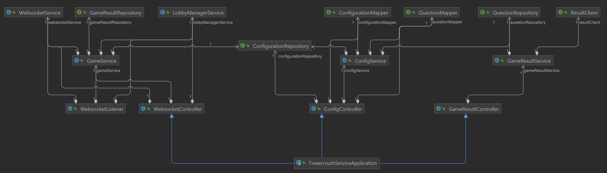
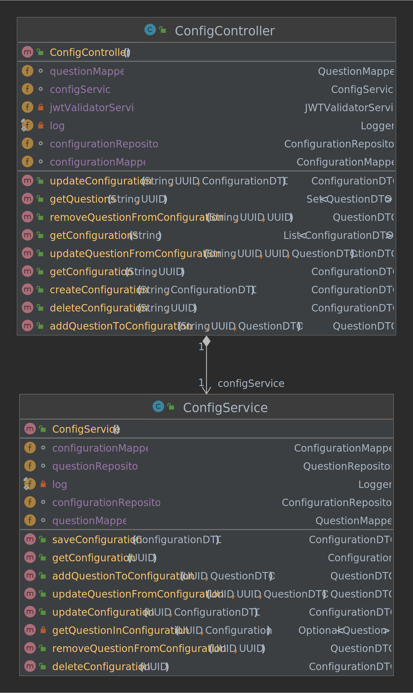

# Architecture of Towercrush-Backend

Towercrush is a minigame which is part of the Gamify-IT platform.
The intention with this game is to make answering single choice questions in a multiplayer environment fun.

## Table of Contents

* [Links](#links)
* [General code structure](#general-code-structure)
* [Starting the service](#starting-the-service)
* [What to look at](#what-to-look-at)
* [What to ignore](#what-to-ignore)
* [Class diagrams](#class-diagrams)
  * [Overview complete application](#overview-complete-application)
  * [ConfigController](#configcontroller)
  * [GameResultController](#gameresultcontroller)
* [Known Design Flaws](#known-design-flaws)
* [Known Bugs](#known-bugs)
* [Tests](#tests)

## Links

- The [user docs](../../../user-manuals/minigames/towercrush.md) explain how to play the game.
- The program code is available [here](https://github.com/Gamify-IT/towercrush-backend).
- The overview of the architecture of the whole platform can be found [here](../general-architecture.md).
- The frontend architecture is described [here](../towercrush/README.md).

## General code structure

This [Java backend](https://github.com/Gamify-IT/towercrush-backend/tree/main/src/main/java/de/unistuttgart/towercrushbackend) has the following package structure
- `data`: Contains the data objects and DTOs
- `controllers`: Containers the server routes
  - `components`: Contains websocket overwritten classes and event handler
  - `websockets`: Contains websocker subscription endpoints
- `services`: Contains the business logic
- `clients`: Contains the b2b (backend-2-backend) communication methods
- `repositories`: Contains the database repositories

## Starting the service

See the [README](https://github.com/Gamify-IT/towercrush-backend#readme).

## What to look at

The controllers for the API requests are a good point to start.  
From there you can follow the code flow to the other components.

- The [GameResultController](https://github.com/Gamify-IT/towercrush-backend/blob/main/src/main/java/de/unistuttgart/towercrushbackend/controller/GameResultController.java) provides the API for the game results.
- The [ConfigController](https://github.com/Gamify-IT/towercrush-backend/blob/main/src/main/java/de/unistuttgart/towercrushbackend/controller/ConfigController.java) provides the API to configure the game.

## What to ignore

Nothing at the moment.

## Class diagrams

### Overview complete application

This simplified class diagram shows how the most important services, mappers and repositories in the project are interlinked.

### ConfigController

This class diagram shows an overview of the ConfigController class.

## Known Design Flaws

There are no known design flaws.

## Known Bugs

An up-to-date list of open bugs can be found at <https://github.com/orgs/Gamify-IT/projects/6/views/11> by searching for Towercrush-backend.

## Tests

We use the following test strategies in the Towercrush-backend:

- unit tests
