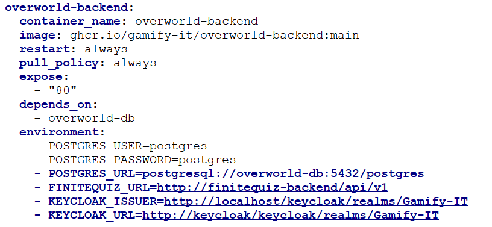

# Docker Architecture Explanation

## General Syntax
A docker compose file serves as an instruction for docker, which containers need to be built and running, and possibly which environment variables etc. are needed.
To specify this, `docker-compose.yaml` files are used.

The basic structure is the keyword `services`, followed by a list of the containers that should be run. The containers are each structure as follows:

You can specify the content of the container with the `image` parameter, if you want your local files to be built as a docker container, use `build: .` instead. The `restart` and `pull_policy` parameters determine the behavior of the container, if it should restart on error and when a new image should be pulled. The last part of the parameters manage the behavior of the containerized app or the relations between containers.

The images are provided via GitHub, we have setup action runners that create a new docker image once they are triggered, e.g. by pushing onto the main branch of a repository.

## Setup in Gamify-IT
Since this project has a microservice architecture, the number of containers can get large. It is advised to use the given `docker-compose.yaml` files for testing since they already contain the minimal dependencies, which speeds up the container creation and startup process of docker.
Most of the minigames are divided into three docker containers, frontend, backend and database. For a given minigame, all three of these parts are necessary for running the minigame. Furthermore, some of the core microservices are always necessary to start the project, e.g. keycloak, reverse-proxy or the overworld.

When creating a new minigame, you should adhere to the existing structure of the docker files and follow the semantic already present and described in the [documentation](../../install-manuals/all-services/docker_dev.md).