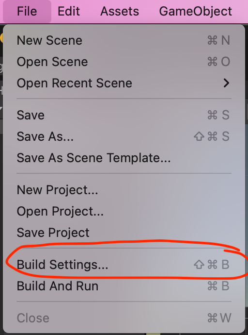
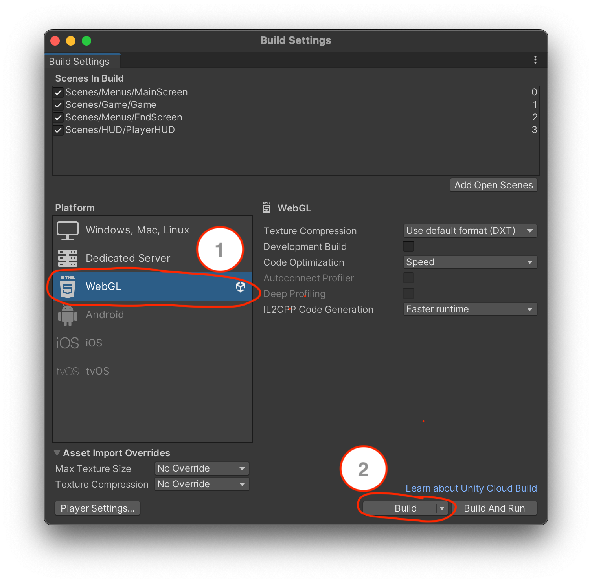
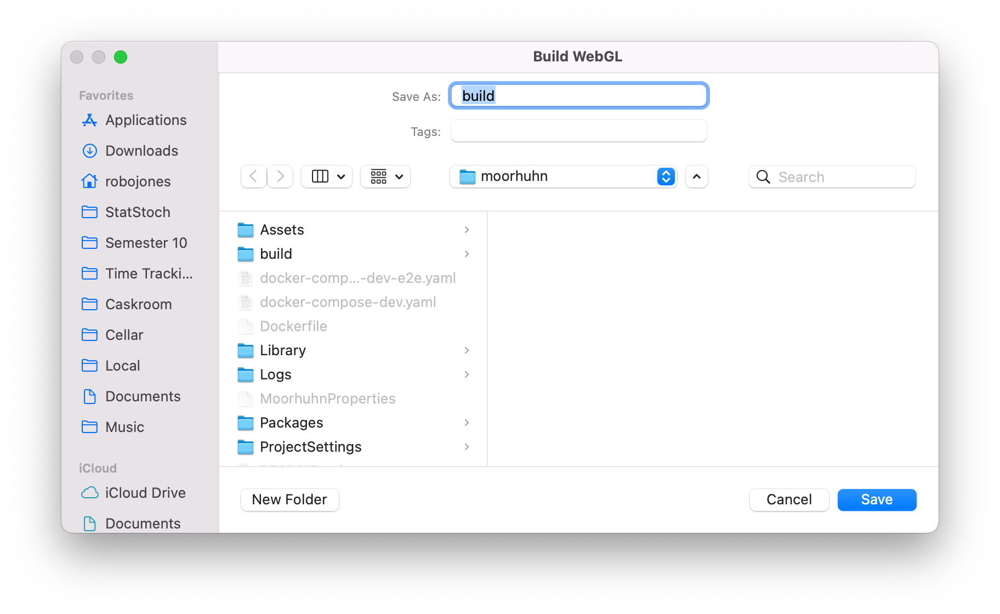

# Use Docker Compose files with unity

The usage of [Docker Compose files](docker-compose.md) with unity projects differs from our other projects, cause we have no ability to build the project in a docker container. Cause of that ther exists no `docker-compose.yaml`.

To use our `docker-compose-dev.yaml` and `docker-compose-dev-e2e.yaml` you have to build the WebGL-build.

### WebGL build instructions

Firstly, open the build settings with `File` > `Build Settings`. \

Then you have to select `WebGL` and click `Build`. \

Then you have save it as `build` in the root directory of the project. \

Now there should exist a `build` folder containing a `index.html` file and other data.