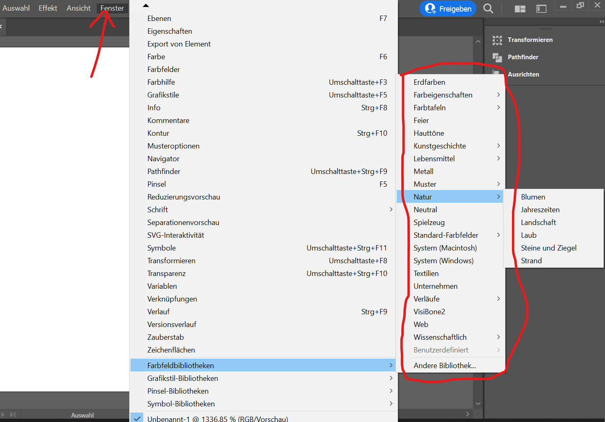
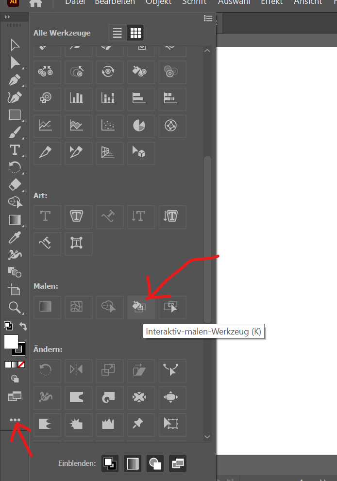
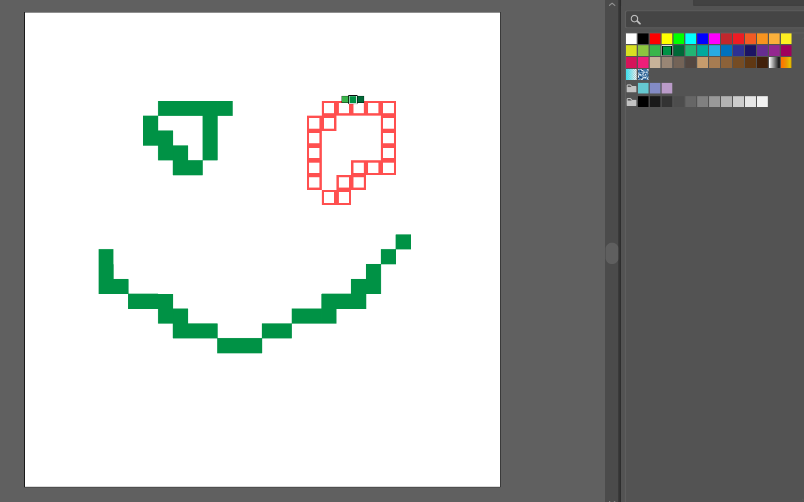
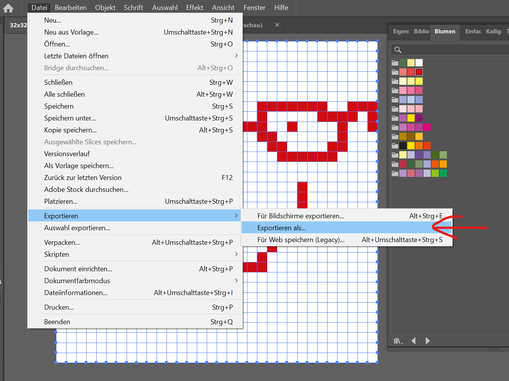
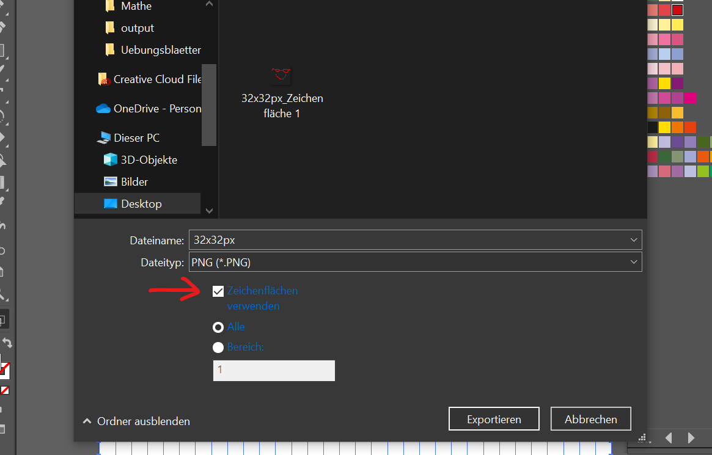
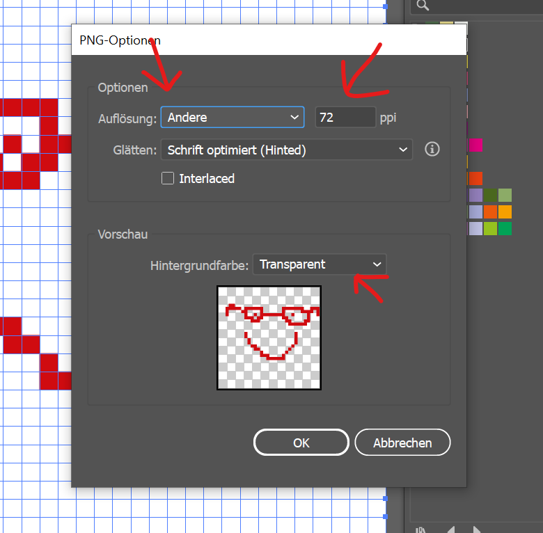

# How to make a Tile 

## Setup

### Step 1

Open either the 32x32px template or the 16x16px template in Illustrator. 
You can find the templates in the new-tiles repository in the templates folder.

### Step 2

Add the colorset you want.

### Step 2

Choose the right tool.

### Step 3

Choose the right color. left click to paint. have fun!

## Export 32x32px or 16x16px

### Step 1

### Step 2

### Step 3

### Result

