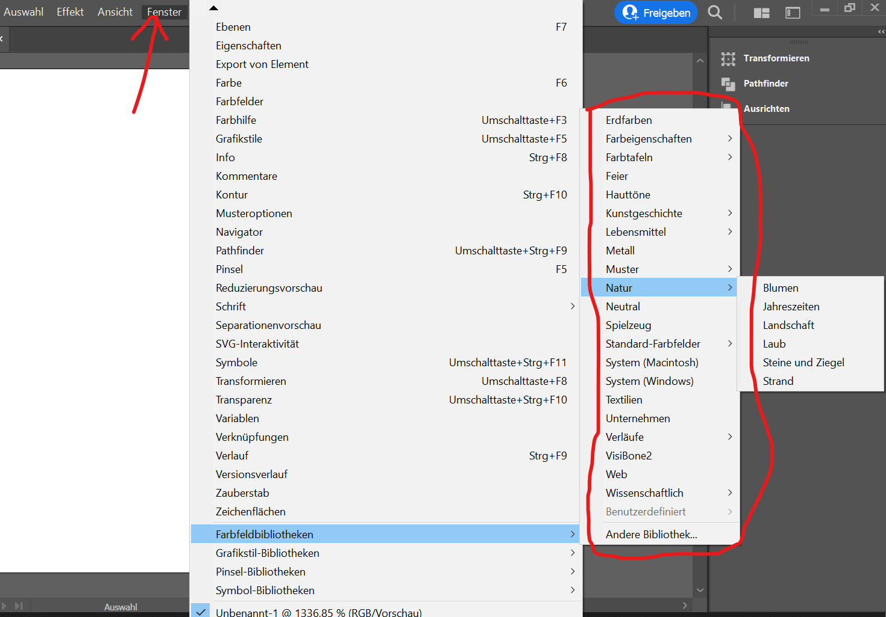
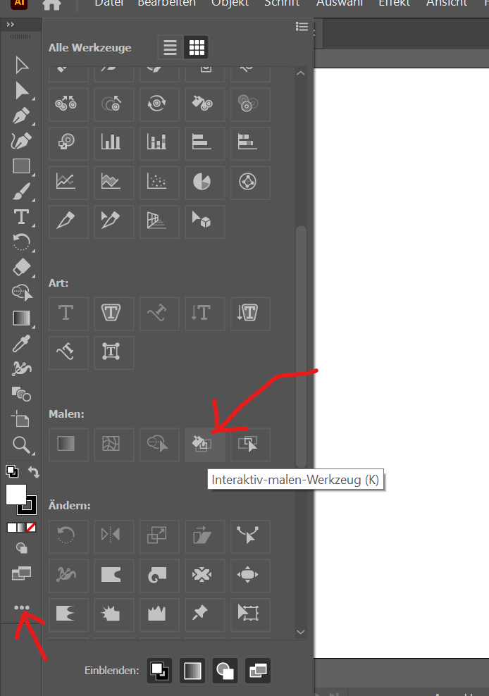
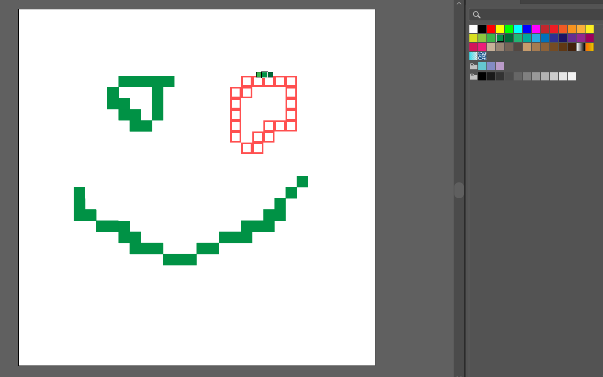
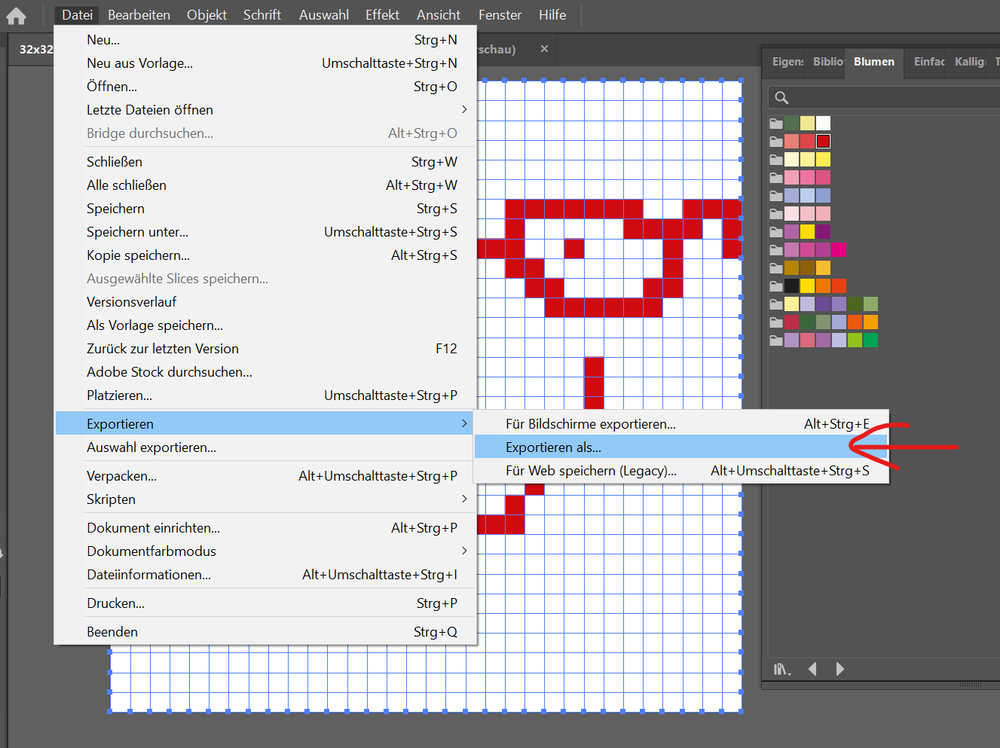
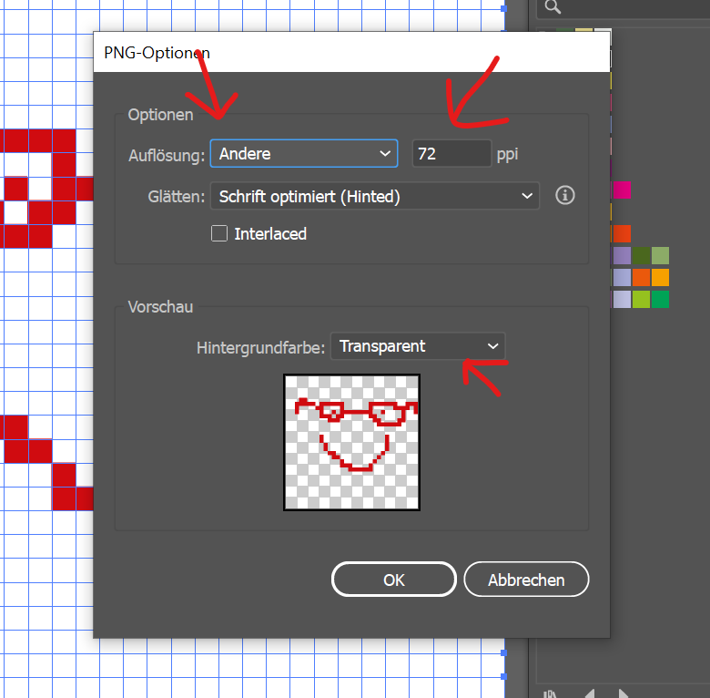

# How to make a Tile

## Setup

### Step 1

Open either the `32x32px` template or the `16x16px` template in Illustrator.  
You can find the templates in the [tiles repository](https://github.com/Gamify-IT/tiles) in the [templates folder](https://github.com/Gamify-IT/tiles/tree/main/templates) folder.

### Step 2

Add the colorset you want.

### Step 2

Choose the right tool.

### Step 3

Choose the right color. Left click to paint. Have fun!
**Make sure the shadows are transparent when drawing!**

## Export 32x32px or 16x16px

### Step 1

### Step 2

### Step 3

### Result

