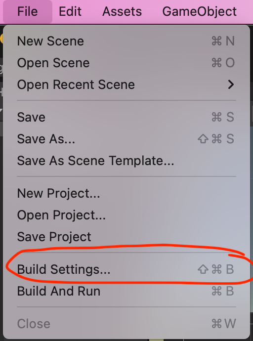
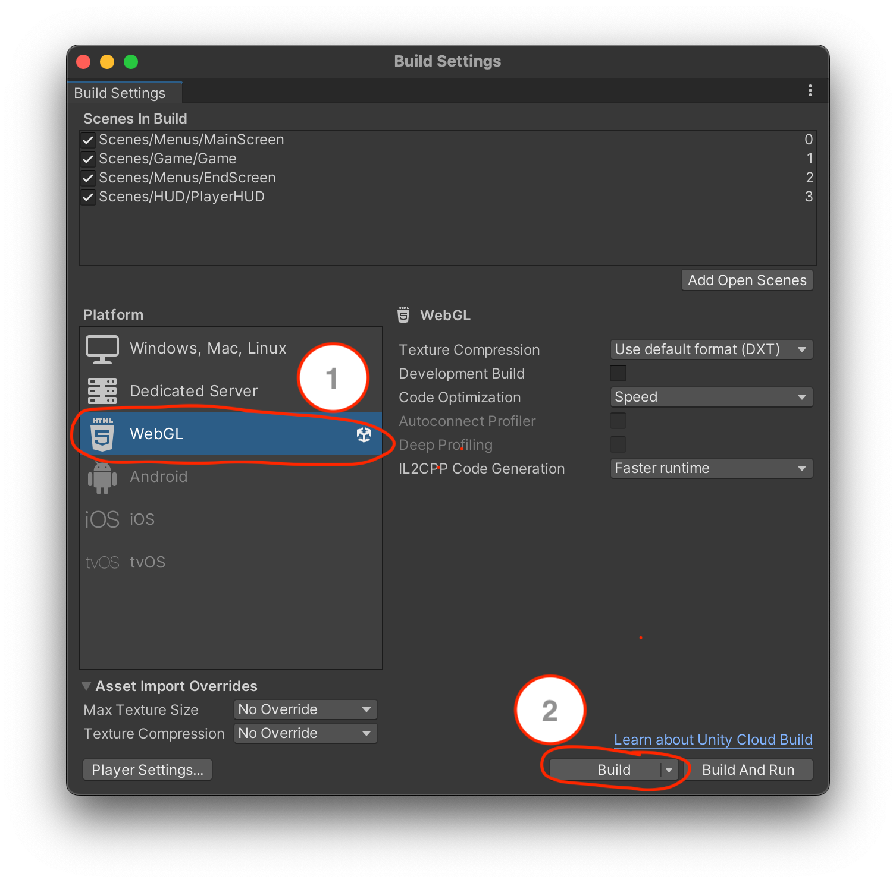

# Use Docker Compose files with Unity

The usage of [Docker Compose files](../../../install-manuals/all-services/docker_dev.md) with Unity projects differs from the other projects, 
because docker can't build a container from the raw files (like with the other repositories). To run your 
local changes, you have to build the project with WebGL.


## WebGL build instructions

Firstly, open the build settings with `File` > `Build Settings`.  


Then you have to select `WebGL` and click `Build`.  


When building the project, choose the following structure as the build destination (relative from the 
repository root): `./builds/WebGL/WebGL`

After the build is completed you can run the docker compose file, and it should start up the container.
To do so, use the usual command: 
```sh
docker compose up --build
```