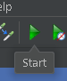
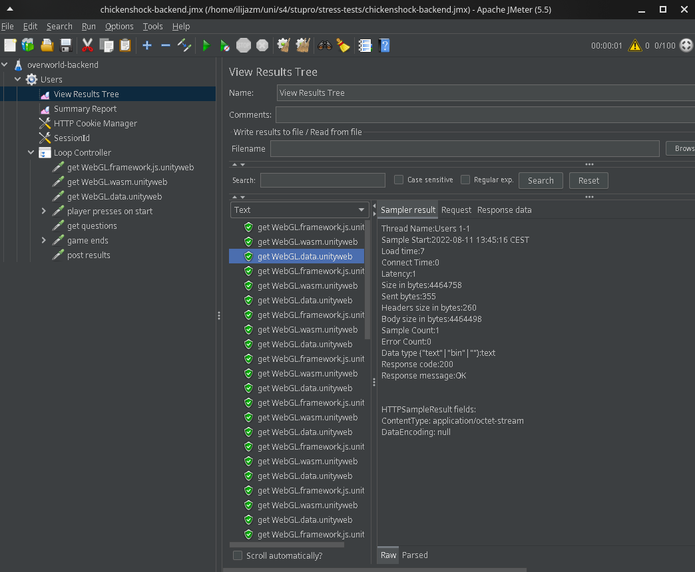

# Run stress tests

## Prerequisite

[Download JMeter](https://jmeter.apache.org/download_jmeter.cgi)

## Open jmeter file

Open a test file (ends with `.jmx`) by doing one of the following things:

Run

```
jmeter -t /path/to/file.jmx
```

Or open up JMeter > `file` > `open`

## Run jmeter test

Press on the start button in the toolbar.



To stop it, press the obvious `Stop` button.

### From the command line

Use
```bash
$JMETER_EXECUTABLE -t $LOAD_PROFILE -n $ARGUMENTS
```
to test a load profile without the UI.

## See reports

Navigate to `View Result Tree` on the left.



## Clear reports

Click on one item in the tree and press <kbd>Ctrl</kbd> + <kbd>E</kbd>.
