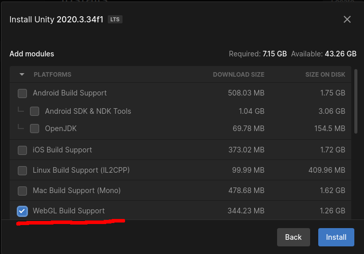

# Build Unity project

## Prerequisite

If you install a new Unity version make sure to check `WebGL Build Support`.

## Setup Unity project player settings

### Switch platform to WebGL

Goto `File`>`Build Settings...` and press on `WebGL` and then on the button on the bottom right corner `Switch Platform`. If the `Switch Platform` button is not present but a `Build` button is, that means that your current platform already is `WebGL` which in this case you don't need to switch platforms.

### Disable Encryption

Goto `Edit`>`Project Settings`>`Player`>`Publishing Settings` and set `Compression Format` to `Disabled`

## Build WebGL project

Goto `File`>`Build Settings...` and make sure `WebGL` is selected and is the target. If not you need to press the button on the bottom right corner `Switch Platform`. Then press `Build` and set the path to `/Build`.
