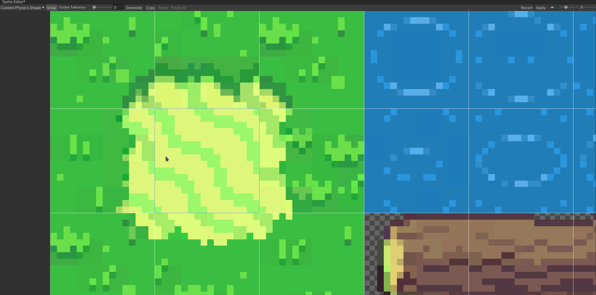

# Get sprites from tilemap

Import your sprite into Unity. Then select it in the project explorer.

In the inspector set the following fields:

- Sprite Mode: `Multiple`
- Pixels Per Unity: the amount of pixels for each tile
- Filter Mode: `Point (no filter)`

Then select the sprite editor and apply.

In the sprite editor select `Slice` and set the type to `Grid by Cell Size`. Set the pixel size to the size of each tile and preview the tiling in the background. Finally press on `Slice` and in the sprite editor on `Apply`.

Now you can unfold the tilemap to preview all sprites.

# Create tilemap

## Install Tile Palette

Navigate to `Window`>`Package Manager`.

On the top right select `Packages: Unity Registry`

Now search for `Tilemap` and install `2D Tilemap Editor` and `2D Tilemap Extras`.

## Create Tile Palette

Navigate to `Window`>`2D`>`Tile Palette`.

You will have a new tileset window which you can move arround and dock to the unity editor.

There you need to press `Create new palette`. Give it a name, make sure you select a `Rectangle` grid and chose a target directory to store it.

Next, select all sprites you want (e.g. all tiles sprites from a tilemap) and drag them over. Select a target directory where you want to store all tiles. This process can take a while. The result should look like this:

### Rotate or Flip sprites

On the Tile Palette toggle `Edit` and then use the cursor tool to select a tile. In the Inspector you can now rotate, move or split the tile by setting the scale to a negative value. Make sure to toggle the edit mode again when you finished.

# Setup colliders

1. Open up the sprite editor (on how to do that see [Get sprites from tilemap](#Get-sprites-from-tilemap))
1. On the top press the dropdown `Sprite Editor` and select `Custom Physics Shape`.
1. Select the tile you want to edit. Press on `Generate` at the top left.
1. Select the edges and fit the collider so only the part that should collide with the player is in that are like that: 
1. when you finish press on `Apply` at the top right.

## How to add a node

Just hover with the mouse on the center of two nodes and the option to create a new node will appear.

### How to delete a node

Select the node and then press the <kbd>del</kbd> key.

### Helpful tips

Use the `Copy` and `Paste` buttons on the top of the sprite editor.

### How to disable collision for a sprite entirely

1. Select the tile
1. Press on `Generate`
1. Delete all points except the last three points. If you delete all points the collider will be set to "automatic" again.
1. Move all three points together to a corner of the sprite.

Now no collider will be generated.

#### I add a collider but the collision doesn't work

1. Did you press on apply?
1. Select all tilemaps and toggle the composite checkbox in the `tilemap collider 2d`: 
1. If all of this didn't work try this: In the sprite editor, copy the name of the tile (by clicking on it) and then search for that name in the project explorer. Look at the sprite's asset in the inspector and make sure that `Collision Type` is set to `Sprite` (NOT `Grid`!):

# Setup sprite rendering order

## Configure rendering order

## Fix rendering order for tiles

Sometimes the player is drawn on top of element that should in theory be above him: 

### Explanation

You can skip this part if you're not interestend in the cause of this problem and go directly to [Fix](#fix).

Unity will render the player on top of a tile if the player's y-position if less than the y-position of the pivot (origin) of the tile. The pivot of the player as well as the default origin of the tile is directly in the center.

In this situation the player is lower than the top part of the shelf so it's getting drawn on top of the shelf. The fix: move the origin of the shelf to the bottom.

### Fix

1. Select a tile in the sprite editor and update the pivot to be: lower than the sprite, if the player should be drawn behind the sprite at all times, above the sprite, if the player should be drawn above the sprite at all times.
1. Now the tiles look a bit wonky. In the tile palette, select the select tool and toggle `Edit`. Press on the sprites origin that got moved (this could be directly one tile below the visible sprite) and in the inspector select update the offset to be y -1.
1. redraw the tile

# Draw unity scene

In the Hirarchy right click>`2D`>`Tilemap`>`Rectangular`.

Make sure the tilemap has to position `0,0,0` in the inspector. Create some more layers in the grid. By duplicating the just created `Tilemap` object.

Set the z position of the second layer to `-0.1`, the z position of the third layer to `-0.2`, etc.

Now you can select tiles from the tile palette and select the brush to draw. You also have a fill tool and a rectangle tool.

Make sure you draw your ground on the lowerst layer (layer 1). Go to the tile palette and set `Active Tilemap` to the first layer. Draw objects that should be drawn above layer 1 on layer 2. See results of using the layers:

## Some tips

`Ctrl + Click or Drag` picks the current tile and you can now draw with that.
`Shift + Click` deletes the tile.
