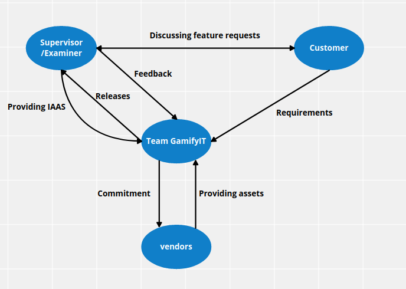
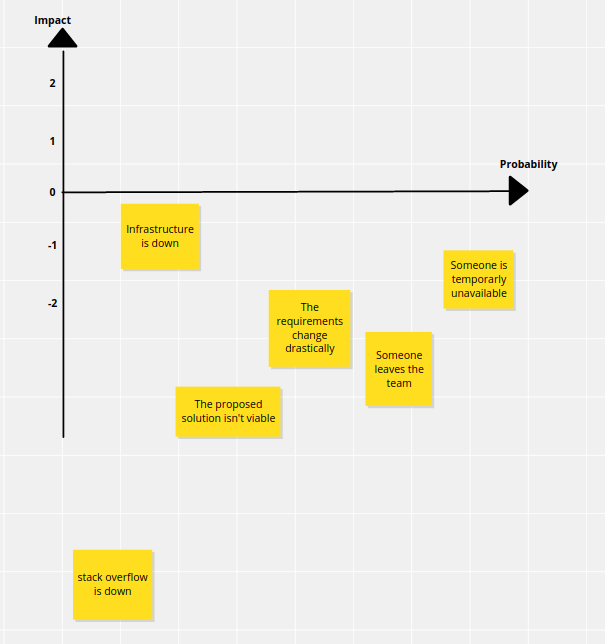

# Agile Charter

This document presents an overview of the roles, our intended goals and our working agreements. It should help us to identify risks or boundaries and to focus on our main goal. Every team member committed to this file.

## Purpose

### Vision

For students in the first semester, the "Gamify-IT" is a online learning platform that teaches computer science basics through minigames.
Unlike ordinary lectures, our product takes a different approach by combining learning with gamification aspects.

### Mission

We build an online minigame platform.  
Features:

- static world you progress by completing minigames
- replacable and interchangable minigame content
- you gain knowledge
- easy to extend with more minigames
- easy to access through the web browser

### Mission Tests (possibly DoD)

- [ ] Users can successfully register and login to the platform
- [ ] An overworld exists where users can wander around and start minigames
- [ ] At least 5 minigames exist
- [ ] Minigames are independent components
- [ ] The minigames can be played as intended
- [ ] A progression system (-> gamification) exists
- [ ] The entire platform can be used by a desktop browser
- [ ] All Code Guidelines have been met
- [ ] The customers (Professor Becker et al.) are happy

## Alignment

### Values & Principles

- Open: We discuss problems within the team
- Availability: We check our discord chats once every working day and answer them
- Feedback: Through multiple iterative releases the customer has the ability to frequently provide feedback
- Fairness: Everyone is treated equally
- Death of the author: Review the code, not the author

### Core Team

- Leon Hofmeister: Project manager / Quality Control
- Timo Schnaible: Project manager deputy / DevOps deputy
- Michael Linder: documentation responsible
- Ilijaz Mehmedovic: documentation responsible deputy / Devops
- Gilian Rehm: Quality Control
- Max Kästner: Login
- Martin Lautenschlager: Overworld
- Leon Layer: Minigames
- Levi Otterbach: Minigames
- Aaron Schmid: developer
- Jonathan Scholz: developer
- Florian Wüst: Overworld
- Jiacheng Qian: agile Coach
- Lavinia Stiliadou: agile Coach

### Working Agreement (wie stellen wir uns die (tägliche) Arbeit miteinander vor?)

- We check our discord chats once every working day and answer them
- We communicate when we're unavailable
- We help each other
- Wise use of meeting time

## Context

### Committed Ressources

- Room
- GitHub (documentation, development)
- Discord (internal communication)
- TimeTree (Availability overview)
- Conceptboard (Brainstorming)

### Boundaries

### Prospective Analysis

