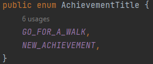
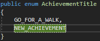

# Add achievements

## Overview

Achievements are a good way to motivate players to do certain things. So if you want to reward players for completing some task or simply want to guide the playing in a specific direction, consider adding an achievement for that.

## How to add an achievement

To add an achievement, you need to add it to the `overworld backend` and adjust everything needed to track the progress of the achievement.

### Overworld Backend

You have to do the following in the overworld backend:

1. Add the title of the new achievement to the `AchievementTitle` enum, located at `src\main\java\de\unistuttgart\overworldbackend\data\enums`  

2. Add all category keyword to the `AchievementCategory` enum, located at `src\main\java\de\unistuttgart\overworldbackend\data\enums`, if the keywords are not yet present  

3. Add the achievement (with the `title`, `description`, the `name of the the image` to show, the `categories` and a `number` to reach) to the list in the `updatePlayerStatisticAchievements` in the `AchievementService`, located at `src\main\java\de\unistuttgart\overworldbackend\services` and add it to the `achievementRepository`.  

### Overworld

If the achievement is tracked in the overworld, you need to additionally do the following:

1. Add the title of the new achievement to the `AchievementTitle` script located at `Assets/Scripts/Achievements`.  

## How to track progress of an achievement

### General

To update the progress of a player of the achievement, you need to send a `PUT request` to the overworld backend, subpath `/players/{playerId}/achievements/{achievementTitle}` with an `AchievementStatisitcDTO` json containing the progress. You can find the `AchievementStatisitcDTO` class at `src\main\java\de\unistuttgart\overworldbackend\data`.

### Overworld

If the achievement is tracked in the overworld, you can use the `UpdateAchievement`and `IncreaseAchievementProgress` functions of the `GameManager` singleton instance.  

