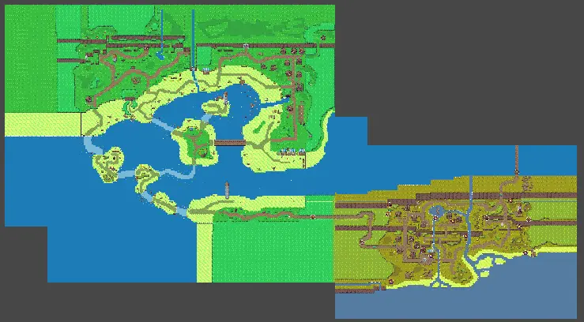

# Add and set up areas

## Overview

To add new areas, you first need to [create it](create-new-world.md) and set up all needed objects of the area. In case of a world, you need to put it at the right place and set up the [world loading](world-loaders.md).

## How to add an area

To add a dungeon, you simply have to add it to a world using a [scene transition](scene-transition.md).  
To add a world, you need to set the position of the `Grid` game object so that it connects with the nearby worlds.  
  
To make this easier, you can load multiple worlds at once. To do that, open the new world and drag and drop a nearby scene in the `Hierarchy`.  

## How to set up an area

To set up an area, you need to set up the following parts:  

1. The [Minigames](set-up-minigames.md)
2. The [NPCs](set-up-npcs.md)
3. The [Barriers](set-up-barriers.md) connecting it to other worlds
4. All [Dungeon entrance or exit points](scene-transition.md)
5. The [Minimap](set-up-minimap.md)
