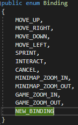
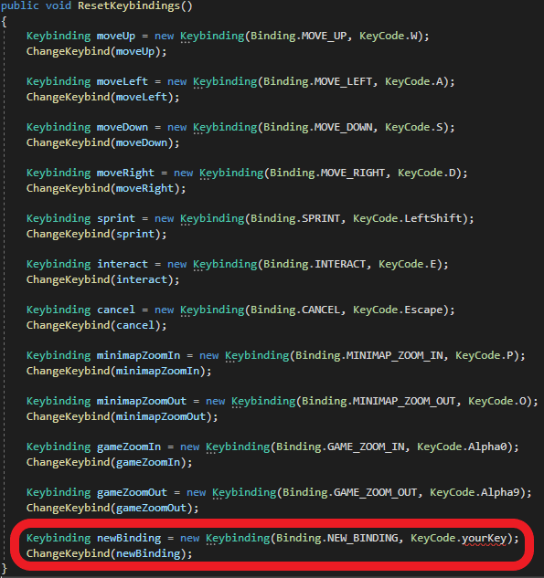
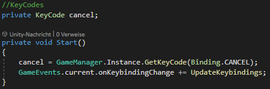
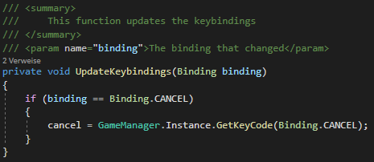

# Add keybindings

## Overview

Each player has their preferences regarding keyboard shortcuts.  
Therefore, we support persistent, player specific keybindings across all courses.  
That means that a player has to configure his bindings only once and can then use them in all his courses.

## How to add a keybinding

If you want to add another action, you have to add it to the list of existing ones, in order to use it and for players to be able to bind it to their prefered key.

### Overworld

You have to do the following in the overworld:

1. You need to add the new action to the script `Binding` located at `Assets/Scripts/Keybinding`.  

2. You need to assign a default key in the function `ResetKeybindings` in the script `GameManager` located at `Assets/Scripts/GameManager`. Simply create a `Keybinding` object with your binding and your chosen key as a `KeyCode` object and call the function `ChangeKeybind` with that `Keybinding` object. For reference, take a look at the other keybindings.  

You need to assign an unused key, so you cannot chose a key already binded to another action!

### Overworld Backend

You have to do the following in the overworld backend:

1. You need to add the new action to the enum `Binding` located at `src/main/java/de/unistuttgart/overworldbackend/data/enums/`.

It has to be the same action as in the overworld!

## How to use the binded key

To use the new binding in a script, add a `KeyCode` object as an attribute and assign it in the `Start` function by calling the `GetKeyCode` function of the `GameManager` singleton instance and provide your action.

You also need to subscribe to the `onKeybindingChange` game event and add a key changing function to your script.

