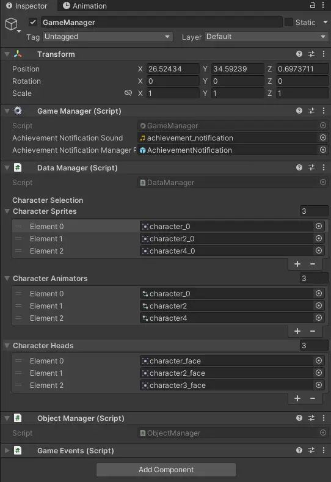

# Character Selection

## Overview

Choosing and selecting between various characters and accessories allows players to personalize their game, resulting in improved user experience, motivation, and engagement.

Currently, the character selection includes complete outfits and accessories like heats or glasses.

## The Character Selection Menu

The character selection can be accessed in the `pause menu` under `character selection`.

## How to create a new Character

Before adding a new character to the game, you need to design and create the required assets. Feel free to take a look at the already existing characters and animations.

- Sprites (saved under `Assets > Sprites > Characters`)
- Head (saved under `Assets > Tiles > HUD`)
- Animations (saved under `Assets > Animations > Player`)

## How to add a new Character to the Character Selection

1. Required components in order to add a new character
   - Sprites
   - Image of the character head for the minimap
   - Animator 
2. Add the new character sprite, character head and animator to the corresponding lists in the `data manager` in the `player scene`
    

## Other 

The character is saved in the backend when the player goes back to the lecturer interface or starts playing a minigame. The saving process happens automatically and can be found 
[here](./save-player-data.md).

