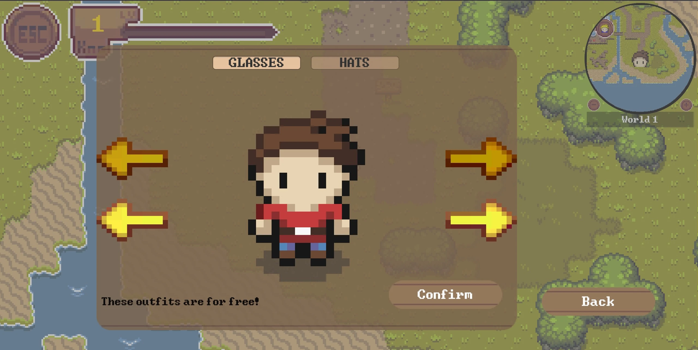

# Character Selection
Choosing and selecting between various characters and accessories allows players to personalize their game, resulting in improved user experience, motivation, and engagement.

Currently, the character selection includes complete outfits and accessories like heats or glasses.

## The Character Selection Menu

The character selection can be accessed in the `pause menu` under `character selection`.
The upper selection is used to choose the accessory and the lower one selects the outfit.
You can switch between hats and glasses with the buttons at the top.

Not all outfits are unlocked immediately, most of them need to be bought in the shop.
Locked outfits will still be displayed but cannot be equipped. Some outfits also cannot equip any accessories.

## How to create a new Character

Before adding a new character to the game, you need to design and create the required assets. Feel free to take a look at the already existing characters and animations.

- Sprites (saved under `Assets/Sprites/character/`)
- Head (saved under `Assets/Tiles/HUD/`)
- Animations (saved under `Assets/Animations/Player/`)

For more information about the creation process see [here](../../illustrator/How_to_add_new_skins.md).

## How to add a new Character to the Character Selection

To expand the character selection with your newly created character (or accessory) you need to edit the CharacterSelection.cs script
located at `Assets/Scripts/HUD/`.\
There you need to adjust the following parts:
- `numberOfCharacters`, `numberOfGlasses` or `numberOfHats` variable depending on what was added
- in the `SetupDictionaries` method you need to add your outfit to both dictionaries, following the pattern already used
- if you wish to add a text when the outfit is displayed see the `UpdateAccessoryWarnings` method
- TODO

## Other 

The character is saved in the backend when the player goes back to the lecturer interface or starts playing a minigame. The saving process happens automatically and can be found 
[here](./save-player-data.md).

