# How to create a new World

This tutorial is for people interested in creating their own World/Dungeon the way we created one. This tutorial will be about creating a new world, but creating a dungeon works equally.

## Tileset

Before starting to paint a world you need to think about in which theme the world should be. We used the [Zelda-like tileset](https://opengameart.org/content/zelda-like-tilesets-and-sprites) for all our Worlds and made some modifications to it according to our own needs (including a few custom sprites). See [new tilesets](https://github.com/Gamify-IT/overworld/blob/main/new-tilesets/README.md) for some info about how to change the look of the tileset. This tutorial works with the standard Zelda-like tileset since it is already available in the project. If you need another tileset you can refer to [setup tilemap in unity](https://github.com/Gamify-IT/docs/blob/main/dev-manuals/languages/unity/setup-tilemap-in-unity.md).

## Copying the Boilerplate Scene

Worlds are created in separate scenes. There is an empty Boilerplate scene which can be used to draw new worlds. It already has the grid and needed layers.

1. Copy the Boilerplate scene that is located in the folder `Assets/Scenes/Boilerplate`
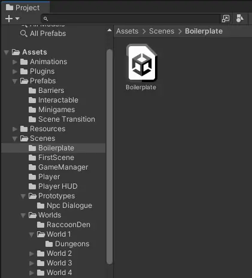
2. Create a new Folder in the `Assets/Scenes/Worlds` Folder and name it for example `World 5`.
3. Paste the copied boilerplate scene into the newly created folder and rename the scene to for example `World 5`

## Layer Information

When painting a World there are multiple layers that can be painted on. It is necessary to paint on the correct layer for everything to work correctly.  
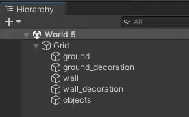

Here is an example for all the layers:  

- All layers combined: 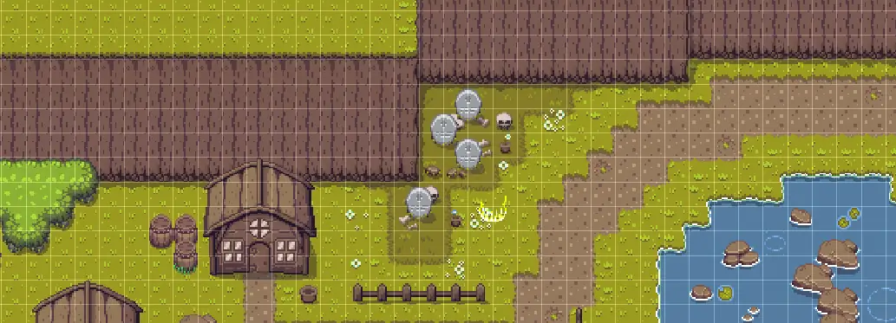

- Ground: On the layer, all ground related tiles are placed (e.g. grass, pathways, rivers, sea, etc.)
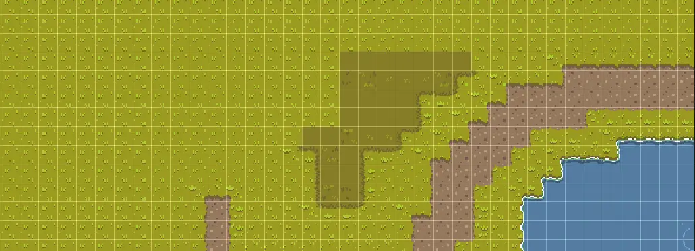
- Ground decoration: On this layer, all additional ground tiles are places (e.g. flowers, moss, little rocks, etc.)
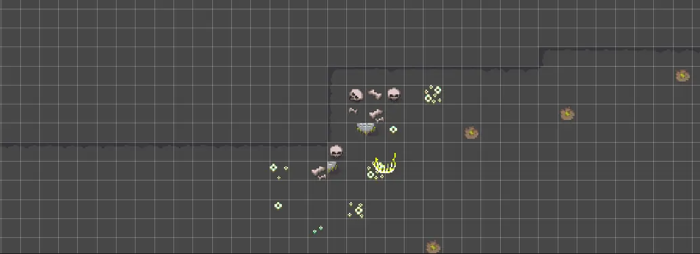
- Walls: On this layer, all tiles limiting the playable area are placed (e.g. walls)
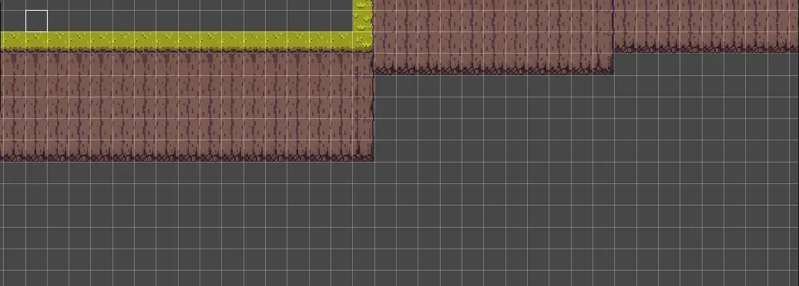
- Wall decoration: On this layer, all additional wall tiles are placed, for example for detailing or realism (e.g. shadows, little rocks, lamps, etc.)  
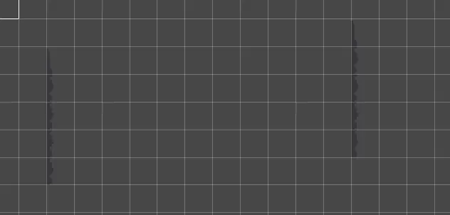
- Objects: On this layer, all big objects are placed (e.g. trees, houses, fences, stones, etc.)
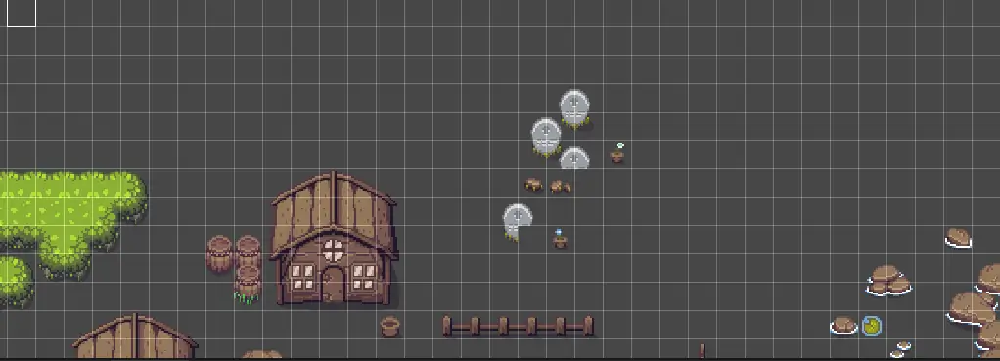

## Start painting the World

1. In Unity open the tile palette.  
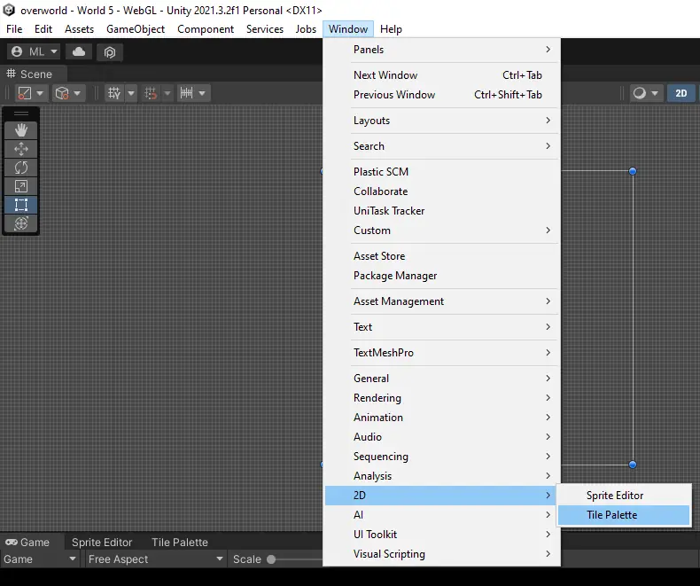
2. In the tile palette you can choose the tilemap you want to use for drawing. There are a few that were created by us.  
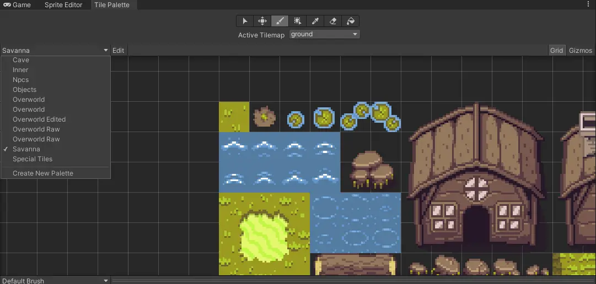
3. Now you need to select on which layer you want to draw (see [Layer Information](#layer-information))  
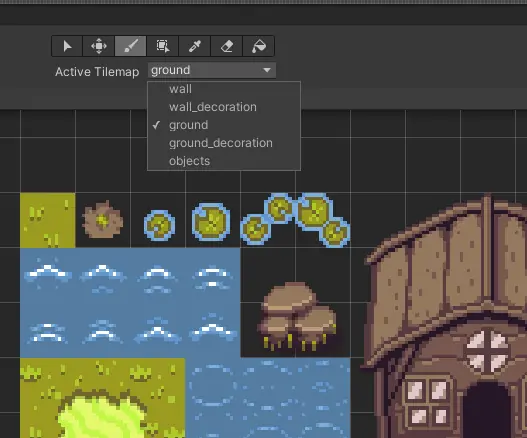
4. There are different tools for drawing.  
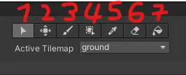  
4.1 Select tool  
4.2 Move tool (needed for editing the tilemap)  
4.3 Standard paint tool. Paints the selected tiles to the selected layer.  
4.4 Box paint tool to paint large area with select tile.  
4.5 Pick tool for picking a tile of a layer.  
4.6 Eraser for erasing.  
4.7 Bucket tool for filling areas.
5. With this info you can start creating your own World.
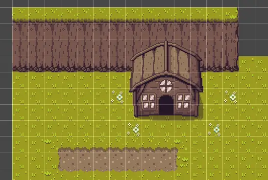
