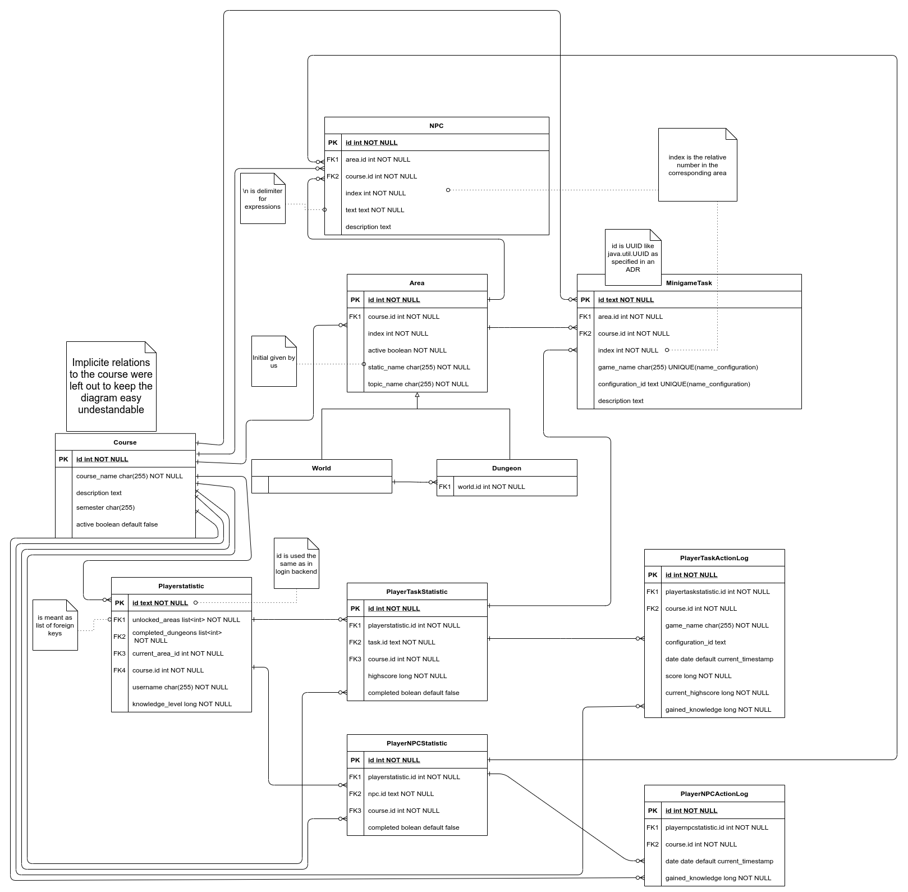
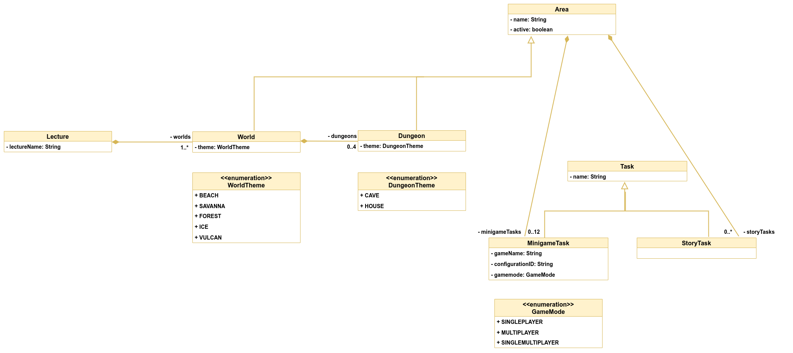

# Database model and type

## Database model

## What kind of data do we need to store?

### Configuration specific data

- configure worlds
  - name
  - spawnpoint
  - active or not
  - dungeons
  - tasks
- configure dungeons
  - name
  - spawnpoint
  - active or not
  - tasks
- configure tasks
  - name
  - game
  - configurationId

### Player-specific data

- userId
- username
- unlocked areas
- completed tasks
- completed dungeons
- location of the player
- knowledge level
- [carried items]
- [life points]

#### Experience System

x is maximum knowledge that can be achieved for this task

The player receives a share of 2% of x for every score under his highscore

**e.g.**

1st attempt: Player achieves 60%
  - 60% is stored for this task as highscore in overworld-backend
  - Player gets x * 60% + x * 0% * 2% knowledge level

2nd attempt: Player achieves 50%
  - no new highscore scored
  - Player gets x * 0% + x * 50% * 2% knowledge level

3rd attempt: Player achieves 80%
  - 80% is stored for this task as highscore in overworld-backend
  - Player gets x * (80% - 60%) + x * 60% * 2% knowledge level

## What kind of databases exists?

### SQL (Structured Query Language)

- MySQL or PostgreSQL
- relational database
- structured through relational data
- SQL is a good choice when working with related data.

### NoSQL

- Redis or Memcache
- non-relational database (key-value)
- allow a dynamic schema for unstructured data
- NoSQL is good when it’s more important that the availability of big data is fast
- NoSQL is also a good choice when there are large amounts of (or ever-changing) data sets or when working with flexible data models or needs that don't fit into a relational model

## What should we use?

### For Configuration specific data

- clear point for SQL, the areas, dungeons, and tasks are all in relationships and do not get often updated.

### For Player-specific data

- the player-specific data should also be stored in a SQL database, there are relations from unlocked areas to the defined areas, completed dungeons, tasks, ...

## Result

SQL is the favorite here because of the many relations we have. For our project, it does not make a difference what type of database system we use because the performance will be similar and the features of all databases are sufficient for us.

## Result after Review

An ORM should be used. We have selected PostgreSQL as our database.
