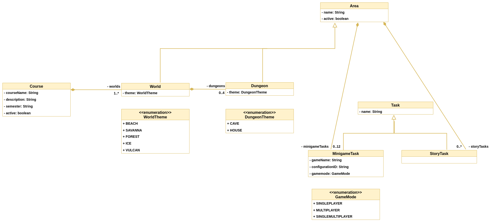

# What kind of data do we need to store?
## Configuration specific data
- configure worlds
   - name
   - spawnpoint 
   - active or not
   - dungeons
   - tasks 
- configure dungeons
   - name
   - spawnpoint 
   - active or not
   - tasks
- configure tasks
   - name
   - game
   - configurationId
    

## Player-specific data
- userId
- username
- unlocked areas
- completed tasks
- completed dungeons
- location of the player
- knowledge level
- [carried items]
- [life points] 

# What kind of databases exists?
## SQL (Structured Query Language)
- MySQL or PostgreSQL
- relational database
- structured through relational data
- SQL is a good choice when working with related data.

## NoSQL
- Redis or Memcache
- non-relational database (key-value)
- allow a dynamic schema for unstructured data
- NoSQL is good when it’s more important that the availability of big data is fast
- NoSQL is also a good choice when there are large amounts of (or ever-changing) data sets or when working with flexible data models or needs that don't fit into a relational model

# What should we use?
## Configuration specific data
- clear point for SQL, the areas, dungeons, and tasks are all in relationships and do not get often updated.

## Player-specific data
- the player-specific data should also be stored in a SQL database, there are relations from unlocked areas to the defined areas, completed dungeons, tasks, ...

# Result

SQL is the favorite here because of the many relations we have. For our project in the overworld, it does not make much difference whether we use MySQL or PostgreSQL, because the performance does not have many differences and the features of both databases are completely sufficient for us

## Result after Review
Of course, an orm is used. We have selected PostgreSQL as database.