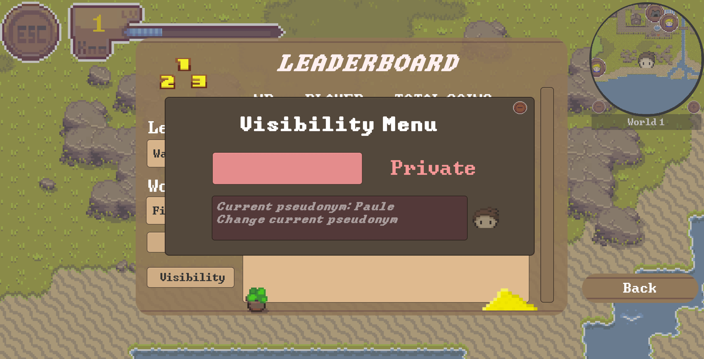

# Leaderboard

The total reward coins earned in the minigames are displayed on the leaderboard, which can be accessed by clicking the `knowledge button` located in the Player HUD. 
This provides a clear overview of the player's accumulated progress and achievements across all games.

Based on the total number of points scored, players are placed into one of `four competitive leagues`. 
These leagues reflect the player's overall performance and rank, offering a sense of progression and accomplishment. 
As players earn more reward coins and improve their scores, they can advance through the leagues, unlocking new challenges and opportunities to showcase their skills. 
The leaderboard acts as a dynamic tracker of their journey, allowing them to compare their progress with others and strive for higher ranks.

## Leagues

Based on the total number of points scored, players are placed into one of four competitive leagues:

1. Wanderer: This is the entry-level league where all players start. It represents the beginning of their journey and serves as the starting point for progression.
2. Explorer: The next league up from Wanderer, Explorer is for players who have demonstrated a certain level of skill and commitment.
3. Pathfinder: Players who advance beyond Explorer move into the Pathfinder league, where they face more challenging scenarios and competition.
4. Trailblazer: The highest league, Trailblazer, is reserved for the top players who have achieved exceptional performance and are at the pinnacle of the game.

#### How to add a league and/or change the ranges between the leagues

To add a league or change the range, you need to add it to the [overworld](https://github.com/Gamify-IT/overworld).

The league of a player is calculated directly in the `PlayerStatisticData` class of the overworld frontend.

So if there is a new league or the range changes one can easily change it in the `calculateLeagueOfPlayer()` method.

## Leaderboard features:

Pseudonym and Visibility:

By default, players are assigned the pseudonym "Traveller," keeping their identity hidden on the leaderboard. 
Their username will only appear in the league rankings once they choose to switch their visibility to "Public" via the leaderboard menu. 
In this menu, players also have the option to update their pseudonym, with changes reflected instantly on the leaderboard.

This feature was designed to give players control over their privacy and help them feel more secure, especially when they might not perform as well. 
It ensures that players aren’t solely motivated by fear of appearing at the bottom of the leaderboard. 
Instead, they can focus on enjoying the game and improving their skills without the pressure of public judgment.

By allowing anonymity, players can choose to stay hidden while still progressing in the game and later decide to reveal their identity when they feel more confident. 
This promotes healthier competition and encourages players to participate for the right reasons—personal growth and enjoyment—rather than to avoid embarrassment. 
Additionally, it helps ensure that the motivation to climb the leaderboard comes from a desire to achieve and not just from the fear of a poor ranking.

The leaderboard includes filter options to help you view specific data more effectively. You can filter results by "World," "League," or both criteria simultaneously.
This functionality allows for a more granular analysis of performance across different worlds and leagues,
helping players track their progress and rankings in various contexts.

## Implementation Logic:

#### 1. Reward Calculation and Data Management
In the backend, reward calculation and player data management are efficiently handled to ensure a smooth and responsive gaming experience.
Each time a minigame is played, the backend processes the data received from the frontend to compute the rewards earned by each player.
This process includes updating the player’s rewards, managing their anonymity settings, and storing their pseudonym in the player statistics.

#### 2. Real-Time Updates and Leaderboard Refresh
The player statistics, including information such as rewards and pseudonym status, are fetched from the backend whenever the overworld is loaded.
This ensures that the player’s current status and rewards are accurately reflected each time they access the game environment.
As players engage in minigames within the overworld, their performance data is processed immediately.
This real-time processing updates the rewards earned and recalculates the player’s position on the leaderboard.
The leaderboard is dynamically refreshed to display the latest rankings and reward totals, providing players with up-to-date information on their progress and standing.

#### 3. Pseudonym and Anonymity Management
Any changes to a player’s pseudonym or anonymity settings are promptly updated in the backend repository.
This ensures that updates are reflected in the player’s profile and leaderboard visibility, as soon as the game is loaded.
By managing these settings in real-time, the system maintains the integrity of the gaming experience, allowing players to seamlessly control their
privacy and display preferences.

Overall, this implementation ensures that player data is accurately managed and updated correctly,
enhancing the overall gameplay experience and ensuring fair and transparent competition.
