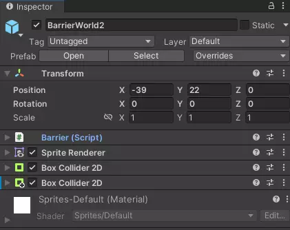

# Add and set up barriers

## Overview

Barriers are used to block access to dungeons and worlds, which have not yet been unlocked by the player.  
Once the player unlocks the area, they are removed and access is granted.

## How to add a barrier

To add a new barrier to a world, do the following:

1. Open the scene, in which the barrier should be
2. Create a new `game object` as a child of the `Barriers` game object on the hierarchy  

3. Add the `Barrier` script, two `Box Collider 2D` components and a `Sprite Renderer` component to the created game object  

4. Place the object where the barrier should be, on the pathway towards the area it should block (via the `x` and `y` coordinates)
5. Adjust the trigger area of one `Box Collider 2D` component using the `Edit collider` button to specifies the area in which the player gets information about the barrier  

6. Adjust the collider area of the second `Box Collider 2D` component using the `Edit collider` button to sets the collider of the barrier  

7. Set the `Is Trigger` flag at the first `Box Collider 2D` component (the one for the trigger area)  

## How to set up a barrier

Provide the required data for the barrier at the `Barrier` component  

1. `Type`: Select `World Barrier` to block access to another world or `Dungeon Barrier` to block access to a dungeon of the world
2. `Origin World Index`: The index of the world the barrier is in
3. `Destination Area Index`: The index of the world or dungeon the barrier is blocking access to (world or dungeon is specified in the `Type` attribute)

You also need to set up the `Sprite Renderer` component.

1. Select a sprite as the visible appearance of barrier as the `Sprite` attribute.  
  
2. Select in the `Sorting Layer` drop-down menu `BackGround`
3. The `Order In Layer` attribute has to be `4`

## Prefab

You can also speed up that process by using the provided prefab, located at `Assets/Prefabs/Barriers`.  
  
Simply drag an drop the `Barrier` object into the scene hierarchy as a child of the `Barriers` game object.
You can then skip steps `2`, `3` and `7` as well as steps `2` and `3` of the `Sprite Renderer` component.
