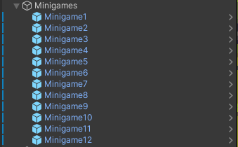
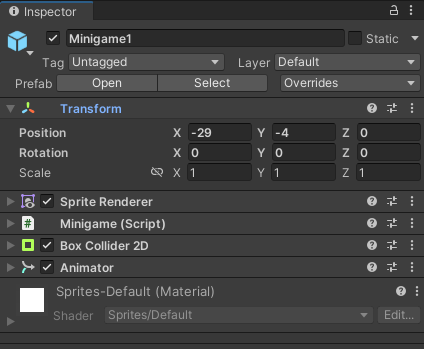
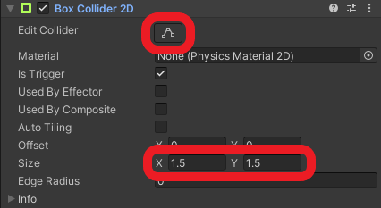
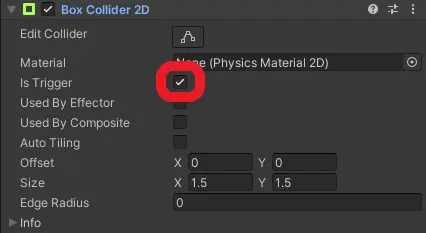
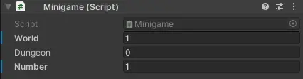
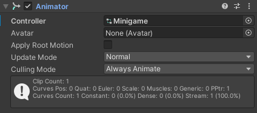
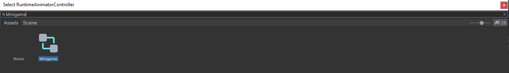
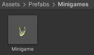
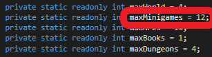

# Add and set up minigames

## Overview

Minigame spots are used to start a minigame. If the player enters the specified area, the spot activates and displays information about the minigame, the players previous success as a highscore and allows the player so start a minigame play round.

## How to add a minigame

To add a new minigame to an area, do the following:

1. Open the scene, in which the minigame should be
2. Create a new `game object` as a child of the `Minigames` game object on the hierarchy

3. Add the `Minigame` script, a `Box Collider 2D` component, a `Sprite Renderer` component and a `Animator` component to the created game object

4. Place the object where the minigame should be (via the `x` and `y` coordinates)
5. Adjust the trigger area of the `Box Collider 2D` component using the `Edit collider` button (default width and height is `1.5`)  

6. Set the `Is Trigger` flag at the `Box Collider 2D` component  

## How to set up a minigame

Provide the required data for the minigame at the `Minigame` component  

1. `World`: The index of the world the minigame is in  
2. `Dungeon`: The index of the dungeon the minigame is in, `0` if it is in a world
3. `Number`: The index of the minigame in its area (a consecutive number starting from `1`)

You also need to set up the `Animator` component. To do that, select the `Minigame` controller located at `Assets/Animations/MinigameSpot` as the `Controller` attribute.  
  

## Prefab

You can also speed up that process by using the provided prefab, located at `Assets/Prefabs/Minigames`.  
  
Simply drag an drop the `Minigame` object into the scene hierarchy as a child of the `Minigames` game object.
You can then skip steps `2`, `3`, `5` and `6` as well as setting up the `Animator` component.

## Disclaimer

If you add a minigame, you have to check whether the `Number` attribute is greater than the maximum amount of minigames specified. If that is the case, you need to change the `maxMinigames` attribute of the `GameSettings` script located at `Assets/Scripts/GameManager`.  

