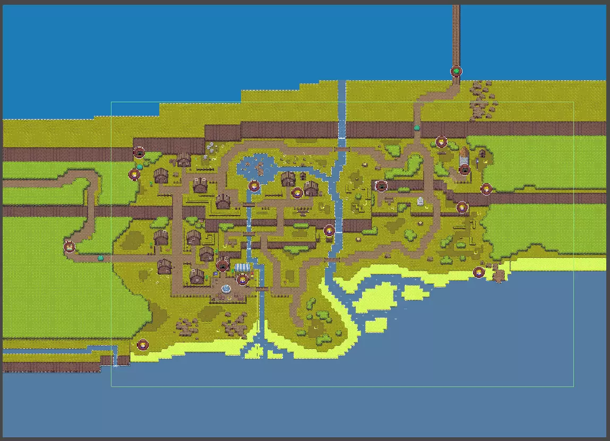
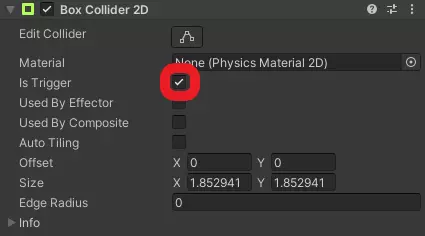

# Set up the minimap and add minimap icons

## Overview

The minimap helps the player to orientate in areas, and highlights important things such as NPCs, dungeon entry points, or connections between worlds.

## How to set up the minimap

For the minimap to work correctly in an area, you need to set up the following parts:

1. The [minimap area name](#how-to-set-up-the-minimap-area-name)
2. The [minimap icons parent object](#how-to-set-up-the-minimap-icons-parent-object)
3. The [minimap icons](#how-to-add-minimap-icons)

## How to set up the minimap area name

1. Open the scene, for which you want to set up the minimap area name
2. Create a new `game object` on the hierarchy  

3. Add the `Minimap Area Name` script and a `Box Collider 2D` component to the created game object  

4. Adjust the trigger area of one `Box Collider 2D` component using the `Edit collider` button in such a way that it covers the entire area  
  

5. Set the `Is Trigger` flag at the `Box Collider 2D` component  

6. Set up the `Minimap Area Name` component by adding the name of the area as the `Area Name` attribute  

## How to set up the minimap icons parent object

1. Open the scene, for which you want to set up minimap icons
2. Create a new `game object` called `MinimapIcons` on the hierarchy
3. Set the `Tag` attribute in the `Inspector` to `MinimapIconsParent`  

If the area is a world, you also need to do the following:

1. Create a new `game object` as a child of the `MinimapIcons` game object on the hierarchy  

2. Add the `Minimap Icons Unloading` script and a `Box Collider 2D` component to the created game object  

3. Adjust the trigger area of one `Box Collider 2D` component using the `Edit collider` button in such a way that it covers the entire playable area area of the world  
  

4. Set the `Is Trigger` flag at the `Box Collider 2D` component  

5. Set up the `Minimap Icons Unloading` component by adding the area name as the `Name Of Current Scene` attribute  

## How to add minimap icons

You can add as many minimap icons as you want. Simply do the following:

1. Create a new `game object` as a child of the `MinimapIcons` game object on the hierarchy  

2. Add the `Minimap Icons Unloading` script, a `Box Collider 2D` component and a `Sprite Renderer` component to the created game object
3. Set the `Tag` attribute in the `Inspector` to `MinimapIcon`
4. Set the `Layer` attribute in the `Inspector` to `Minimap`  

5. Adjust the trigger area of one `Box Collider 2D` component using the `Edit collider` button to cover the area of the minimap icon  

6. Set the `Is Trigger` flag at the `Box Collider 2D` component  

7. Set up the `Minimap Icons Unloading` component by leaving the `Name Of Current Scene` attribute blanc  

You also need to set up the `Sprite Renderer` component.

1. Select a sprite as the icon you want as the `Sprite` attribute.  
  
2. Select in the `Sorting Layer` drop-down menu `MinimapIcons`
3. The `Order In Layer` attribute has to be `0`

If you don't want the minimap icon to be removed once you walked by it, for example because it shows the position of a NPC and therefor should always be active, you have to remove the `Box Collider 2D` component.
