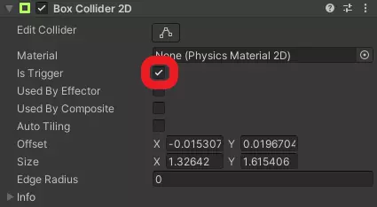
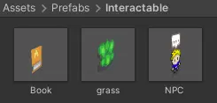

# Add and set up NPCs

## Overview

NPCs are used to impart knowledge to the player. The course creator can set dialogues and texts to help the player to complete minigames. Once a player approched an NPC, he can talk to him as often as he likes to.

## How to add a NPC

To add a new NPC to an area, do the following:

1. Open the scene, in which the NPC should be
2. Create a new `game object` as a child of the `NPCs` game object on the hierarchy

3. Add the `NPC` script, a `Box Collider 2D` component, a `Sprite Renderer` component and a `Capsule Collider 2D` component to the created game object

4. Place the object where the NPC should be (via the `x` and `y` coordinates)
5. Adjust the trigger area of the `Box Collider 2D` component using the `Edit Collider` button (this sets the area the player can talk to the NPC)
6. Adjust the trigger area of the `Capsule Collider 2D` component using the `Edit Collider` button (this sets the collider of the NPC)  

7. Set the `Is Trigger` flag at the `Box Collider 2D` component  

## How to set up a NPC

Provide the required data for the NPC at the `NPC` component  

1. `World`: The index of the world the NPC is in  
2. `Dungeon`: The index of the dungeon the NPC is in, `0` if it is in a world
3. `Number`: The index of the NPC in its area (a consecutive number starting from `1`)
4. `Image Of NPC`: The image shown in the dialogue box
5. `Name Of NPC`: The name of the NPC

You also need to set up the `Sprite Renderer` component. 

1. Select a sprite as the visible appearance of NPC as the `Sprite` attribute.  
  
  
2. Select in the `Sorting Layer` drop-down menu `BackGround`
3. The `Order In Layer` attribute has to be `4`

## Prefab

You can also speed up that process by using the provided prefab, located at `Assets/Prefabs/Interactable`.  
  
Simply drag an drop the `NPC` object into the scene hierarchy as a child of the `NPCs` game object.
You can then skip steps `2`, `3`, `5`, `6` and `7`.

## Disclaimer

If you add an NPC, you have to check whether the `Number` attribute is greater than the maximum amount of NPCs specified. If that is the case, you need to change the `maxNPCs` attribute of the `GameSettings` script located at `Assets/Scripts/GameManager`.  

