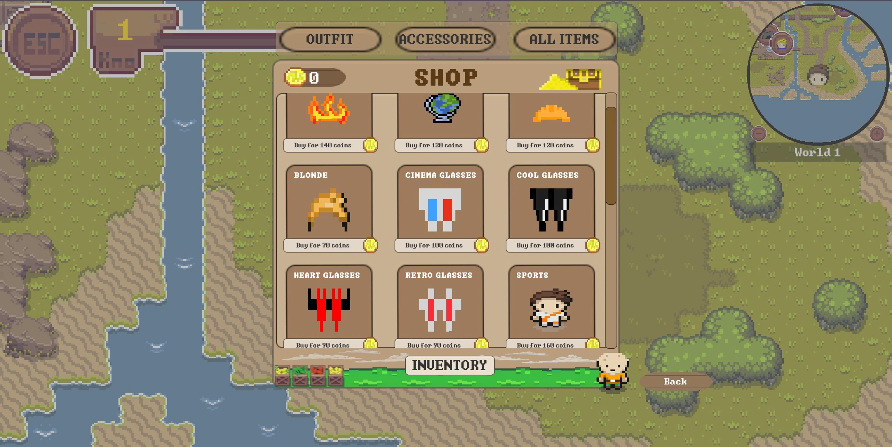

# Shop

The in-game shop provides players with a way to spend their reward coins on a variety of items, including new outfits and accessories. 
This feature adds an extra layer of personalization and motivation, allowing players to enhance their in-game appearance and express their unique style.

## Motivation

Having a shop where players can purchase skins, outfits, and accessories is a crucial component of gamification. 
It incentivizes continued play by providing tangible rewards for progress, allowing players to spend their earned rewards on customizations that enhance their gaming experience. 
This system encourages ongoing engagement and offers players meaningful choices that reflect their personal preferences and achievements.

## Access

To access the shop, click on the knowledge button located in the Player HUD. This will lead the player to the shop interface, where he/she can browse through available items.

## Shop Features:

 - Categories and Combinations:
     Currently, the shop categorizes items into two main types: "Outfits" and "Accessories." 
     Outfits include complete ensembles, while Accessories consist of items like hats and glasses.

     - Outfits: You can purchase and equip complete outfits, which offer a cohesive look.
     - Accessories: Accessories are separate from outfits and include items such as hats and glasses.
     Please note that you can only wear one outfit along with either a hat or glasses at a time. 
     This ensures that your character's appearance remains coherent while allowing for customization with a limited combination of items.

a) Item Display: Items are displayed in rows of three, with each item's image, price, and purchase status clearly visible. 
This layout makes it easy to navigate and compare different options.
b) Filters: The shop includes filter options to help you find items more efficiently. You can filter by "Outfits," "Accessories," "All," or view items in your "Own Inventory."
c) Current Budget: Your current budget is prominently displayed, allowing you to keep track of how many reward coins you have available to spend.

- Reward Coins and Budget:

Please note that the reward coins displayed on the leaderboard are separate from your shop budget. 
Reward coins earned through gameplay are accumulated and collected over time. 
The credit available in your shop budget varies based on the items you have purchased and any remaining balance from previous transactions. 
This distinction ensures that players can continuously earn rewards while managing their in-game currency efficiently.

#### Click sound

In the shop, the player will find some interactive buttons, such as the option to start or exit the game. When the player clicks on a button, they will hear a click sound.

#### Sound for successfully buying an item

When the player has enough credits and didn't buy the item so far, the player is able to buy the item by confirming it after clicking on "buy". When there is no problem at all
a cash sound will be heard.

#### Sound for an unsuccessful purchase

Once the player has pressed the button to confirm their purchase but there isn't enough credit to buy the item, the player will hear kind of an error sound and a text
which says that there isn't enough budget.

#### Sound for enough credit but already bought item

In the case of enough credits but already bought items, the player will hear a friendlier error sound.

