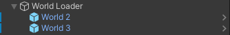
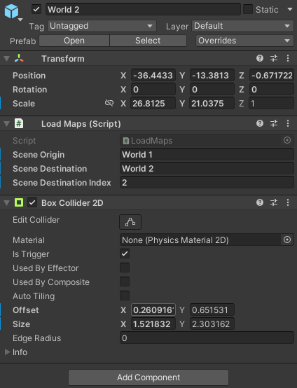
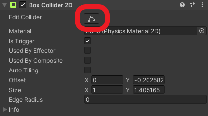
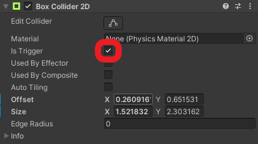
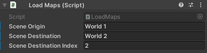
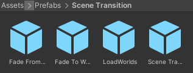

# Load worlds

## Overview

World loaders are used to dynamically load new parts of the map and unload no longer needed ones.  
By doing that, the amount of data to handle is smaller and that increases the performance of the game.

## How to create a world loader

To add a new part of the world, you need to [create it](create-new-world.md), [move it to the right place](set-up-area.md) and set up the loading and unloading.  
To do that, do the following:

1. Open the scene, in which the scene transition should be
2. Create a new `game object` as a child of the `World Loader` game object on the hierarchy  

3. Add the `Load Maps` script and a `Box Collider 2D` component to the created game object  

4. Place the object at the pathway to another part of the map (via the `x` and `y` coordinates)
5. Adjust the collider of the `Box Collider 2D` component using the `Edit collider` button  

6. Set the `Is Trigger` flag at the `Box Collider 2D` component  

## How to set up a world loader

Provide the required data for the world loading at the `Load Maps` component  
  

1. `Scene Origin`: The name of the scene, which the world loader is in (normally `World x`)
2. `Scene Destination`: The name of the scene, which the world loader should load (normally `World y`)
3. `Scene Destination Index`: The index of the world the world loader should load (in this case `y`)

## Prefab

You can also speed up that process by using the provided prefab, located at `Assets/Prefabs/Scene Transition`.  
  
Simply drag an drop the `LoadWorlds` object into the scene hierarchy as a child of the `World Loader` game object.
You can then skip steps 2 and 3.
