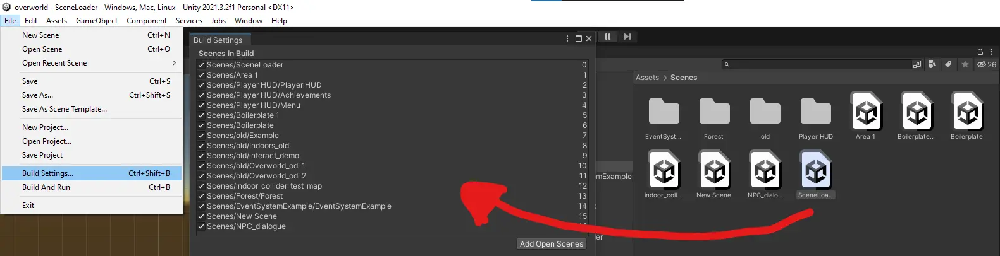

# Scene handling

Here it is documented how we currently handle multiple scenes in Unity.

## Requirements

To use our unity scenes with script code we need to add them to the Build Settings.  
  
Simply just drag and drop the required Scenes into the `Scenes in Build` area.
Every Scene that needs to be in the Final Version, has to be there.

## First Scene

We need to have a starting Scene from which every other Scene is accessible in some way. Currently we have a dummy scene called `FirstScene` which has a Script attached to it. If you load the `FirstScene` it executes a Script `LoadFirstScene.cs` that is attached to it. This Script loads the configured Scenes.

```c#
using System.Collections;
using System.Collections.Generic;
using UnityEngine;
using UnityEngine.SceneManagement;

public class LoadFirstScene : MonoBehaviour
{
    public VectorValue startingPosition;
    // Start is called before the first frame update
    void Start()
    {
        //Here you can specify the starting World/Scene
        SceneManager.LoadScene("Area 1");
        //Add HUD over it
        SceneManager.LoadScene("Player HUD", LoadSceneMode.Additive);
        // Set the desired starting position
        startingPosition.initialValue = new Vector2(-15f, 41f);
    }

    // Update is called once per frame
    void Update()
    {
        
    }
}


```

In this example, the Scene `Area 1` is loaded, and the HUD Scene is also loaded additively.  
There is also a line that specifies the starting point of the Player in the loaded Scene.  
The Script should be adapted to load whatever Scene should be the starting Scene for our Game (World Selection Hub for example).

## Other Scenes

Other scenes are loaded with the `Scene Transition.prefab`. It is using the `LoadSubScene.cs` script to load another scene and place the player character in the desired position.
Simply drag the prefab to where you want the player to transition scenes and fill out `Scene To Load` with the scene you want to load (the exact name of the scene as it is shown in the asset manager) and `Player Position` with the position the player is supposed to appear in. 

```c#
using System.Collections;
using System.Collections.Generic;
using UnityEngine;
using UnityEngine.SceneManagement;

public class LoadSubScene : MonoBehaviour
{
    public string sceneToLoad;
    public GameObject fadeInPanel;
    public GameObject fadeOutPanel;
    public float loadingTime;
    public Vector2 playerPosition;
    public VectorValue playerStorage;

    private void Awake()
    {
        if(fadeInPanel != null)
        {
            GameObject panel = Instantiate(fadeInPanel, Vector3.zero, Quaternion.identity) as GameObject;
            Destroy(panel, 1);
        }
    }

    private void OnTriggerEnter2D(Collider2D player)
    {
        if (player.tag == "Player")
        {
            playerStorage.initialValue = playerPosition;
            StartCoroutine(FadeCoroutine());
        }
    }

    public IEnumerator FadeCoroutine()
    {
        if(fadeOutPanel != null)
        {
            Instantiate(fadeOutPanel, Vector3.zero, Quaternion.identity);
        }
        yield return new WaitForSeconds(loadingTime);
        AsyncOperation asyncOperation = SceneManager.LoadSceneAsync(sceneToLoad);
        AsyncOperation loadHUD = SceneManager.LoadSceneAsync("Player HUD", LoadSceneMode.Additive);
        while (!asyncOperation.isDone && !loadHUD.isDone)
        {
            yield return null;
        }
        
    }
}

```
