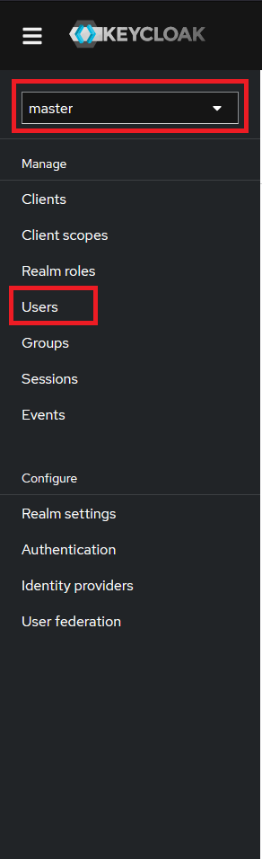

# How to use Keycloak to manage users
## Prerequisites

Gamify-IT must be running on your machine.
If this is not the case, refer to [How to run all services via docker](./README.md).

## How to use keycloak 
Open [http://localhost/keycloak](http://localhost/keycloak). 
Select the administrator console and login with `admin` as username and password.

In the keycloack interface firstly change from `master` to `Gamify-IT` in the dropdown menu.
Then navigate to `Users`.

In this overview you can edit and add users.
When adding a new user select the permissions of the user under `Join Groups` (lecturer means the user 
can create and edit courses).
After creating a new user you need to set a password under the `Credentials` tab.
You can now open Gamify-IT and login with your user under [localhost](http://localhost).