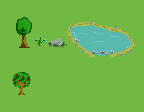
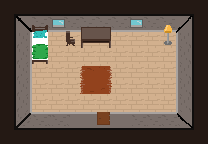
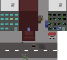
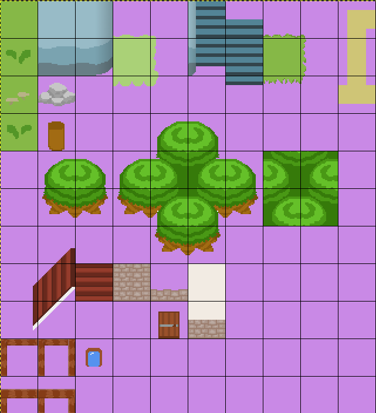
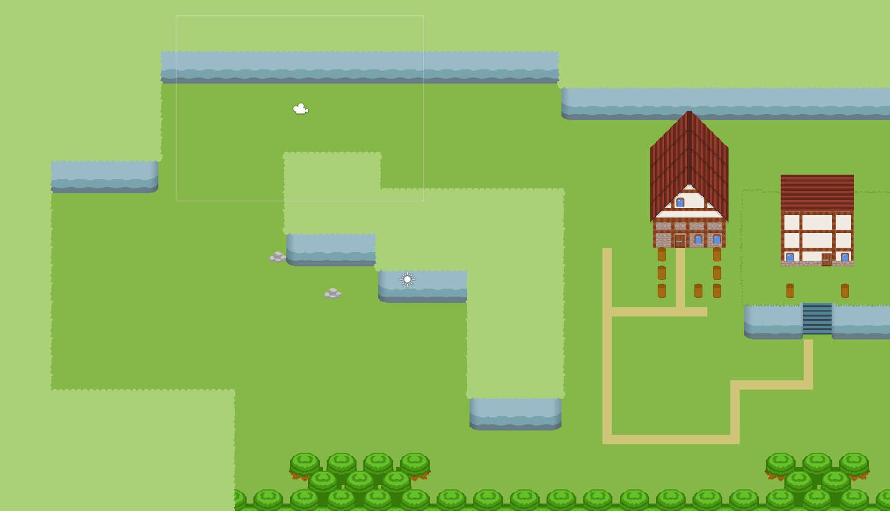

# Meeting Transcript 23.05.2022

Attempt to draw custom assets and integrate them into unity.

- present: Leon H., Florian, Jonathan, Ilijaz
- absent excused: -
- absent unexcused: -

## How we do it

### Programs

We tried different programs to draw tilesets. We don't find any good and free app except gimp.

### Speed drawing

We tried to make art in 20 minutes with a three person team. Each one drew for ten minutes and then someone else continued:

#### Results

#### Issues

Most didn't know gimp so it was a hard start

#### Conclusion

We have mixed feelings about the result. Some say it's not good enough but some think with these few assets we can create many landscapes / rooms, etc.

### Unity Tileset Editor

We tried to include drawn graphics to the unity tileset editor. We used `Unity 2021.3.2f1`.

#### Tileset

#### Unity scene

#### How we do it

We used reusable and flexible graphics that we can stack on top on each other e.g. corner tiles or wall tiles of houses.

We didn't add must detail but we can easily extends and modify a tileset and have hot reload in unity.

#### Issues

- Unity has many bugs, crashes and issues with some unity versions.
- Setup of tilemap is complicated but will get documented

#### Conclusion

It was way harder to includes existing graphics into unity than drawing them. Drawing graphics took way less time than adding these graphics into unity.

Now let's say we take an existing asset pack from the unity asset store or itch.io etc. There will be graphics missing e.g.: specific corners of a house tile that we need to add to the asset pack which will not be that bad but we definitely will draw custom graphics or modify the asset pack. Then we need (depending on the asset pack but most asset packs don't come with a unity tileset) to add all sprites into unity which will be very tedious. Then we need to draw the map which takes much time too.

Also we recomend don't draw all graphics into one huge tile set because moving them will be hard after they got add but it is possible.

We think with just a small but flexible tileset we can create huge worlds. With what we have now we can create:

- Planes
- City
- Woods
- Deep Woods
- Stony areal
- etc.
