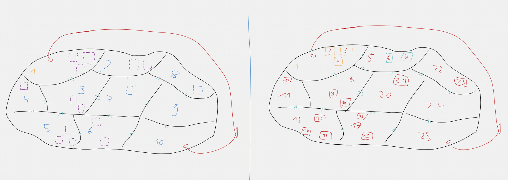

# Meeting Transcript 03.06.2022  

Define: Overworld design basic & Sprint-2-Goal  

- present: Levi, Martin, Florian, Leon H., Lavinia & Gili  

## issues  

- no sprint 2 goal  
- no plan how the overworld should look now, because of cancelled discussion in meeting yesterday  

## Meetings  

- planning meeting (02.06.2022) 
- meeting with Uwe (03.06.2022)
- debriefing -> created Issues (03.06.2022)

## Overworld  

- agreement on 
- 5 Areas = Levels with dungeons (which are in areas) = Levels   

## Sprint Goal  

- Test changeability of tiles (to sand/snow region).
- Create design for Overworld -> get approval from Uwe
- Level 1/2 + complete 1 dungeon (+ more if you manage more)
- Lecturer interface design -> get approval from Uwe
- Create and test monologue system for NPC (rudimentary)
- Create meta model for Overworld (Class Diagram like (Overworld -> Area (=level) -> Dungeon (=level)) -> get approval from Uwe
- Create Database
- Get SonarQube running

## Video of the Meeting with Uwe  
https://1drv.ms/u/s!AiLU3aoB6-18l5EEwmNFtQx1EI2Nfw?e=MXrE1h
