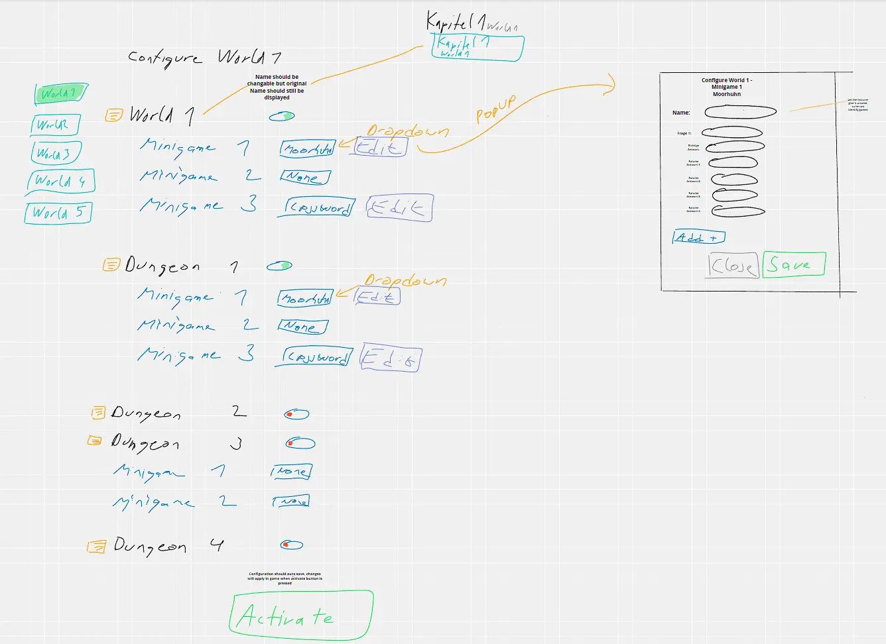
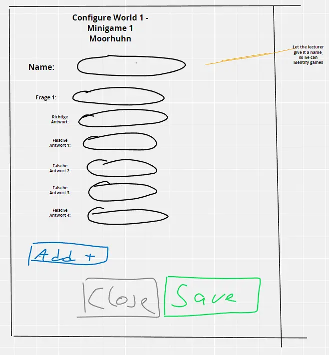

# Meeting Transcript 14.06.2022

In this meeting we created a sketch for the professor's interface and discussed about how to save configurations

- present: Aaron, Max

## Sketches

### Popup

## Problems we need to discuss with other

- Because it is a big architectural decision, we need to discuss following points in bigger team:

- How do we store configurations of different minigames (maybe see popup, e.g. Chickenshock needs 1 Question, 1 right answer, multiple false answer, Crossword puzzle 1 question, 1 answer) -> Possible Solution: Every minigame has own table in own database backend, with id and own configuration style

- Are we (the interface) the central database, where the Overworld gets information, whether e.g. the dungeon is active or not. -> Yes?
