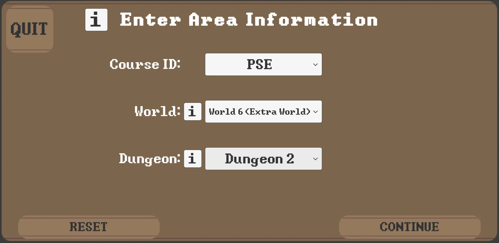
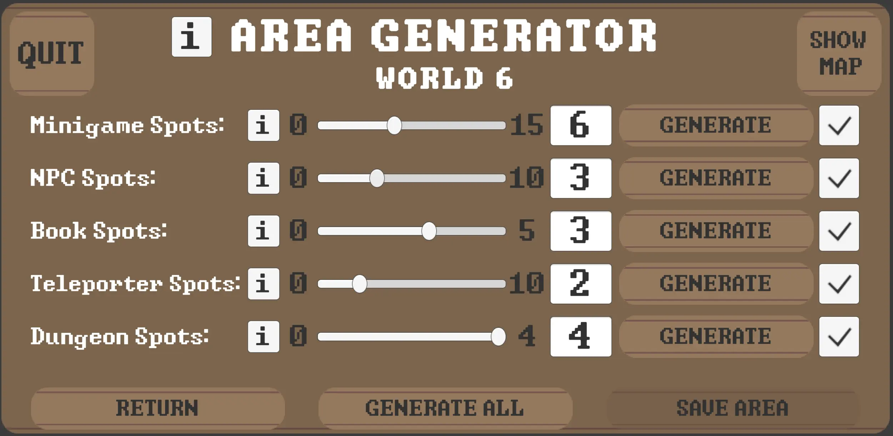

# World Generation

*Work in Progress:*

The world generation is not fully usable since transitions between generated worlds have yet to be implemented

## About the World Generation

The world generation offers the possibility for lecturers to create entirely new random worlds.
Additionally, existing worlds can be updated. \
To understand the general structure of worlds and dungeons as well as the overworld, please take a look at the corresponding 
documentation of the [lecturer interface](../lecturer-interface/README.md) and 
the [overworld](../overworld/README.md).

Gamify-IT consists of four (detailed) worlds with four dungeons each.
These can be found [here](../maps/maps.md).

The world generation extends these four worlds by four additional worlds, making it eight worlds in total. 
Only these additional ones can be edited with the world generation, guaranteeing that the four default worlds are always available, regardless of the course.

## How to create or update new Worlds and Dungeons

The world generation can be accessed in the landing page via the world generation button.

After that, there are three required steps:
1. select the desired area type as well as the course for it should be created in
2. choose the parameters to start the area generation
3. add minigames and other intractable objects the new area should contain

Below is a detailed description each of the step.

### 1. Area and Course Selection

First, you can select the course for which you want to create or update a new world. Then, you can choose the desired world and its dungeon. \
Please consider the following:
- to create a world, leave the dungeon field empty
- if an already existing world is chosen, it will be updated

### 2. Area Generation

Here, you can choose the parameters which determine the new area's appearance. Feel free to experiment in order to achieve a satisfactory result.

### 3. Area Content

Finally, you can further customize the new area and its content by selecting different amounts of object spots. 

After that, you can quit the world generation and the new area appears in the lecturer interface. There, you can configure created objects like minigames, books or NPCs.

**Note:** The PSE test course is not considered in the world generation.

