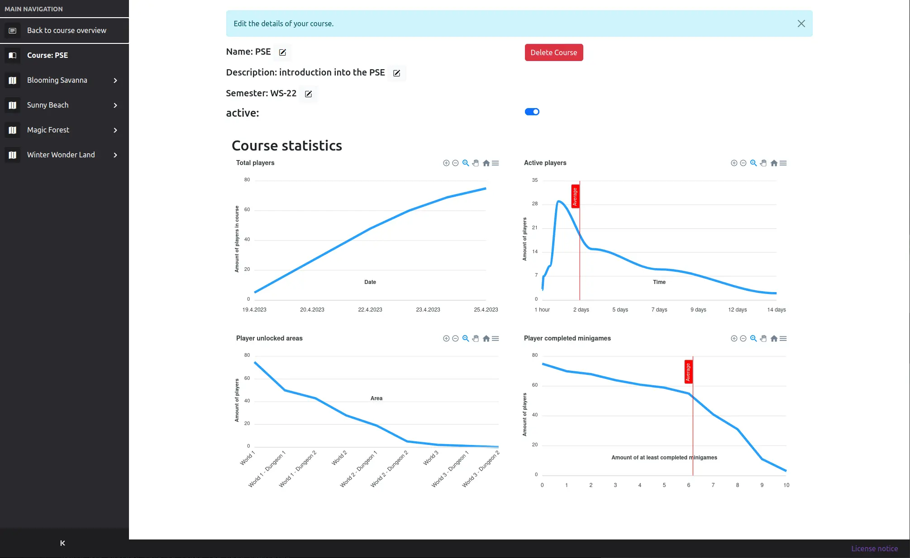

# Lecturer interface

The lecturer interface is the main interface for lecturers to create and manage courses and their content.

## About the lecturer interface

When entering the lecturer interface, you can see all current courses and additionally you can create a new course.

When you want to create a course, click on the `create new course` button.

After you created the course, the new course is displayed in the courses list.

You can click on a course to view and configure this course.  
You will get redirected to the course overview page.

The sidebar allows navigating between different configuration pages of the course.  
For editing an area, you have to click on a sidebar item marked with a map.

On this area overview page, you can see a quick overview of this area by clicking on the `Show Map` button.

You can assign a topic name to this area, or set it as active or not active.
Inactive areas will not be playable for users.
The topic name can be used to signify what you intend to teach in this area, i.e. `UML Diagrams` when this area focuses on UML content.

You can also navigate through the sub-items that were expanded after clicking on a world.
 There, you can configure the following things:

### Configure area minigames

To see where which minigame spot is, click on the `Show Map` button.  
To configure a minigame, select the spot of your choice.  
Select the minigame type of your choice in the dropdown.  
After selecting the minigame, you can start configuring the minigame by clicking on the `Edit` button. You can configure the minigame in the newly opened dialogue.  
After you configured the minigame, you need to save the configuration by clicking on the `Ok` button.  
In order to be able to quickly find a specific minigame, it is recommended to set a description. This description will nowhere else be shown.

### Configure area NPCs

You can use NPCs to give the user some hints about minigames, to teach him something, or to add some humor.  
Configuring NPCs works exactly the same as [configuring a minigame](#configure-area-minigames), except you don't have to select a type beforehand.  
Overall, the NPC edit screen looks as follows:  

### Configure area books

Books are another form to teach the user something.
Unlike NPCs, however, they are especially intended for longer texts that go more into detail than you would in a normal conversation.
Configuring books works exactly the same as [configuring an NPC](#configure-area-npcs).  
Overall, the book edit screen looks as follows:  
