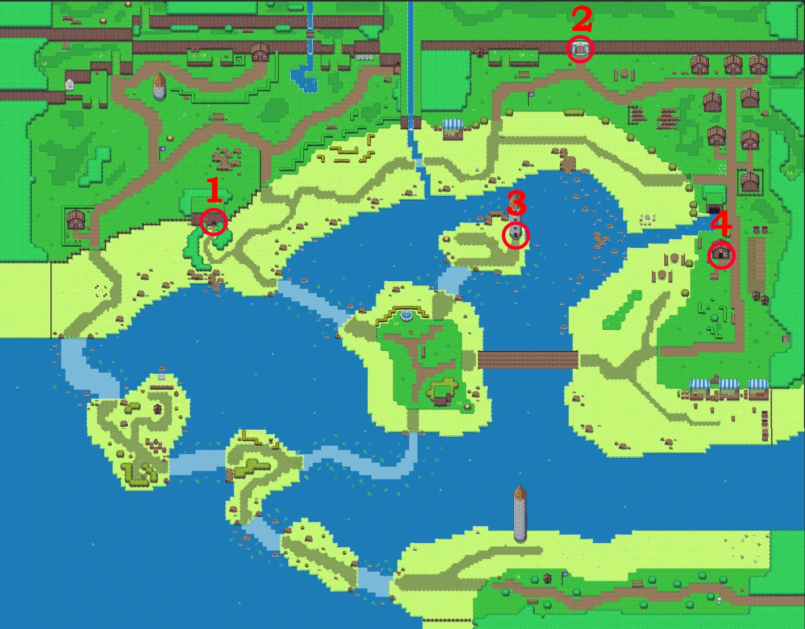
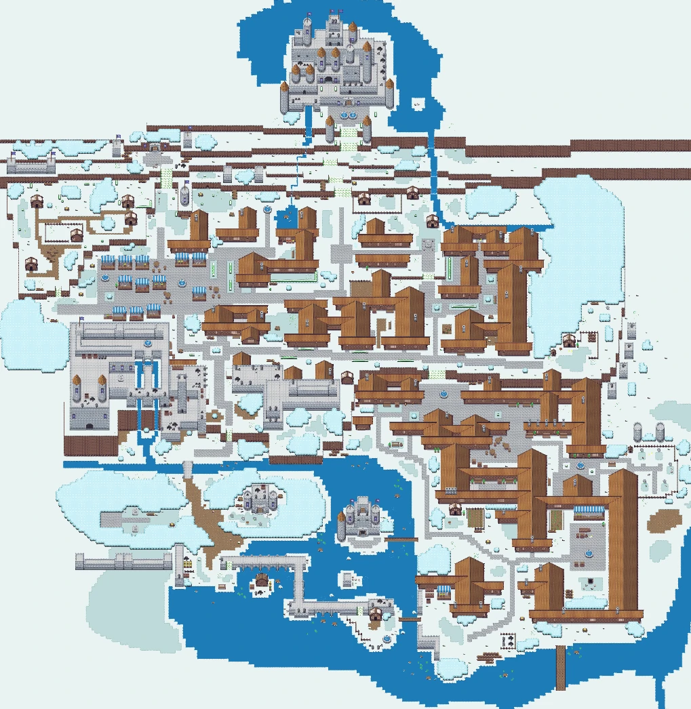

# Maps

Areas inside Gamify-IT look fairly different.
This can include any of general design, minigames, NPC spots book spots, …
The following are maps of the current areas:

## Table of Contents

<!-- TOC -->
* [World 1](#world-1)
  * [World 1 Minigame spots](#world-1-minigame-spots)
  * [World 1 NPC spots](#world-1-npc-spots)
  * [World 1 Book spots](#world-1-book-spots)
  * [World 1 Dungeon spots](#world-1-dungeon-spots)
  * [Dungeon 1-1](#dungeon-1-1)
    * [Dungeon 1-1 Minigame spots](#dungeon-1-1-minigame-spots)
    * [Dungeon 1-1 NPC spots](#dungeon-1-1-npc-spots)
    * [Dungeon 1-1 Book spots](#dungeon-1-1-book-spots)
  * [Dungeon 1-2](#dungeon-1-2)
    * [Dungeon 1-2 Minigame spots](#dungeon-1-2-minigame-spots)
    * [Dungeon 1-2 NPC spots](#dungeon-1-2-npc-spots)
    * [Dungeon 1-2 Book spots](#dungeon-1-2-book-spots)
  * [Dungeon 1-3](#dungeon-1-3)
    * [Dungeon 1-3 Minigame spots](#dungeon-1-3-minigame-spots)
    * [Dungeon 1-3 NPC spots](#dungeon-1-3-npc-spots)
    * [Dungeon 1-3 Book spots](#dungeon-1-3-book-spots)
  * [Dungeon 1-4](#dungeon-1-4)
    * [Dungeon 1-4 Minigame spots](#dungeon-1-4-minigame-spots)
    * [Dungeon 1-4 NPC spots](#dungeon-1-4-npc-spots)
    * [Dungeon 1-4 Book spots](#dungeon-1-4-book-spots)
* [World 2](#world-2)
  * [World 2 Minigame spots](#world-2-minigame-spots)
  * [World 2 NPC spots](#world-2-npc-spots)
  * [World 2 Book spots](#world-2-book-spots)
  * [World 2 Dungeon spots](#world-2-dungeon-spots)
  * [Dungeon 2-1](#dungeon-2-1)
    * [Dungeon 2-1 Minigame spots](#dungeon-2-1-minigame-spots)
    * [Dungeon 2-1 NPC spots](#dungeon-2-1-npc-spots)
    * [Dungeon 2-1 Book spots](#dungeon-2-1-book-spots)
  * [Dungeon 2-2](#dungeon-2-2)
    * [Dungeon 2-2 Minigame spots](#dungeon-2-2-minigame-spots)
    * [Dungeon 2-2 NPC spots](#dungeon-2-2-npc-spots)
    * [Dungeon 2-2 Book spots](#dungeon-2-2-book-spots)
  * [Dungeon 2-3](#dungeon-2-3)
    * [Dungeon 2-3 Minigame spots](#dungeon-2-3-minigame-spots)
    * [Dungeon 2-3 NPC spots](#dungeon-2-3-npc-spots)
    * [Dungeon 2-3 Book spots](#dungeon-2-3-book-spots)
  * [Dungeon 2-4](#dungeon-2-4)
    * [Dungeon 2-4 Minigame spots](#dungeon-2-4-minigame-spots)
    * [Dungeon 2-4 NPC spots](#dungeon-2-4-npc-spots)
    * [Dungeon 2-4 Book spots](#dungeon-2-4-book-spots)
* [World 3](#world-3)
  * [World 3 Minigame spots](#world-3-minigame-spots)
  * [World 3 NPC spots](#world-3-npc-spots)
  * [World 3 Book spots](#world-3-book-spots)
  * [World 3 Dungeon spots](#world-3-dungeon-spots)
  * [Dungeon 3-1](#dungeon-3-1)
    * [Dungeon 3-1 Minigame spots](#dungeon-3-1-minigame-spots)
    * [Dungeon 3-1 NPC spots](#dungeon-3-1-npc-spots)
    * [Dungeon 3-1 Book spots](#dungeon-3-1-book-spots)
  * [Dungeon 3-2](#dungeon-3-2)
    * [Dungeon 3-2 Minigame spots](#dungeon-3-2-minigame-spots)
    * [Dungeon 3-2 NPC spots](#dungeon-3-2-npc-spots)
    * [Dungeon 3-2 Book spots](#dungeon-3-2-book-spots)
  * [Dungeon 3-3](#dungeon-3-3)
    * [Dungeon 3-3 Minigame spots](#dungeon-3-3-minigame-spots)
    * [Dungeon 3-3 NPC spots](#dungeon-3-3-npc-spots)
    * [Dungeon 3-3 Book spots](#dungeon-3-3-book-spots)
  * [Dungeon 3-4](#dungeon-3-4)
    * [Dungeon 3-4 Minigame spots](#dungeon-3-4-minigame-spots)
    * [Dungeon 3-4 NPC spots](#dungeon-3-4-npc-spots)
    * [Dungeon 3-4 Book spots](#dungeon-3-4-book-spots)
* [World 4](#world-4)
  * [World 4 Minigame spots](#world-4-minigame-spots)
  * [World 4 NPC spots](#world-4-npc-spots)
  * [World 4 Book spots](#world-4-book-spots)
  * [World 4 Dungeon spots](#world-4-dungeon-spots)
  * [Dungeon 4-1](#dungeon-4-1)
    * [Dungeon 4-1 Minigame spots](#dungeon-4-1-minigame-spots)
    * [Dungeon 4-1 NPC spots](#dungeon-4-1-npc-spots)
    * [Dungeon 4-1 Book spots](#dungeon-4-1-book-spots)
  * [Dungeon 4-2](#dungeon-4-2)
    * [Dungeon 4-2 Minigame spots](#dungeon-4-2-minigame-spots)
    * [Dungeon 4-2 NPC spots](#dungeon-4-2-npc-spots)
    * [Dungeon 4-2 Book spots](#dungeon-4-2-book-spots)
  * [Dungeon 4-3](#dungeon-4-3)
    * [Dungeon 4-3 Minigame spots](#dungeon-4-3-minigame-spots)
    * [Dungeon 4-3 NPC spots](#dungeon-4-3-npc-spots)
    * [Dungeon 4-3 Book spots](#dungeon-4-3-book-spots)
  * [Dungeon 4-4](#dungeon-4-4)
    * [Dungeon 4-4 Minigame spots](#dungeon-4-4-minigame-spots)
    * [Dungeon 4-4 NPC spots](#dungeon-4-4-npc-spots)
    * [Dungeon 4-4 Book spots](#dungeon-4-4-book-spots)
<!-- TOC -->

## World 1

### World 1 Minigame spots

### World 1 NPC spots

### World 1 Book spots

### World 1 Dungeon spots

<!-- w1d1 -->

### Dungeon 1-1

#### Dungeon 1-1 Minigame spots

#### Dungeon 1-1 NPC spots

#### Dungeon 1-1 Book spots

<!-- w1d2 -->

### Dungeon 1-2

#### Dungeon 1-2 Minigame spots

#### Dungeon 1-2 NPC spots

#### Dungeon 1-2 Book spots

<!-- w1d3 -->

### Dungeon 1-3

#### Dungeon 1-3 Minigame spots

#### Dungeon 1-3 NPC spots

#### Dungeon 1-3 Book spots

<!-- w1d4 -->

### Dungeon 1-4

#### Dungeon 1-4 Minigame spots

#### Dungeon 1-4 NPC spots

#### Dungeon 1-4 Book spots

<!-- w2 -->

## World 2

### World 2 Minigame spots

### World 2 NPC spots

### World 2 Book spots

### World 2 Dungeon spots

<!-- w2d1 -->

### Dungeon 2-1

#### Dungeon 2-1 Minigame spots

#### Dungeon 2-1 NPC spots

#### Dungeon 2-1 Book spots

<!-- w2d2 -->

### Dungeon 2-2

#### Dungeon 2-2 Minigame spots

#### Dungeon 2-2 NPC spots

#### Dungeon 2-2 Book spots

<!-- w2d3 -->

### Dungeon 2-3

#### Dungeon 2-3 Minigame spots

#### Dungeon 2-3 NPC spots

#### Dungeon 2-3 Book spots

<!-- w2d4 -->

### Dungeon 2-4

#### Dungeon 2-4 Minigame spots

#### Dungeon 2-4 NPC spots

#### Dungeon 2-4 Book spots

<!-- w3 -->

## World 3

### World 3 Minigame spots

### World 3 NPC spots

### World 3 Book spots

### World 3 Dungeon spots

<!-- w3d1 -->

### Dungeon 3-1

#### Dungeon 3-1 Minigame spots

#### Dungeon 3-1 NPC spots

#### Dungeon 3-1 Book spots

<!-- w3d2 -->

### Dungeon 3-2

#### Dungeon 3-2 Minigame spots

#### Dungeon 3-2 NPC spots

#### Dungeon 3-2 Book spots

<!-- w3d3 -->

### Dungeon 3-3

#### Dungeon 3-3 Minigame spots

#### Dungeon 3-3 NPC spots

#### Dungeon 3-3 Book spots

<!-- w3d4 -->

### Dungeon 3-4

#### Dungeon 3-4 Minigame spots

#### Dungeon 3-4 NPC spots

#### Dungeon 3-4 Book spots

<!-- w4 -->

## World 4

### World 4 Minigame spots

### World 4 NPC spots

### World 4 Book spots

### World 4 Dungeon spots

<!-- w4d1 -->

### Dungeon 4-1

#### Dungeon 4-1 Minigame spots

#### Dungeon 4-1 NPC spots

#### Dungeon 4-1 Book spots

<!-- w4d2 -->

### Dungeon 4-2

#### Dungeon 4-2 Minigame spots

#### Dungeon 4-2 NPC spots

#### Dungeon 4-2 Book spots

<!-- w4d3 -->

### Dungeon 4-3

#### Dungeon 4-3 Minigame spots

#### Dungeon 4-3 NPC spots

#### Dungeon 4-3 Book spots

<!-- w4d4 -->

### Dungeon 4-4

#### Dungeon 4-4 Minigame spots

#### Dungeon 4-4 NPC spots

#### Dungeon 4-4 Book spots

