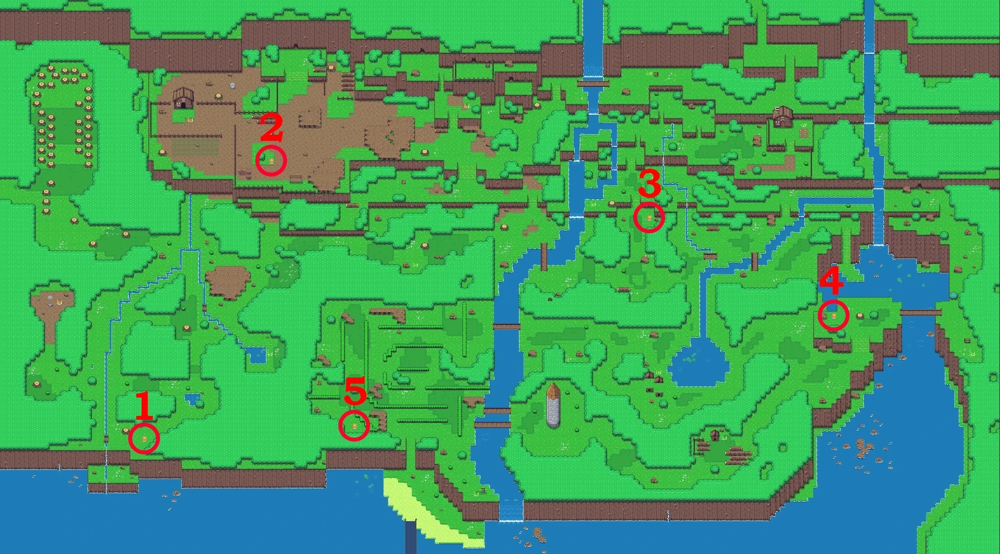

# Maps

Areas inside Gamify-IT look fairly different.
This can include any of general design, minigames, NPC spots book spots, …
The following are maps of the current areas:

## Table of Contents

<!-- TOC -->
* [World 1](#world-1)
  * [Minigame spots](#minigame-spots)
  * [NPC spots](#npc-spots)
  * [Book spots](#book-spots)
  * [Dungeon spots](#dungeon-spots)
  * [Dungeon 1](#dungeon-1)
    * [Minigame spots](#minigame-spots-1)
    * [NPC spots](#npc-spots-1)
    * [Book spots](#book-spots-1)
  * [Dungeon 2](#dungeon-2)
    * [Minigame spots](#minigame-spots-2)
    * [NPC spots](#npc-spots-2)
    * [Book spots](#book-spots-2)
  * [Dungeon 3](#dungeon-3)
    * [Minigame spots](#minigame-spots-3)
    * [NPC spots](#npc-spots-3)
    * [Book spots](#book-spots-3)
  * [Dungeon 4](#dungeon-4)
    * [Minigame spots](#minigame-spots-4)
    * [NPC spots](#npc-spots-4)
    * [Book spots](#book-spots-4)
* [World 2](#world-2)
  * [Minigame spots](#minigame-spots-5)
  * [NPC spots](#npc-spots-5)
  * [Book spots](#book-spots-5)
  * [Dungeon spots](#dungeon-spots-1)
  * [Dungeon 1](#dungeon-1-1)
    * [Minigame spots](#minigame-spots-6)
    * [NPC spots](#npc-spots-6)
    * [Book spots](#book-spots-6)
  * [Dungeon 2](#dungeon-2-1)
    * [Minigame spots](#minigame-spots-7)
    * [NPC spots](#npc-spots-7)
    * [Book spots](#book-spots-7)
  * [Dungeon 3](#dungeon-3-1)
    * [Minigame spots](#minigame-spots-8)
    * [NPC spots](#npc-spots-8)
    * [Book spots](#book-spots-8)
  * [Dungeon 4](#dungeon-4-1)
    * [Minigame spots](#minigame-spots-9)
    * [NPC spots](#npc-spots-9)
    * [Book spots](#book-spots-9)
* [World 3](#world-3)
  * [Minigame spots](#minigame-spots-10)
  * [NPC spots](#npc-spots-10)
  * [Book spots](#book-spots-10)
  * [Dungeon spots](#dungeon-spots-2)
  * [Dungeon 1](#dungeon-1-2)
    * [Minigame spots](#minigame-spots-11)
    * [NPC spots](#npc-spots-11)
    * [Book spots](#book-spots-11)
  * [Dungeon 2](#dungeon-2-2)
    * [Minigame spots](#minigame-spots-12)
    * [NPC spots](#npc-spots-12)
    * [Book spots](#book-spots-12)
  * [Dungeon 3](#dungeon-3-2)
    * [Minigame spots](#minigame-spots-13)
    * [NPC spots](#npc-spots-13)
    * [Book spots](#book-spots-13)
  * [Dungeon 4](#dungeon-4-2)
    * [Minigame spots](#minigame-spots-14)
    * [NPC spots](#npc-spots-14)
    * [Book spots](#book-spots-14)
* [World 4](#world-4)
  * [Minigame spots](#minigame-spots-15)
  * [NPC spots](#npc-spots-15)
  * [Book spots](#book-spots-15)
  * [Dungeon spots](#dungeon-spots-3)
  * [Dungeon 1](#dungeon-1-3)
    * [Minigame spots](#minigame-spots-16)
    * [NPC spots](#npc-spots-16)
    * [Book spots](#book-spots-16)
  * [Dungeon 2](#dungeon-2-3)
    * [Minigame spots](#minigame-spots-17)
    * [NPC spots](#npc-spots-17)
    * [Book spots](#book-spots-17)
  * [Dungeon 3](#dungeon-3-3)
    * [Minigame spots](#minigame-spots-18)
    * [NPC spots](#npc-spots-18)
    * [Book spots](#book-spots-18)
  * [Dungeon 4](#dungeon-4-3)
    * [Minigame spots](#minigame-spots-19)
    * [NPC spots](#npc-spots-19)
    * [Book spots](#book-spots-19)
<!-- TOC -->

## World 1

### Minigame spots

### NPC spots

### Book spots

### Dungeon spots

<!-- w1d1 -->

### Dungeon 1

#### Minigame spots

#### NPC spots

#### Book spots

<!-- w1d2 -->

### Dungeon 2

#### Minigame spots

#### NPC spots

#### Book spots

<!-- w1d3 -->

### Dungeon 3

#### Minigame spots

#### NPC spots

#### Book spots

<!-- w1d4 -->

### Dungeon 4

#### Minigame spots

#### NPC spots

#### Book spots

<!-- w2 -->

## World 2

### Minigame spots

### NPC spots

### Book spots

### Dungeon spots

<!-- w2d1 -->

### Dungeon 1

#### Minigame spots

#### NPC spots

#### Book spots

<!-- w2d2 -->

### Dungeon 2

#### Minigame spots

#### NPC spots

#### Book spots

<!-- w2d3 -->

### Dungeon 3

#### Minigame spots

#### NPC spots

#### Book spots

<!-- w2d4 -->

### Dungeon 4

#### Minigame spots

#### NPC spots

#### Book spots

<!-- w3 -->

## World 3

### Minigame spots

### NPC spots

### Book spots

### Dungeon spots

<!-- w3d1 -->

### Dungeon 1

#### Minigame spots

#### NPC spots

#### Book spots

<!-- w3d2 -->

### Dungeon 2

#### Minigame spots

#### NPC spots

#### Book spots

<!-- w3d3 -->

### Dungeon 3

#### Minigame spots

#### NPC spots

#### Book spots

<!-- w3d4 -->

### Dungeon 4

#### Minigame spots

#### NPC spots

#### Book spots

<!-- w4 -->

## World 4

### Minigame spots

### NPC spots

### Book spots

### Dungeon spots

<!-- w4d1 -->

### Dungeon 1

#### Minigame spots

#### NPC spots

#### Book spots

<!-- w4d2 -->

### Dungeon 2

#### Minigame spots

#### NPC spots

#### Book spots

<!-- w4d3 -->

### Dungeon 3

#### Minigame spots

#### NPC spots

#### Book spots

<!-- w4d4 -->

### Dungeon 4

#### Minigame spots

#### NPC spots

#### Book spots

