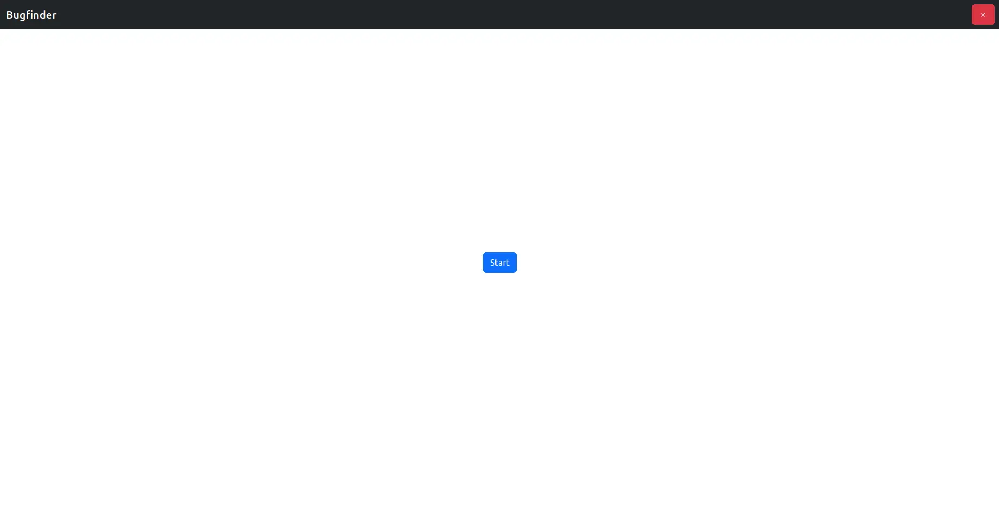
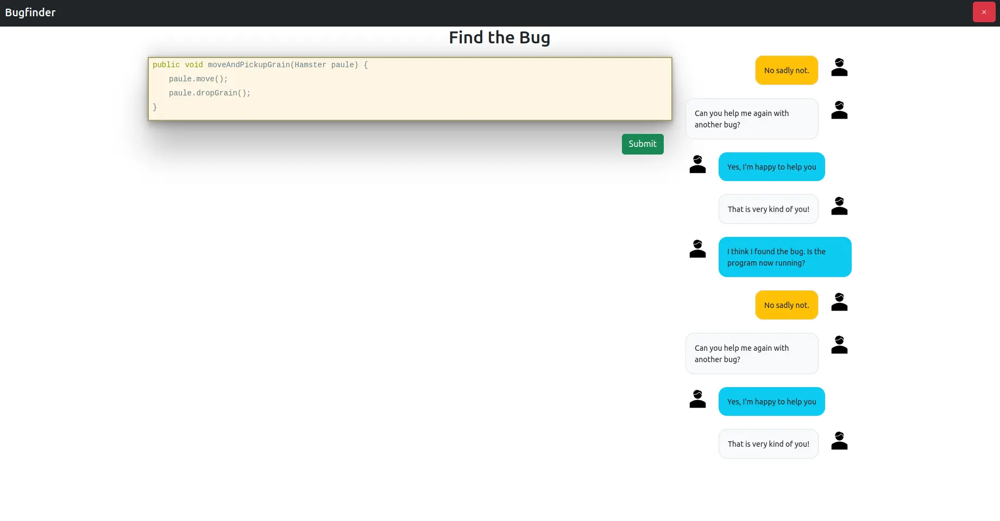
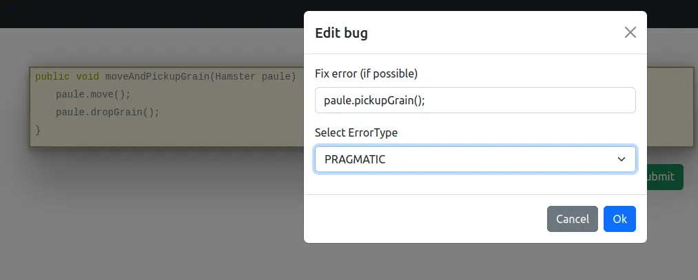
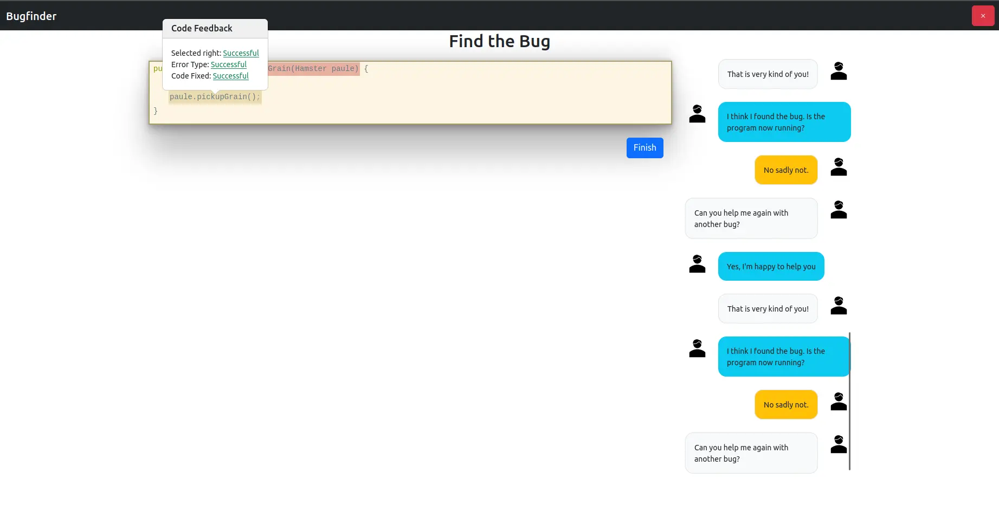
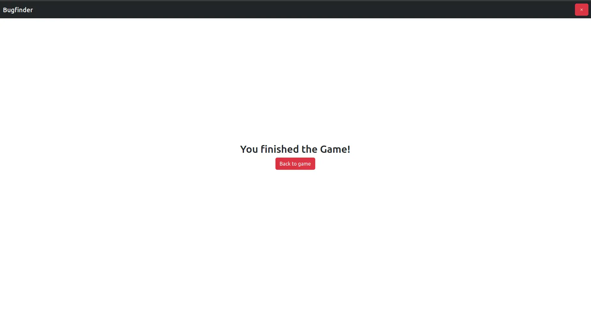

# Bugfinder

_Bugfinder_ is a minigame for the _Gamify-IT_ platform.

## TOC

- [Gameplay](#gameplay)
- [Sounds](#sounds)
- [Configuration](#configuration)

## About the Game

The goal of _Bugfinder_ is to find and fix errors in a small program.

## Gameplay

When entering the game, you see the start screen.  
To start a game, click on `Start`.  
To exit the game, click on the red button in the upper-right corner.

After clicking on the `Start` button, you get a code snippet with some errors that you are tasked to find. 

By clicking on words in this code snippet, you can mark this word as a bug, you can correct it, and you can specify the error type.  
Already selected bugs will be highlighted.

If you are sure that you have found all bugs, you can see your results by clicking on the `submit` button.

Next, you'll get another snippet.
Once you've submitted all snippets, you will see the end screen that finishes the game:

## Sounds

In the overworld and each minigame, the player will hear different sounds. The player has an ability to control the volume of all sounds. You can read more about volume control here: [overworld volume control](../overworld/README.md)

#### Background music

When entering the minigame, the player will hear background music that plays throughout the game.

#### Click sound

In the minigame, the player will find some interactive buttons, such as the option to start or exit the game. When the player clicks on a button, they will hear a click sound.

#### Sound for wrong answer

Once the player has pressed the button to confirm their answer, they will see a message in the chat telling them whether they got it right or not. If the player gets it wrong, they will hear a sound for wrong answer.

#### Sound for notifications in chat

As well as messages in the chat about whether the answer is right, there are also messages asking for help with finding bugs. In these cases, the usual notification sound is played.

#### Sound for correct answer 

In the case of a correct answer, a message about a successfully found error will appear in the chat, accompanied by a sound for the correct answer.

#### Sound for successfully completed minigame

Once the game is over, the player can see how many questions they got right. If they got more than the average number of questions right, they will hear a sound that symbolizes the game is successfully completed.

#### Sound for unsuccessfully completed minigame

If the player gets a small number of questions right, they will hear a sound that lets them know the game didn't get completed successfully.

## Configuration

The lecturer can configure the game with lots of codes.
The solutions can be specified with the correct values of bugs and with error types of a bug.

For more information how to configure minigames see the [lecturer interface manual](../lecturer-interface/README.md).
