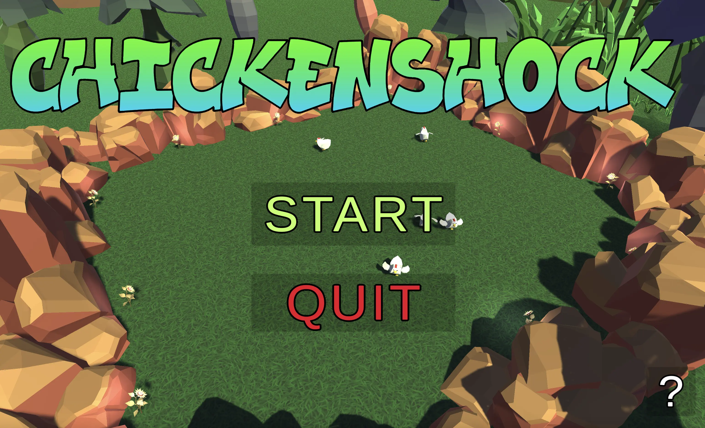
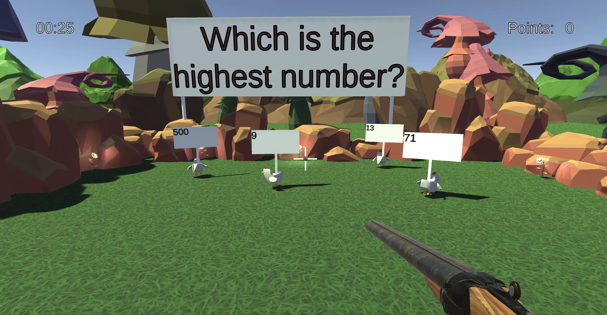
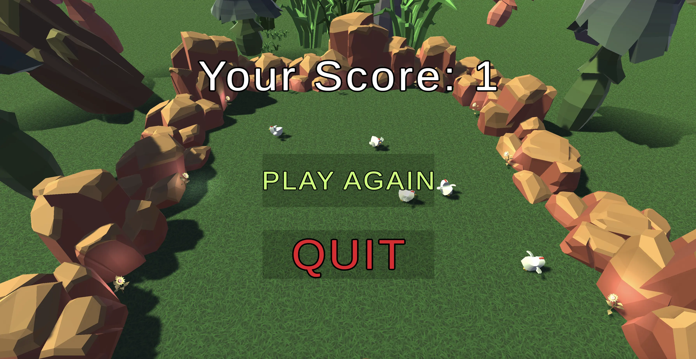

# Chickenshock

Chickenshock is a minigame which is part of the Gamify-IT platform.

## About the Game

The intention with this game is to make answering single choice questions fun.

When entering the game, the user is presented with main menu.

After clicking on the "Start" button, the user is presented with a question.
A horde of chickens is running around in front of the player.
Each chicken has a different answer to the question floating above them.
The player has to shoot at the chicken with the correct answer.
After the player chooses an answer, the next question is presented.

With each question, the player can earn points.
The goal is to get as many points as possible.
The game ends when the player has answered all questions or if the timer in the top left corner runs out.
Then, the player is presented with the score screen.

Pressing <kbd>p</kbd> unlocks the mouse.

## Sounds

In the overworld and each minigame, the player will hear different sounds. The player has an ability to control the volume of all sounds. You can read more about volume control here: [overworld volume control](../overworld/README.md)

#### Background music

Upon entering the game, the player immediately hears the background music of clucking chickens, which continues throughout the game.

#### Click sound

In the minigame, the player will find some interactive buttons, such as the option to start or exit the game. When the player clicks on a button, they will hear a click sound.

#### Sound for wrong answer

If the player shoots the chicken with the wrong answer, a sound is played to inform the player of the mistake.

#### Sound for correct answer

If the player shoots the correct chicken, a sound will be heard indicating the correct answer.

#### Shot sound

When the player shoots the chicken, the sound of the shot will be played.

#### Sound for end of minigame

Once the player has answered all the questions or the timer has run out, the player will see a final screen with the number of correct answers, with music playing in the background to announce the end of the game.

## Configuration

The lecturer can configure the game with an arbitrary number of questions.

Each question has a single correct answer and an arbitrary number of wrong answers.
The lecturer can also configure the time limit for the game.

For more information how to configure minigames see the [lecturer interface manual](../lecturer-interface/README.md).
