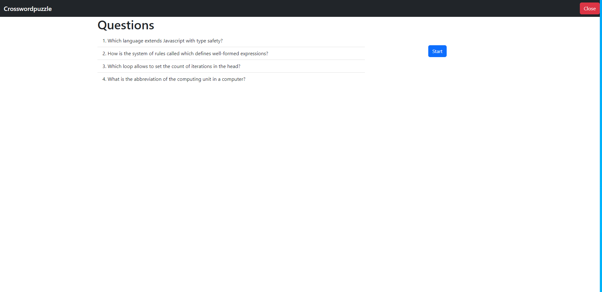
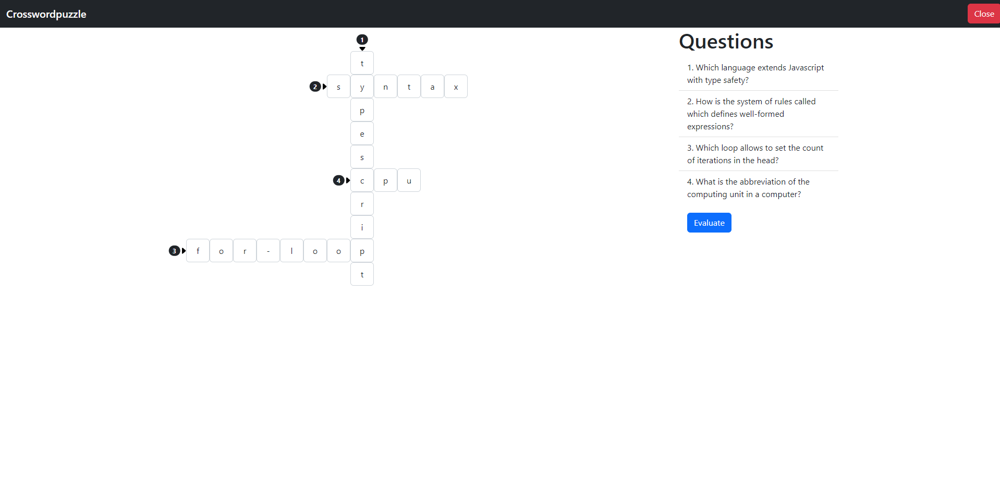
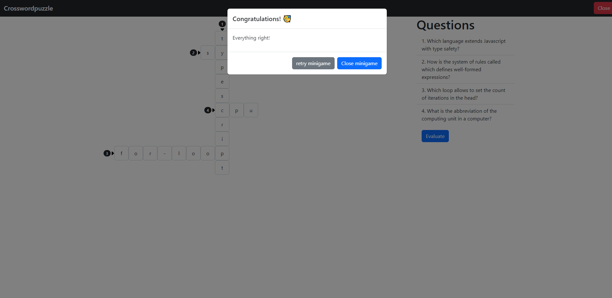
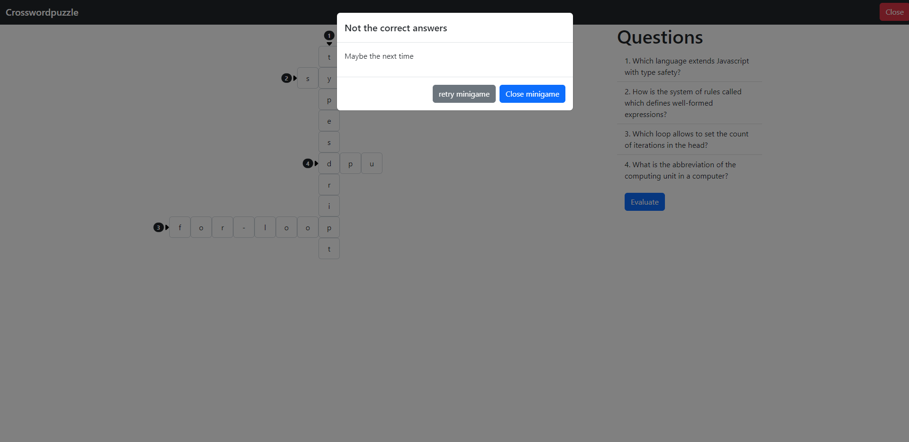

# Crosswordpuzzle

_Crosswordpuzzle_ is a minigame for the _Gamify-IT_ platform.

## TOC

- [Gameplay](#gameplay)
- [Sounds](#sounds)
- [Configuration](#configuration)

## About the Game

The goal of _Crosswordpuzzle_ is to answer the questions and fill out the crosswordpuzzle.

## Gameplay

When entering the game, you see the start screen.  
To start a game, click on `Start`.  
To exit the game, click on the red button in the upper-right corner.

After clicking on the `Start` button, you get a crosswordpuzzle in the middle and questions on the right. 

After filling out all the answers your screen should look like this.

If you answered everything correct, your screen looks like this.
To end the game, click the close button.

If you answered something wrong, your screen looks like this.
To end the game, click the close button. To retry, click the close button.

## Sounds

In the overworld and each minigame, the player will hear different sounds. The player has an ability to control the volume of all sounds. You can read more about volume control here: [overworld volume control](../overworld/README.md#volume-control)

#### Background music

As the player enters the game, they will hear background music that will accompany them throughout the game.

#### Click sound

In the minigame, the player will find some interactive buttons, such as the option to start or exit the game. When the player clicks on a button, they will hear a click sound.

#### Sound for unsuccessfully completed minigame

At the end of the game, a panel will appear informing the player if they have answered everything correctly. If at least one mistake has been made, the game will be considered as not completed successfully. In this case, sound will be played informing the player that a mistake has been made.

#### Sound for successfully completed minigame

If no mistakes were made and the player has answered everything correctly, a sound is played to indicate that the game has been successfully completed.

## Configuration

The lecturer can configure the game with questions and answers.
The crosswordpuzzle gets generated automatically.

For more information how to configure minigames see the [lecturer interface manual](../lecturer-interface/README.md).
