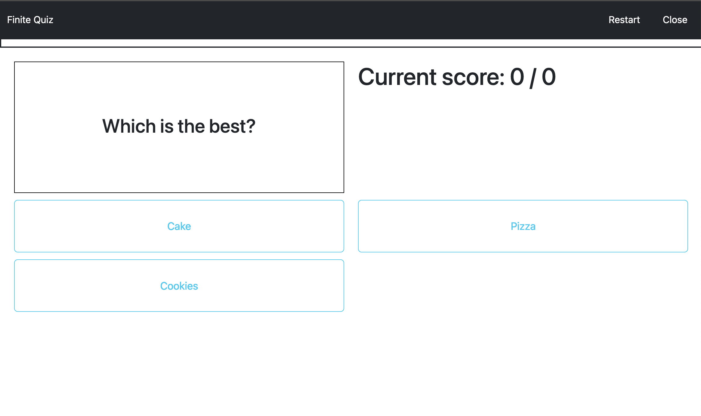
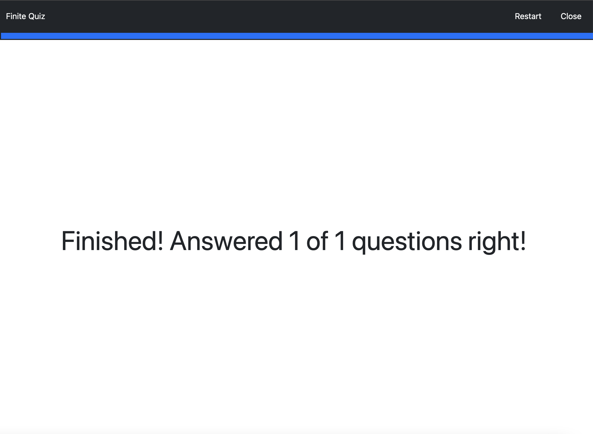

# Finitequiz

Finitequiz is a minigame which is part of the Gamify-IT platform.

## About the Game

The goal of the game is to provide a simple game for students to practice their knowledge with single choice questions.

When entering the game, the user is directly presented with the first question.
The score is displayed in the format `current score / max score`, meaning that the right number counts the total number of question that the player has answered.
The left number is only incremented when the player answers a question correctly.
When the user answers a question, they are presented with the next question.

When all questions are answered, the end screen is presented.

At any point in the game, the player may choose to restart the game or to close the it, using the buttons in the top right corner.

## Sounds

In the overworld and each minigame, the player will hear different sounds. The player has an ability to control the volume of all sounds. You can read more about volume control here: [overworld volume control](../overworld/README.md#volume-control)

#### Background music

When entering the game, the player immediately hears the background music.

#### Click sound

In the minigame, the player will find some interactive buttons, such as the option to start or exit the game. When the player clicks on a button, they will hear a click sound.

#### Sound for wrong answer

If the player clicks on a wrong answer, it will be highlighted in red and accompanied by a wrong answer sound.

#### Sound for correct answer

If the player chooses the correct answer, it will light up green and a sound will be played to indicate the correct answer.

#### Sound for end of minigame

After answering all the questions, the player will see the final screen with the number of correct answers, accompanied by a game over sound.

## Configuration

The lecturer can configure the game with an arbitrary number of questions.

Each question has a single correct answer and an arbitrary number of wrong answers.
The lecturer can also configure the time limit for the game.

For more information how to configure minigames see the [lecturer interface manual](../lecturer-interface/README.md).

