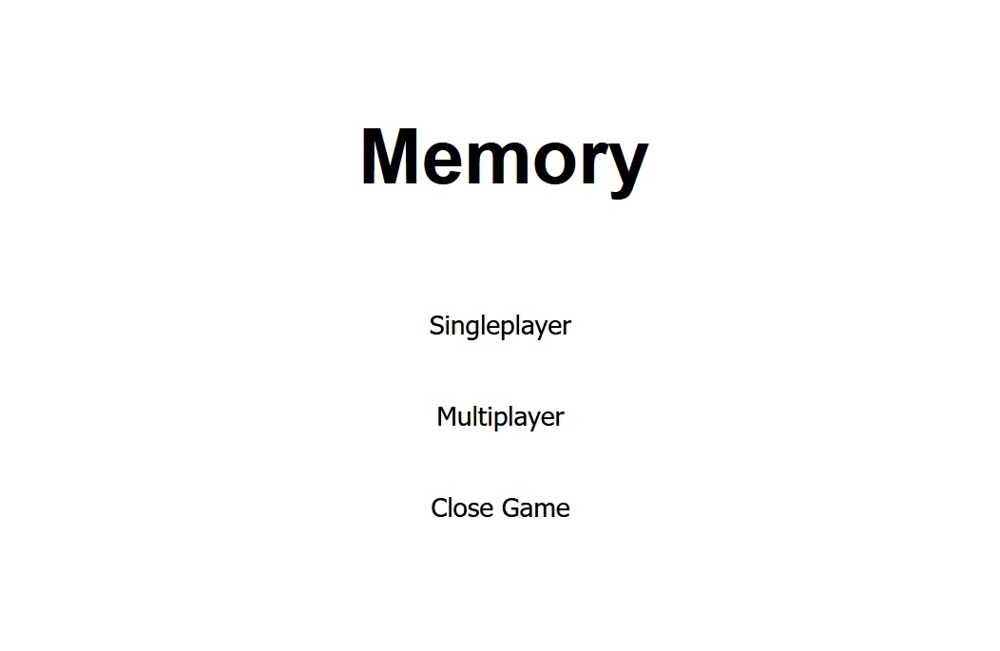
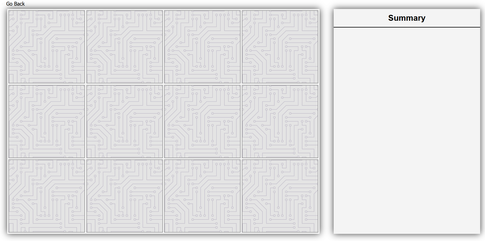
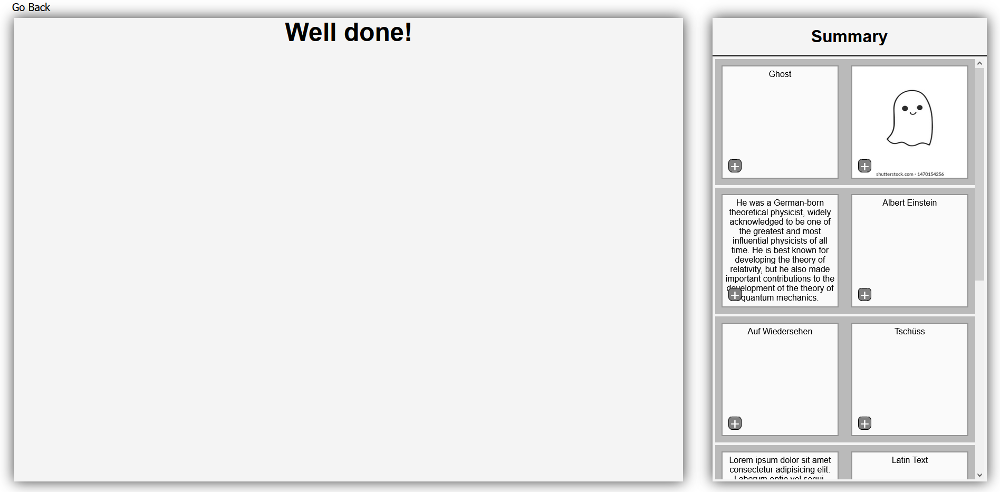

# Memory

_Memory_ is a minigame for the _Gamify-IT_ platform.

## TOC

- [Gameplay](#gameplay)
- [Configuration](#configuration)

## About the Game

The goal of _Memory_ is to find the two matching cards.  

## Gameplay

When entering the game, you see the start screen.  
To start a game, click on `Singleplayer`.  
To exit the game, click on `Close Game`.

After clicking on the `Start` button, you get your memory cards on the left.   
On the right is a table in which the correct pairs are automatically inserted.  
In the upper left corner is a `Go Back` button which directs you to the start screen.

After filling out all the answers your screen should look like this.  
You can click on the `plus Button` in the lower left corner of each card.  
It enlarges the card to have a better look at it.

## Configuration

The lecturer can configure the game with corresponding cards.
The cards get shuffeld automatically.

For more information how to configure minigames see the [lecturer interface manual](../lecturer-interface/README.md).
