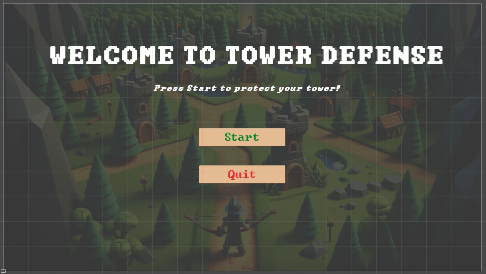
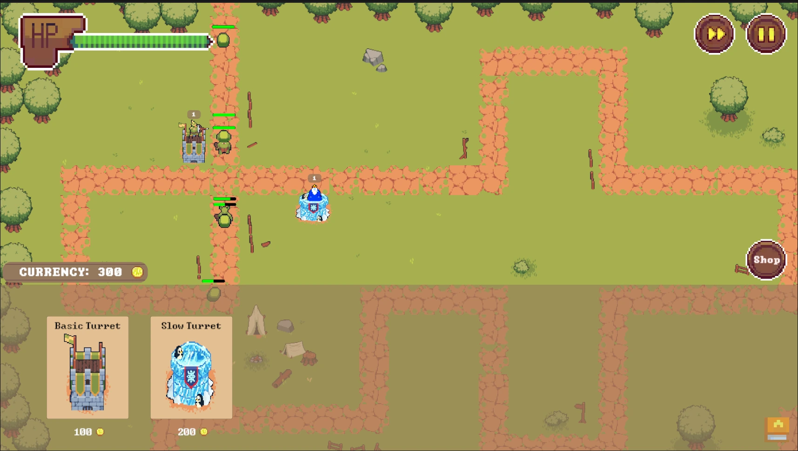

# Tower Defense

Tower Defense is a minigame which is part of the Gamify-IT platform.

## About the Game

The intention with this game is to make answering single choice questions fun but. \
In comparison to other minigames, Tower Defense provides a more complex and longer effort.

When entering the game, the user is presented with the main menu. 
After pressing the start button the enemies start spawning. The player then can place towers along the road to kill the enemies. Everytime the player wants to place a tower he must answer a question correctly to do so.The player also can upgrade the towers to make them stronger, for each upgrade he also must answer a question correctly.
Once too many enemies reach the base the game ends. The longer the player survives the more points he can earn. 

## Configuration

The lecturer can configure the game with an arbitrary number of questions.

Each question has a single correct answer and an arbitrary number of wrong answers.
The lecturer can also configure the time limit for the game.

For more information how to configure minigames see the [lecturer interface manual](../lecturer-interface/README.md).

## User Interface

The game will open with the start menu. There, you can choose to either start or exit the game.

When you start the game, the game map with the UI elements will be loaded. In the top right-hand corner you have a pause button and a speed up button. You can switch between standard pace and double pace. On the other side to the buttons, there is a life bar representing your current amount of health points.

At the beginning of the game, the shop menu is expanded allowing you to choose between towers with different attack styles. In the top left-hand corner of the shop menu you can see the current amount of currency available to you. After left-clicking on a tower you can move the cursor to the preferred position on the map and place the tower by left-clicking again. You can collapse the shop menu by clicking on the shop icon at the right-hand side.

## Game Mechanics

### Win Condition 

In Tower Defense, there are two conditions to finish the game:

1. When your life is empty, the game ends and you will be directed to the game over screen, where you can return back to the overworld or try again.

2. If you answered all questions, the game will end after the current wave has finished. Then, you have the opportunity to see your results. 

2. If you answered all questions, the game also ends and you have the opportunity to see your results. 

### Upgrading Towers 

If you click on a tower, there will appear an upgrade menu that enables you to improve the tower's defense 
properties. Before you can upgrade a tower, you need to have enough coins and to correctly answer a question.
If your answer is wrong, the upgrade price is still lost, so answer carefully but also quickly since the game is not paused! 

## Sprites
The tileset and some of the tower as well as enemy sprites are free assets from craftpix.net in addition to selfmade spritesheets.

### Towers
Currently the game has 4 different towers, all with different costs as well as abilities.

#### Basic Tower
The normal tower that just shoots projectiles at the enemies.

#### Freeze Tower
Freezes the enemies every few seconds to slow down their movement.

#### Defense Tower
Blocks the enemies from advancing furter. After taking too much damage it gets destroyed.

#### Sniper Tower
Shoots enemies from a larger distance with higher damage. Reveals enemies that are hidden.

### Enemies
Enemies get spawned every round. With each wave the numbers of enemies that spawn increases. After killing an enemies they drop coins that can be used to upgrade or build a new tower.

#### Slime
Weakes and most common enemy. Just a slime ball that is easy to kill.

#### Goblin
Slower but tankier enemy. You will need more hits to kill it.

#### Bee
Easy to kill but it flies really fast. It will also not be blocked by Defense Towers.

#### Kitty
Enemy that can hide itself. Towers will not attack this enemy until it gets revealed by sniper Towers.

### Boss Enemies
Bosses are enemies with much more life that are harder to kill but drop more coins. They spawn every second wave.
Currently there is only one boss type implemented.

#### Chicken Boss
A big chicken that can spit fire. Tower that get hit by the fire will take damage. If the tower takes too much damage it will get destroyed.

## Sounds

In the overworld and each minigame, the player will hear different sounds. The player has an ability to control the volume of all sounds. You can read more about volume control here: [overworld volume control](../overworld/README.md#volume-control)

#### Background music

Upon entering the game, the player will immediately hear themed background music that will accompany them throughout the game.

#### Click sound

In the minigame, the player will find some interactive buttons, such as the option to start or exit the game. When the player clicks on a button, they will hear a click sound.

#### Tower shot

When enemies move, tower will attack them. In addition to the visual effects, there is also an audio effect that symbolises the sound of a shot.

#### Kill enemy
When the enemy is killed, the corresponding sound is played to inform the player of the enemy's death.

#### Tower update 
If the player answers the question correctly, they will have the opportunity to upgrade the tower. The correct answer and the opportunity to upgrade the tower will be accompanied by a sound symbolising the level up and the correct answer.

#### Triumph sound for end screen 
At the end of the game, the player will see the final screen accompanied by a sound symbolising the end of the game.

#### Game Over 
When the player's defense falls, the game over sound plays and the game over menu appears.
