# Overworld

The overworld is the core of the Gamify-IT platform.
It is the main interface for students to interact with the platform.

## Overview

The overworld consists of multiple `worlds` and `dungeons`.
Throughout these areas, students can discover course contents like playable [minigames](../README.md) and dialogues with `NPCs`.  
The player (the character in the middle of the picture) can walk around and interact with various objects such as the NPC on the left or with books to learn something.  
The `HUD` helps navigating with the minimap and keeping track of the progress with the progress bar.  
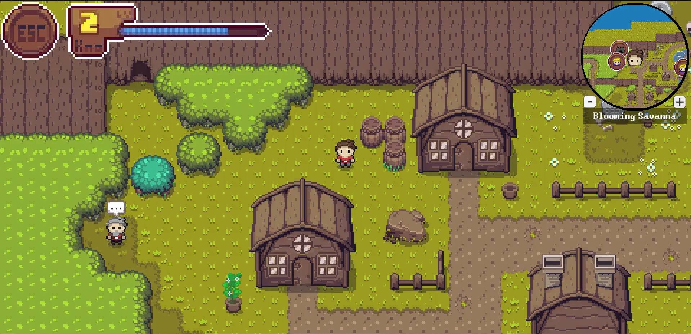

## Gameplay

### NPCs

The player can talk to other characters in the world to obtain information.  
The lecturer can specify what each `NPC` has to say.  
This can be used to give tips or to summarize important topics for the player.
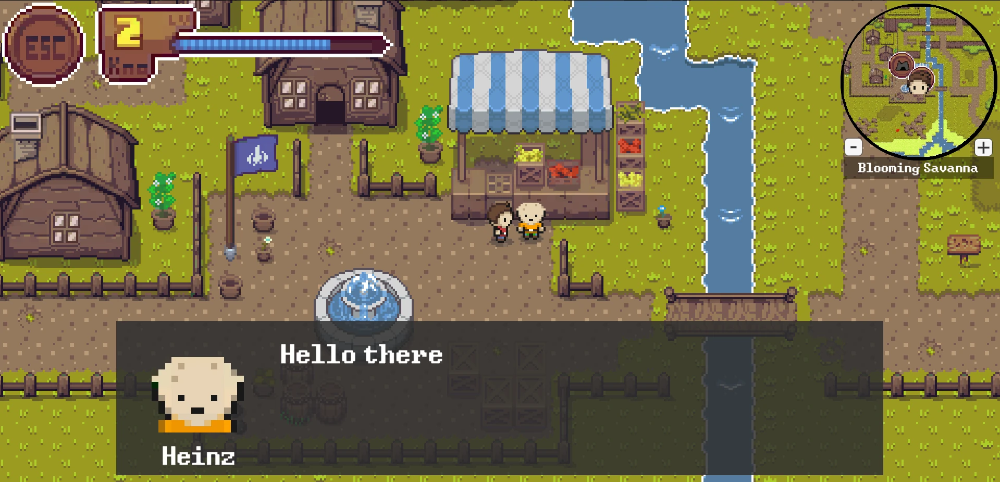

### Books

For large amounts of information, you can use books.  
They are similar to NPCs:
They can also be configured by the lecturer and are meant to provide assistance.  
Unlike NPCs, however, they show all content combined on one big page instead of splitting it up into sentences.  
Hence, there are different ways to display information and help the player.  
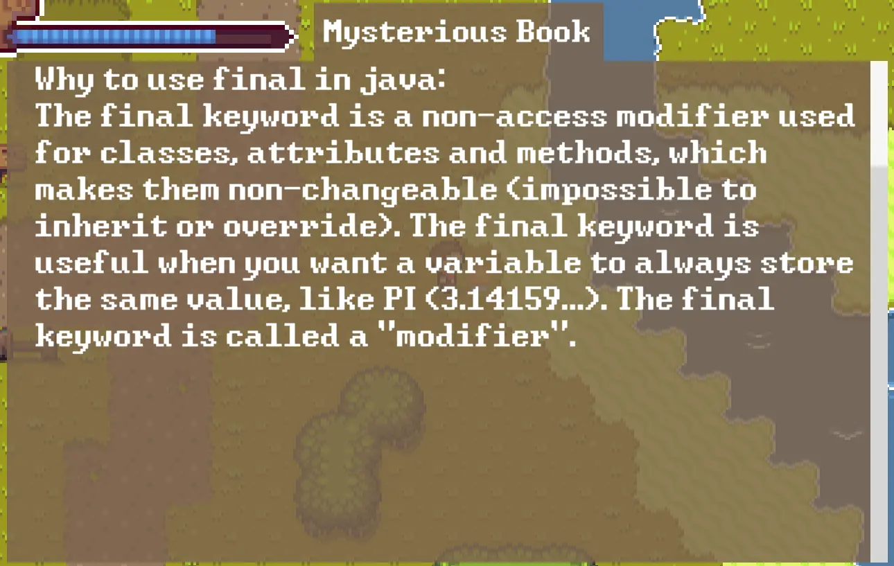

### Minigames

The main purpose of the overworld is to allow the player to test and increase his knowledge and understanding by playing `minigames`. Minigames can be started at `minigame spots`, displayed as the red circle in the picture. The lecturer can set up the questions and possible answers in the [lecturer interface](../lecturer-interface/README.md). Once the player enters the area of the minigame spot an information panel is opened. It displays the type of the game as well as the best result achieved by the player. The color of the minigame spot shows how good the player performed at the specific minigame. If the spot is `red` as shown in the picture, the player has not yet gotten enough points to `complete` the minigame. Once he finished a playthrough with the specified amount of points, the minigame spot turns `blue` which shows that he has finished it. The minigame can still be played and better results can be achieved, but the player doesn't have to in order to progress to the next area.  
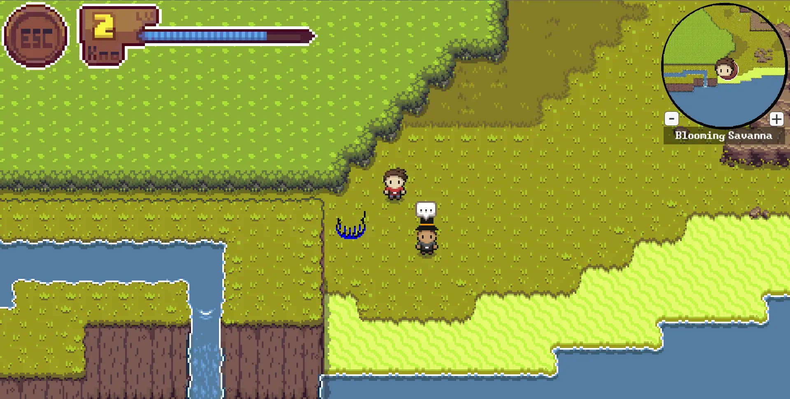

### Teleporters
As player paths through the world can get long and repetitive, we added `teleporters` to make life easier. Teleporters are spread over worlds and their dungeons. In the beginning of the game, all teleporters are locked. To `unlock` one, the player needs to walk towards it. Unlocked teleporters are indicated by a `green` shining T as shown in the picture, locked teleporters are indicated by a `brown` T. When a teleporter is unlocked it becomes a destination for all other teleporters that are unlocked. By interacting with it, the player can choose between available target destinations which are sorted by worlds.

## Progress

There are multiple `worlds` with optional `dungeons` each. The lecturer can configure each of them in the lecturer interface. Once some playable content is added, the world or dungeon becomes playable, but is locked at first. If a player has achieved enough points in all minigames of an area, he completed it. He can then progress to the next one, which is either the next dungeon of the world or the next world, if no further dungeon exists or is not configured by the lecturer. To help the player navigate and keep track of his progress, the `HUD` comes into play. The minimap in the top right corner helps to get around and highlights the positions of important objects like NPCs (displayed with the character head symbol) or dungeon entrance points (displayed with a cave symbol). The progress bar shows the `furthest area` the player can play, displayed as the yellow number, and the `ratio of completed minigames` as the blue bar. With each completed minigames, the bar fills up until all are done and the next area is unlocked.

## Controls

The player has a lot of options to interact with the game:  
They can move around, they can adjust their (movement) speed, can interact with objects and characters, can open menus, and can zoom the game or minimap.  
The respective keys for each of those actions are listed below and can also be found in-game in the pause menu (press the <kbd>ESC</kbd> button and navigate to the `keybindings` tab).  
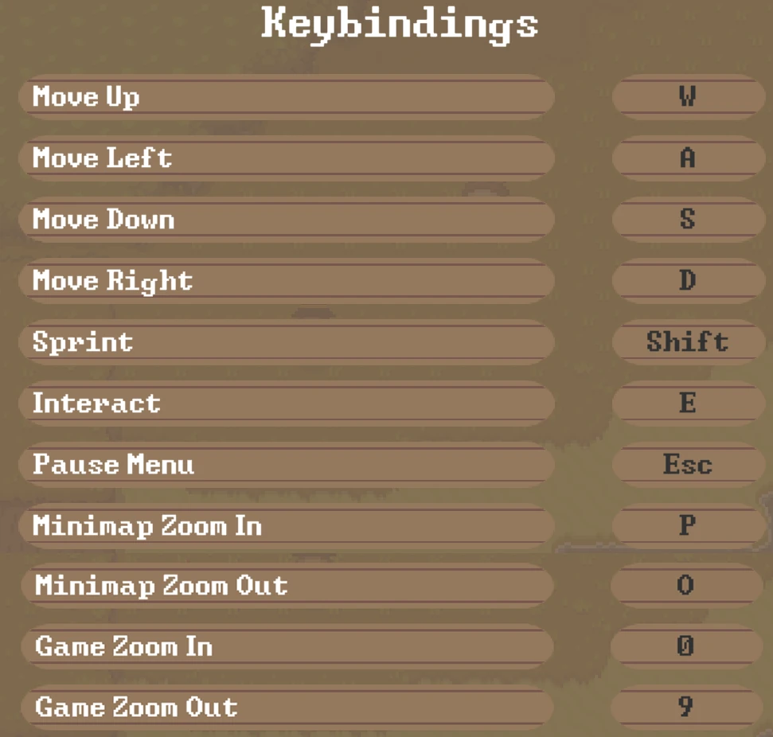

## Achievements

### Table with achievements

In the pause menu, the player can find the "achievements" category. 
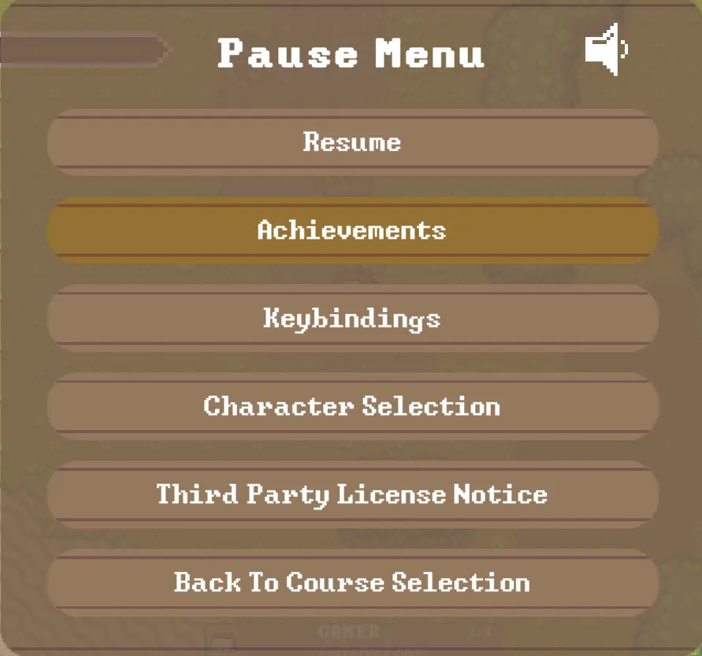

Clicking on this category will open a table. On the left are the filter buttons, on the right are all unfiltered achievements.
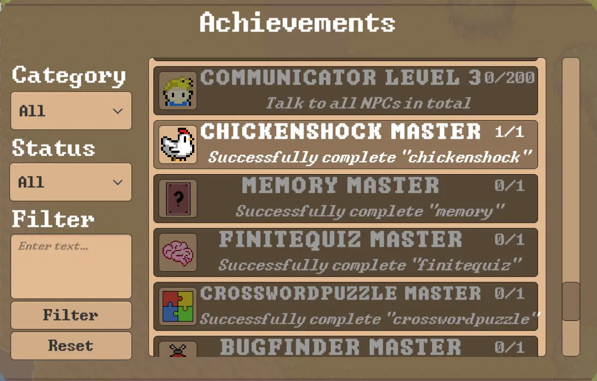

### Filter achievements

There are 3 options for filtering achievements: 
<ul>
  <li>By category:</li>
  
  Category is the type of player, namely: Exploring, Achieving, Competitive, Socializing. You can read more about the types of player here: [achievement and player types](/dev-manuals/achievements/achievement-types.md)

  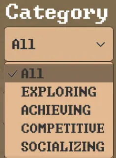

  <li>By status:</li>
  
  Achievement is completed or locked

  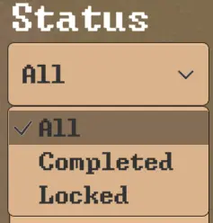

  <li>By keyword:</li>
  
  The player can enter a word, then press the "Filter" button, and all the achievements containing the entered word in the title or description will be displayed on the right.

  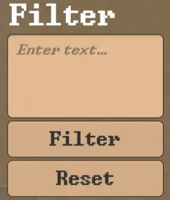

  For example, if a player types in the word "login", only achievements that contain the word "login" will appear on the right.

  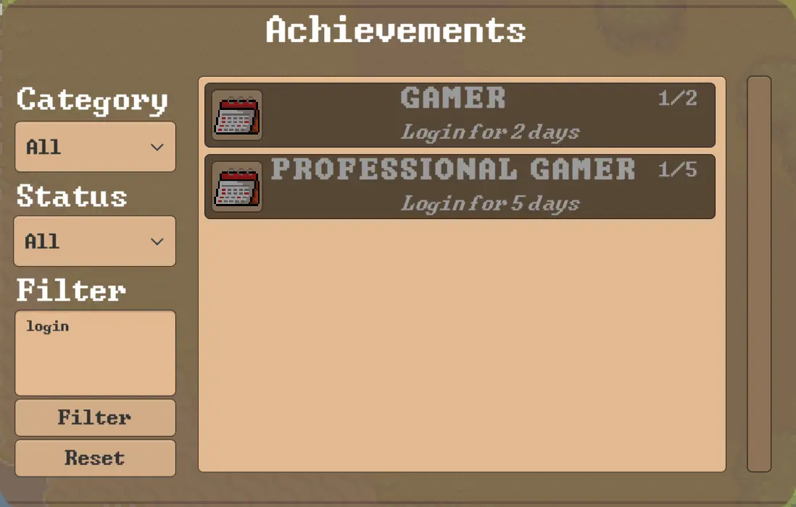

  The player also has the option to reset the keyword by clicking on the 'Reset' button.
</ul>

### Achievement structure

Each achievement contains a name, a brief description, the current progress, the progress required to complete the achievement and a themed image representing the achievement's task.

### Groups of achievements

There are different groups of achievements in the game. Most groups have several achievements that relate to the same object in the game, for example, there are several achievements for opening the book (see below).

#### Walk

Category: Exploring, Achieving 
The goal of these achievements is to walk a certain number of steps, namely 10 and 1000 steps.

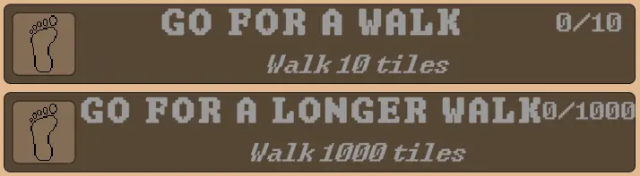

#### Select character

Category: Exploring 
There is an option in the game to choose a new character, and an achievement has been created to draw attention to this and encourage players to select a new character.
You can read more about character selection here: [select character](/dev-manuals/services/overworld/character-selection.md)

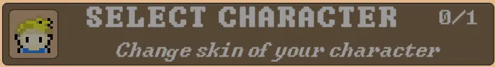

#### Successfully complete minigame

Category: Achieving, Competitive 
The goal of this achievement is to successfully complete a certain number of minigames that the player can find in the overworld. Once the player has played the minigame, the achievement will be updated and if the minigame was successfully completed, the achievement progress will increase.
It is also important that the player cannot complete the achievement by playing the same minigame multiple times, which encourages the player to look for other minigames in the overworld.

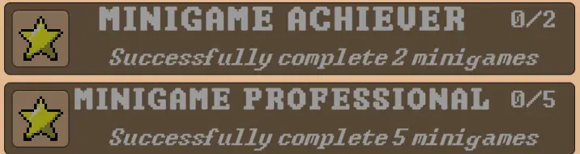

#### Play for a certain amount of time

Category: Exploring, Achieving, Competitive, Socializing 
To successfully complete these achievements, the player must be in the game for 30 and 90 minutes. The player also has the option to pause and resume the game, in which case the achievement progress will not be reset.

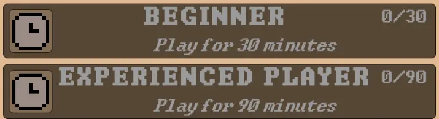

#### Use sprint

Category: Achieving, Competitive 
In order to move quickly in the game, the player can use sprint. To complete this achievement, the player must use sprint for a total of 30 seconds. However, the player can stop and then use sprint again, in which case the achievement progress will not be reset.

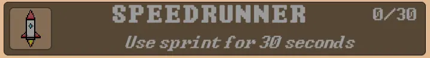

#### Unlock all dungeons

Category: Exploring, Achieving 
Each world contains dungeons that can be unlocked by completing all the minigames available in the current level. Unlocking each of the dungeons will increase the achievement progress associated with the current world.

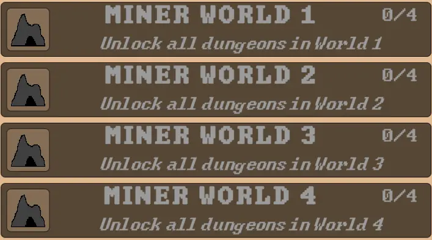

#### Open new worlds

Category: Exploring, Achieving 
Once the player has unlocked all the dungeons in the current world and successfully completed all the minigames, the next world will open. Along with the panel that appears to announce the opening of a new world, the achievement progress for that world will also be updated.

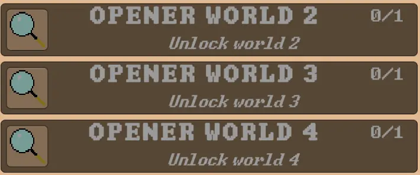

#### Find minigame spots

Category: Exploring 
When the player finds a minigame spot and steps on it, the achievement progress is updated. Importantly, the player cannot complete the achievement by stepping on the same spot multiple times, encouraging the player to search for other minigame spots in the overworld.

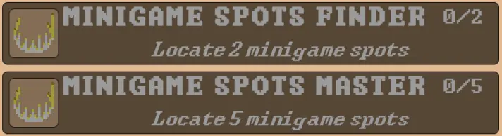

#### Open books

Category: Exploring, Achieving 
The goal of this achievement is to open as many books as possible with important clues. Since the books are located in each world, three achievements per world were created, as well as three general achievements, so that in case the player did not find all the books in a particular world, they could still complete at least a few achievements. Books found in dungeons count towards the achievement of the world in which the dungeon is located. Each time the player interact with a book that has not yet been opened, the achievement progress will be updated. It is important that the player cannot complete the achievement by opening the same book multiple times. 

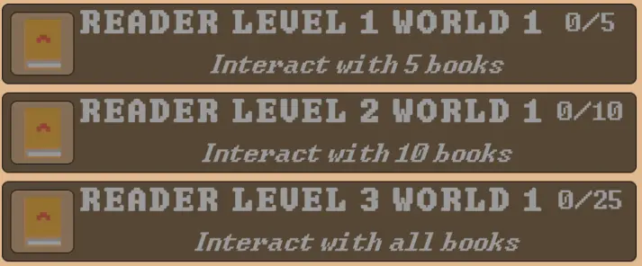

#### Unlock teleporter

Category: Exploring, Achieving 
Each world has teleporters. Three achievements have been created for each world, as well as three general achievements. Teleporters in dungeons count towards the achievement of the world in which the dungeon is located. When the player enters the teleporter area, it is unlocked and the progress of the achievement is updated. Importantly, the player cannot complete the achievement by unlocking the same teleporter multiple times.

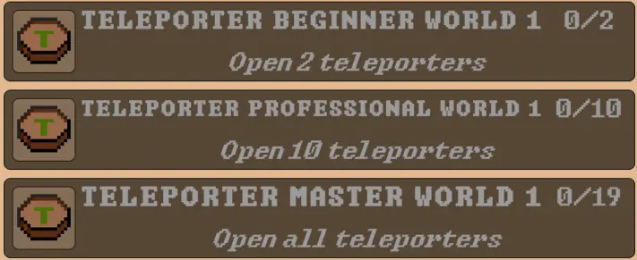

#### Talk to NPC

Category: Exploring 
Each world has NPCs. When interacting with an NPC, the achievement is updated according to the world in which the NPC is located. If the NPC is in a dungeon, the achievement progress is updated according to the world in which the dungeon is located. Also created three achievements for each world and three general achievements. Importantly, the player cannot complete the achievement by interacting with the same NPC.

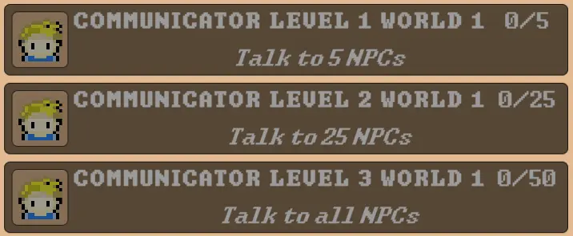

#### Successfully complete each minigame

Category: Achieving, Competitive 
Achievements have been created for the following minigames: chickenshock, memory, finitequiz, crosswordpuzzle, bugfinder and towercrush. When the player successfully completes a particular minigame, the achievement will be updated.

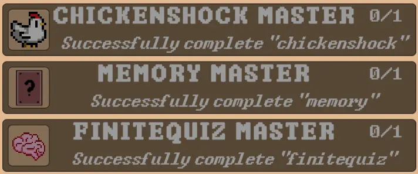
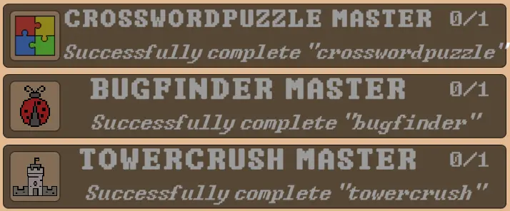

#### Use UFO

Category: Exploring, Achieving 
To get around the overworld quickly, the player can use the teleporter. To teleport, the player is picked up by a UFO. To complete the achievement, the player needs to use the UFO three times.

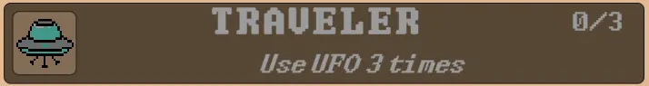

#### Login

Category: Exploring, Achieving, Competitive, Socializing 
To complete the login achievements, the player must log into the game for two and five different days.

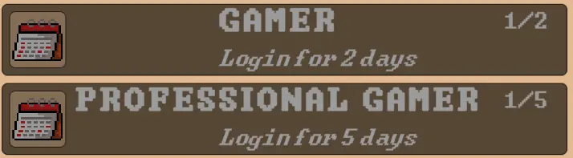

#### The best in the leaderboard

Category: Competitive 
Created two achievements related to the leaderboard. First one is to be the best and take first place. The second one is to take second or third place in the leaderboard.

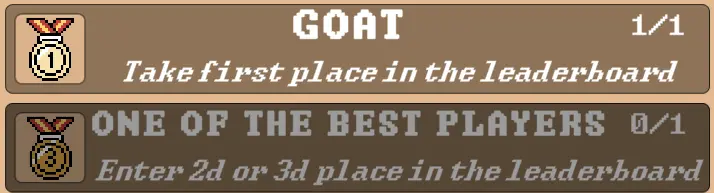

#### Get coins

Category: Achieving 
When the player completes the minigame, they will receive a certain number of coins depending on how well they played. To complete the achievements, the player needs to get 50 and 150 coins.

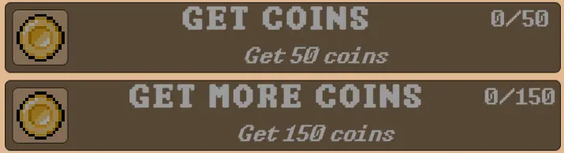

#### Level up

Category: Achieving 
As new dungeons and worlds are unlocked, the player's level changes. On entering the game, the player will automatically have the first level as World 1 is unlocked, when the player unlocks the next world, they will gain the second level, at this point the progress of the achievement is updated.

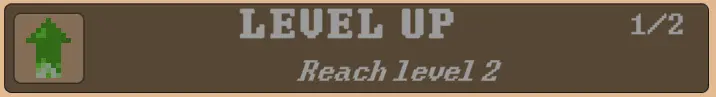

### Achievement progress 

When certain conditions are met, the achievement's progress will be updated. Once the player has gained the progress required to complete the achievement, the progress will no longer increase.

### Achievement status

As mentioned above, each achievement has its own status: completed or locked. Once an achievement has been completed, it will become brighter, while locked achievements are dimmed. 

### Achievement completion notification

Once the player has done everything they need to do to complete a particular achievement, a panel with the achievement the player has just completed will appear at the bottom of the screen. It will disappear after five seconds.

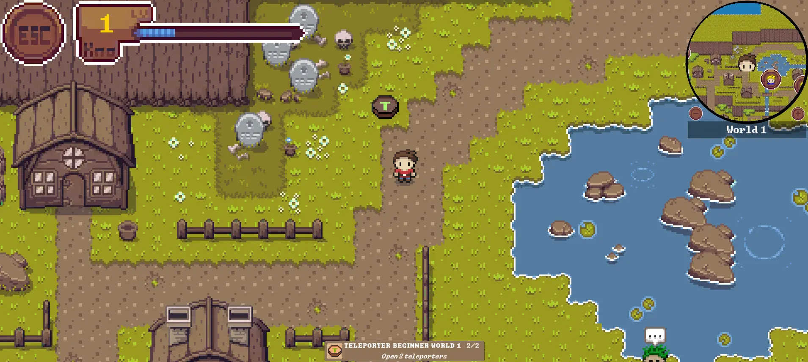

### Object Tracking

As mentioned earlier, the player can't complete the achievement by interacting with the same object multiple times. This is implemented by saving objects that the player has already interacted with. You can read more about saving achievements and objects related to achievements here: [save interacted objects](/dev-manuals/services/overworld/save-player-data.md)

## Sounds

Different sounds play throughout the game for complete immersion.

#### Background music

Each world has its own background music, dungeons have their own distinct music as well. During transitions between worlds or when entering a dungeon, the music changes smoothly.

#### Open sound of minigame spot

Once the player enters the area of the minigame spot, the corresponding sound will be played, indicating that the minigame is open.

#### Sound for completed achievement

When the player completes an achievement, a panel will appear at the bottom of the screen with a message about the achievement. A notification sound will play at this time to draw the player's attention to the panel that has just appeared.

#### Click sound

The game has many interactive buttons. When the player presses one of the buttons, the corresponding click sound is played, e.g. when the map is zoomed in/out, when the pause menu is opened, when a category in menu is selected, etc.

#### Sound for interaction with NPC

A sound symbolising that the NPC has said hello will be played when the player interacts with an NPC.

#### Sound for interaction with book

When the player interacts with the book, a magical opening sound plays.

#### Sound for movement

As the player moves in the game, the sound of rustling grass is played to represent footsteps. When the player accelerates, the sound of movement also changes its speed.

#### Sound for teleporter opening

If the player is on a teleporter, the teleporter will be unlocked. This event is also accompanied by a characteristic sound to attract more attention.

#### Sounds for UFO

Once the player has selected the final teleportation location, a UFO will follow them, accompanied by an alien sound. Upon reaching the end point of the teleportation, the player will also be brought back by the UFO. At this point, the sound of the aliens will play, but this time in reverse.

## Volume control

The player has the ability to control the volume of sounds in the game. The control button is located in the top right corner of the pause menu. When the player presses the button, the volume of the sounds increases to the next level, which is accompanied by a change of image of the button. There are 4 volume levels in total in the game: mute, low volume, medium volume and high volume.
The volume level chosen by the player will also be applied to all minigames the player plays in the future.
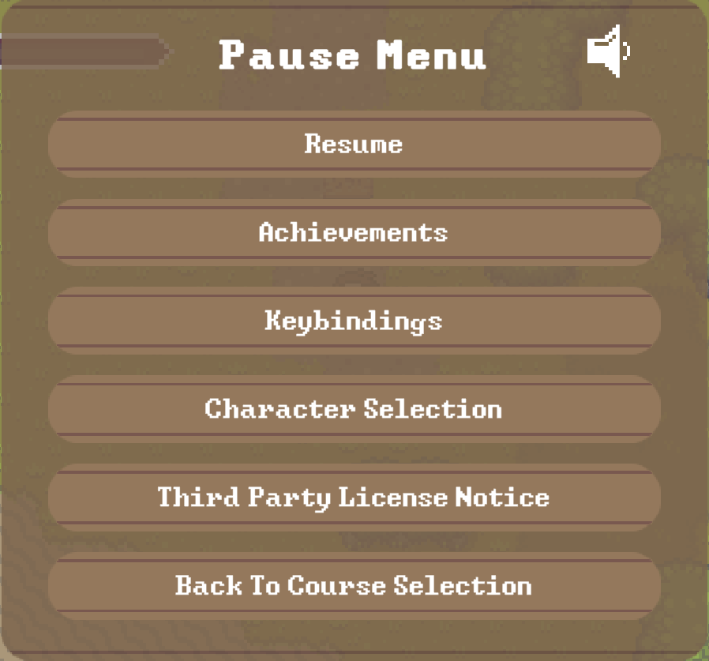

## Leaderboard

The leaderboard is a feature that displays player rankings based on their performance in various aspects of the game. The ranking display shows player rankings from top to bottom, highlighting the best performers.
Players are ranked based on scores achieved in minigames. The leaderboard updates regularly to reflect the most current player performances and rankings.
Purpose: 1) Competition: Encourages players to improve their skills and scores to climb the ranks. 2) Recognition: Provides recognition to top players and motivates others to strive for better performance.

### Place

In the knowledge menu, the player can find the leaderboard by clicking on the button.

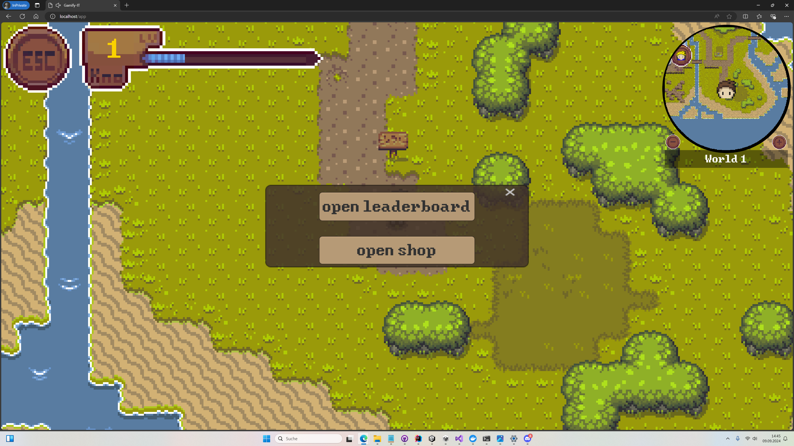

After clicking the button the player will see the leaderboard
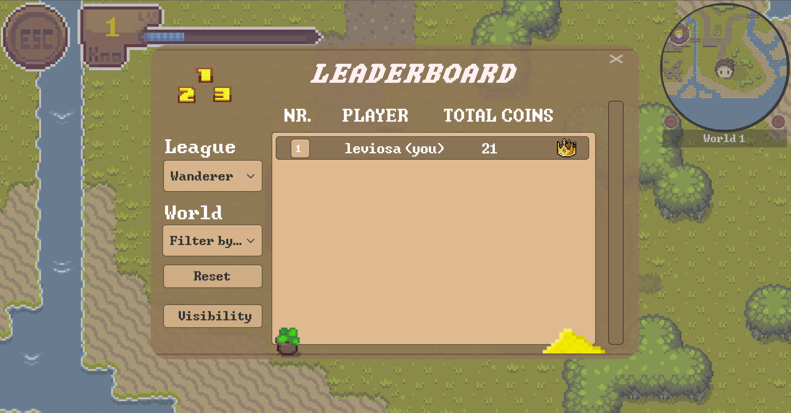

### Filter rewards

There are 3 options for filtering rewards:
<ul>
  <li>By League:</li>

There are four leagues: pathfinder, explorer, trailblazer and wanderer.

  <li>By World:</li>

The players can be filtered by world.

The player also has the option to reset the keyword by clicking on the 'Reset' button.
</ul>

## Shop

### Place

In the knowledge menu, the player can find the shop by clicking on the button.

After clicking the button the player will see the shop

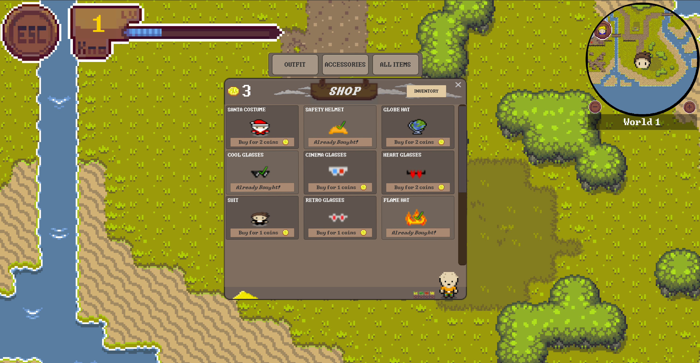

### Filter rewards

There are 3 options for filtering rewards:
<ul>
  <li>By OUTFIT:</li>

  <li>By ACCESSORIES:</li>

  <li>By ALL ITEMS:</li>

  <li>By INVENTORY:</li>

</ul>

## Multiplayer

The overworld features a multiplayer mode, allowing players to see each other in real time. The multiplayer option can be enabled from the pause menu under the `Multiplayer` section. \
The multiplayer UI includes the multiplayer menu in the pause menu 

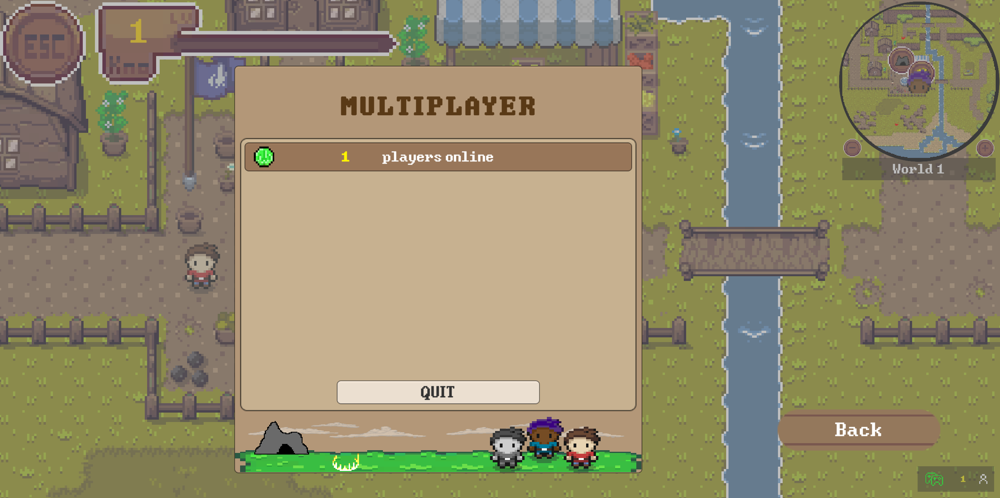

and a HUD element located in the bottom right corner.

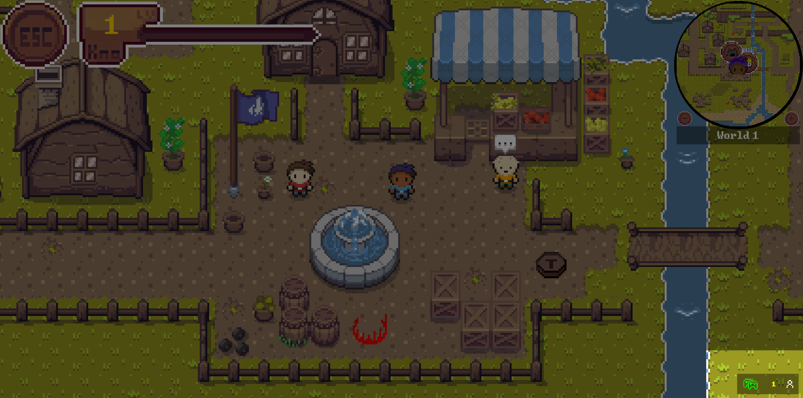

## Developer

If you are a developer wanting to change or add something in the overworld, please refer to the [developer README](../../dev-manuals/services/overworld/README.md)
