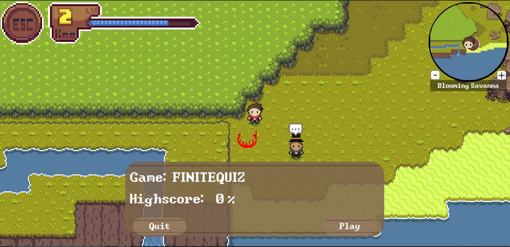

# Overworld

The overworld is the core of the Gamify-IT platform.
It is the main interface for students to interact with the platform.

The overworld consists of multiple regions and dungeons.
Throughout the world, students can discover course contents in form of [minigames](../README.md) and NPC dialogues.

- On the screenshot you see the player in the middle.
- He can walk around and interact with various objects, such as the NPC on the left.
- There is also a HUD which displays a minimap and other useful information

- The Lecturer can configure what the NPCs talk
- they could give tips about a topic for example

- if a minigame spot is configured, the player can walk to it and start the configured minigame
- the lecturer can edit the minigame configuration in the [lecturer interface](../lecturer-interface/README.md)

- the controls of the game
- they can also be looked up in the pause menu under the button `keybindings`

## Developer

If you are a developer wanting to change or add something in the overworld, please refer to the [developer README](../../dev-manuals/services/overworld/README.md)
