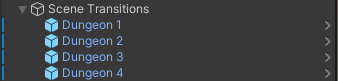
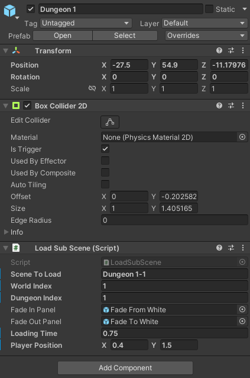
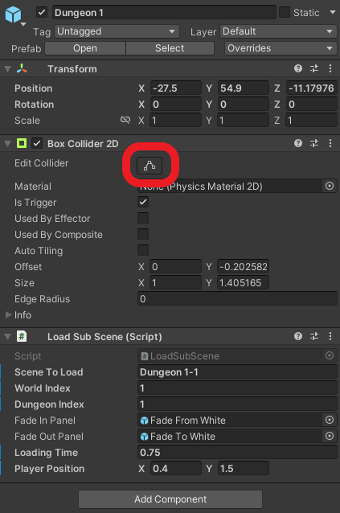
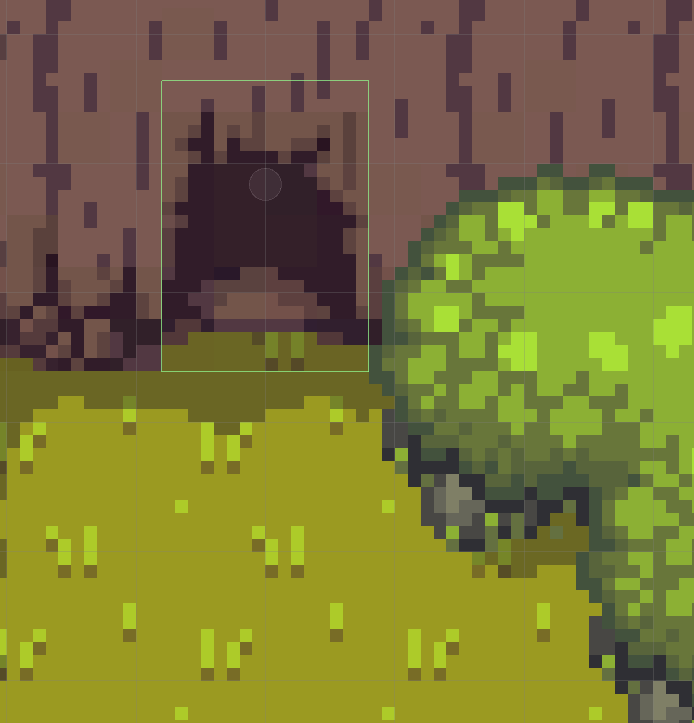
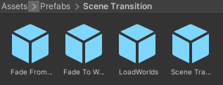

# Scene Transitions

## Overview

Scene Transitions are used to enter and exit dungeons. If the player enters the specified area, the transitions gets triggered and closes all open area scenes and loads the provided one.

## How to use

To add a new scene transition, do the following:

1. Open the scene, in which the scene transition should be
2. Create a new `game object` as a child of the `Scene Transitions` game object on the hierarchy
	
3. Add the `Load Sub Scene` script and a `Box Collider 2D` component to the created game object
	
4. Place the object at the dungeon entry or exit point (via the `x` and `y` coordinates)
5. Adjust the trigger area of the `Box Collider 2D` component using the `Edit collider` button
	
	
6. Provide the required data for the scene transition at the `Load Sub Scene` component  
	6.1 `Scene To Load`: The name of the scene, which should be loaded (normally `Dungeon x-y` or `World x`)  
	6.2 `World Index`: The index of the world or the world the dungeon is in  
	6.3 `Dungeon Index`: The index of the dungeon in its world, `0` if a world should be loaded  
	6.4 `Fade In Panel`: A fade in animation, you can use the default one (`Fade From White` located at `Assets/Prefabs/Scene Transition`)  
	6.5 `Fade Out Panel`: A fade out animation, you can use the default one (`Fade To White` located at `Assets/Prefabs/Scene Transition`)  
	6.6 `Loading Time`: The amount of time the loading animation lasts, measured in seconds  
	6.7 `Player Position`: The `x` and `y` coordinates the player should spawn at in the loaded scene
	
## Prefab

You can also speed up that process by using the provided prefab, located at `Assets/Prefabs/Scene Transition`.  
  
Simply drag an drop the `Scene Transition` object into the scene hierarchy as a child of the `Scene Transitions` game object. 
You can than skip steps 2 and 3.
