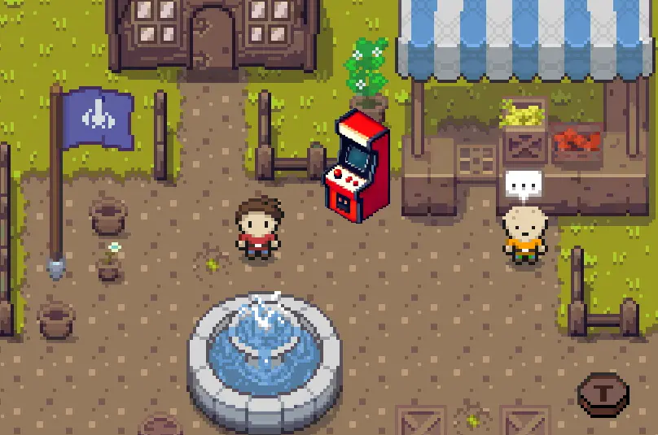

# Minigame Replay Menu

The minigame replay menu offers you a quick way to replay a completed minigame. This way you won't have to go back to the minigame spot, if you want to play a specific game again that you have already mastered. Your completed minigames will be saved, when you exit the Overworld. The next time you enter the Overworld, the replay menu will be populated with your completed games.

## Accessing the Replay Menu

You can access the replay menu via an arcade game machine, which you can find in the market place of World 1. 

There is also a teleport spot nearby, so that you can fast travel to the market place from any other teleport location in the Overworld. Approach the arcade game machine and interact with it by pressing the key E. 

The replay menu window will open up and you can see a list of completed minigames. To replay a minigame, click on the replay button of the minigame item of choice. Once done, you will repawn back at the arcade game machine.